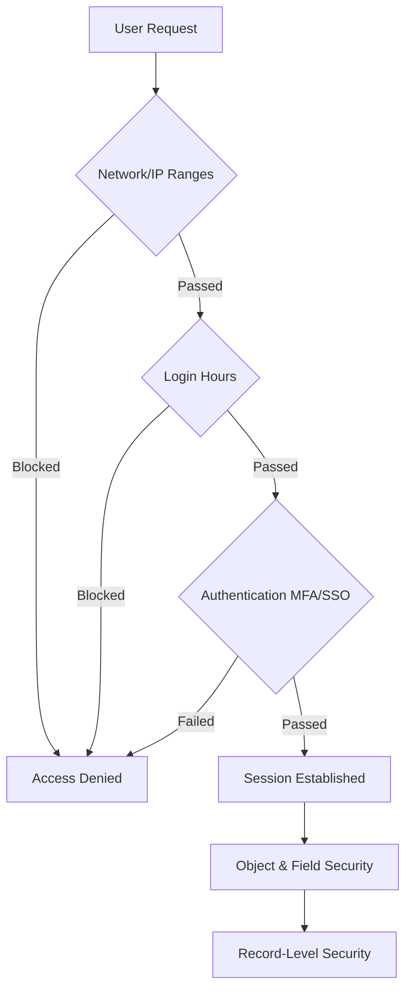
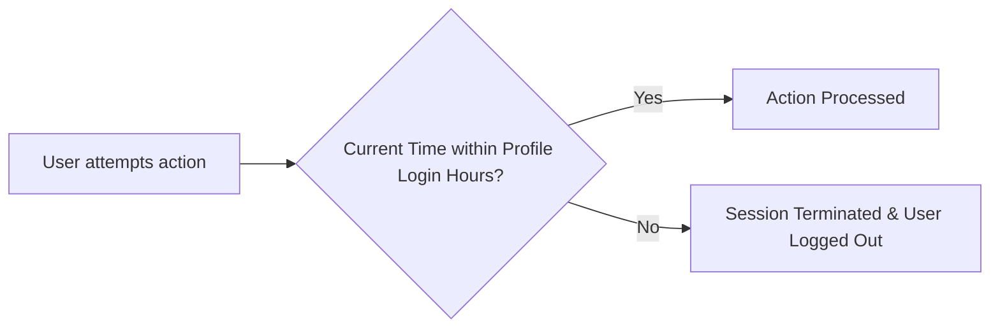
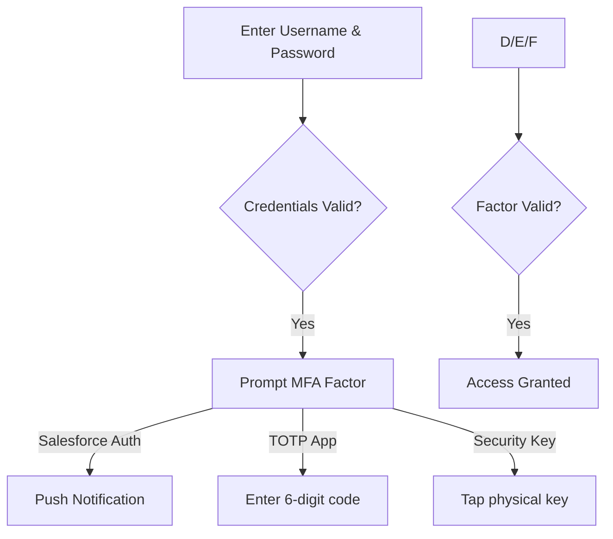
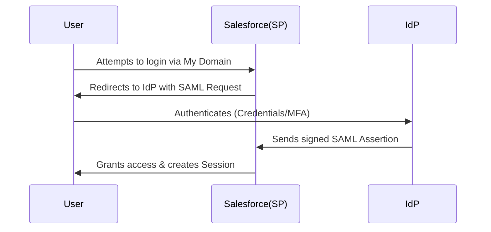

# Advanced Security Login Policies

## 1. Introduction

### Why Salesforce Security is Important
In an era of sophisticated cyber threats, securing your CRM is paramount. Salesforce houses an enterprise's most sensitive data: customer PII (Personally Identifiable Information), financial records, and strategic communications. A breach can lead to severe regulatory fines, loss of customer trust, and financial damage.

### Authentication vs Authorization
* **Authentication (AuthN):** Proving *who* you are (e.g., Username/Password, MFA, SSO).
* **Authorization (AuthZ):** Determining *what* you can do once inside (e.g., Profiles, Permission Sets, Sharing Rules).

### Importance of Login Controls
Login controls act as the outer perimeter of your Salesforce org. By enforcing when, where, and how users log in, you dramatically reduce the attack surface against brute-force attacks, credential stuffing, and session hijacking.

### Enterprise Security Challenges
* Managing access for a global workforce across multiple time zones.
* Securing remote workers operating outside the corporate VPN.
* Integrating third-party Identity Providers (IdPs) seamlessly.
* Meeting strict compliance frameworks (GDPR, HIPAA, SOX, RBI).

> **Real-world example:** A financial services firm must ensure offshore contractors can only log in during their local business hours and strictly from the contractor facility's IP addresses to prevent data exfiltration.

---

## 2. Salesforce Security Architecture Overview

The Salesforce Security Model resembles a layered onion. A user must pass through the outer layers to reach the data inside.

1.  **Authentication Layer:** Network Access, Login IP Ranges, Login Hours, MFA, SSO.
2.  **Authorization Layer (App/System):** Profiles, Permission Sets, System Permissions.
3.  **Object Security:** CRUD permissions (Create, Read, Update, Delete) on objects.
4.  **Field Security:** Field-Level Security (FLS) to restrict specific fields.
5.  **Record Security:** Org-Wide Defaults (OWD), Role Hierarchy, Sharing Rules, Manual Sharing.
6.  **Session Security:** Session timeouts, High Assurance sessions, IP locking.

### Security Architecture Diagram

---

## 3. Authentication in Salesforce

Salesforce offers multiple avenues to authenticate users, catering to different enterprise needs.

* **Username and Password Authentication:** The standard, basic method. Must be fortified with strong password policies and MFA.
* **Identity Verification:** Device activation. If a user logs in from an unrecognized browser/IP, Salesforce emails/texts a verification code.
* **MFA (Multi-Factor Authentication):** Requires a user to provide two or more pieces of evidence (factors) to verify their identity (e.g., Password + Salesforce Authenticator approval).
* **SSO (Single Sign-On):** Allows users to authenticate via a corporate Identity Provider (e.g., Azure AD, Okta) using SAML. Salesforce trusts the IdP's assertion.
* **OAuth Authentication:** Used primarily for integrations and mobile apps. Instead of sharing credentials, connected apps use tokens (Access/Refresh tokens) to interact with Salesforce APIs.

---

## 4. What are Login Policies?

### Definition
Login Policies are a set of declarative security controls in Salesforce that govern the prerequisites and conditions a user must meet to successfully authenticate into the system.

### Purpose
To block unauthorized access attempts at the front door before any data or application logic is exposed.

### Security Benefits
* Mitigates credential theft via IP restrictions.
* Prevents unauthorized overtime or off-hours data exports via Login Hours.
* Forces strong password hygiene.

### Enterprise Use Cases
* **Call Centers:** Restrict agents to only log in from the physical call center IPs.
* **Contractors:** Limit access to a strict 90-day window using temporal access provisioning and Login Hours.

---

## 5. Organization Login Policies

Org-wide login policies establish the baseline security posture for all internal and external users.

* **Password Policies:** Governs the rules for creating and maintaining passwords.
* **Password Expiration:** Forces users to change passwords periodically (e.g., every 90 days).
* **Password Complexity:** Mandates a mix of alpha, numeric, and special characters.
* **Password History:** Prevents users from reusing their last *N* passwords.
* **Security Questions:** Used for self-service password resets (though generally being phased out in favor of MFA/SSO).
* **Identity Verification:** Configured under Session Settings to require OTPs for new IP addresses.

> **Configuration Note:** Setup -> Password Policies applies org-wide, though Profile-level policies override org-wide policies.

---

## 6. Password Policies

Administrators can fine-tune password requirements based on corporate security mandates.

| Setting | Description | Best Practice Recommendation |
| :--- | :--- | :--- |
| **Minimum Length** | Minimum characters required. | 12 to 15 characters. |
| **Complexity Requirement** | Mix of characters required. | Alpha, numeric, and special characters. |
| **Password Expiration** | Time before a password expires. | 90 days (or never if SSO/MFA is strictly enforced). |
| **Password History** | Number of previous passwords remembered. | Remember 5 to 10 passwords. |
| **Maximum Invalid Login Attempts** | Failed logins before lockout. | 3 to 5 attempts. |
| **Lockout Effective Period** | How long the account remains locked. | 15 to 30 minutes (deters brute force). |

---

## 7. Login Hours

### What Login Hours Are
Login Hours dictate the specific days and times during which users assigned to a specific profile can log in.

### Why They Exist
To prevent off-hours access, which is a common indicator of credential compromise, data theft, or unauthorized overtime (for hourly workers).

### Profile-Level Configuration
Login Hours are set *exclusively* at the Profile level. There is no org-wide Login Hour setting.

### Access Restriction Logic
* If a user tries to log in outside their designated hours, the login fails.
* If a user is already logged in and their shift ends, they can continue viewing their current page, but **any new action (saving a record, navigating to a new page) will terminate their session** and kick them out.

---

## 8. Login Hours Architecture

### Time Zone Considerations
Login hours are evaluated based on the **Organization's Default Time Zone**, NOT the user's local time zone. This is a critical architectural consideration for global deployments.

### User Experience
Users kicked out due to login hours will receive a standard error message. It can be jarring, so communication and proper shift-buffer design are key.

### Security Implications
Strict login hours reduce the window of vulnerability. Even if an attacker steals a password, they cannot use it outside the allowed window.

---

## 9. Login Hours Real Project Scenarios

* **Banking Organization (Business Hours Access):** Tellers can only access the CRM between 08:00 and 18:00, Monday to Friday. This prevents accessing sensitive account data from home.
* **Automotive CRM (Dealer Access Timing):** Dealership users can access the Partner Portal from 07:00 to 20:00 local time (Requires separate profiles per time zone due to Org Time Zone limitations).
* **BPO Operations (Shift-Based Access):** Support agents working rotating 8-hour shifts. Profiles are created for "Morning Shift", "Evening Shift", and "Night Shift" to enforce access.
* **Government Systems:** Strict enforcement to ensure no remote/weekend access to classified data.

---

## 10. Login IP Ranges

### What Login IP Ranges Are
A strictly enforced perimeter set at the **Profile** level that dictates the exact IP addresses a user must originate from to authenticate.

### Why They Exist
To ensure that users handling highly sensitive data can only do so from secured, trusted, physical locations (or via corporate VPNs).

### Profile-Level Restrictions
Configured directly on the Profile. You specify the Start IP and End IP (IPv4 or IPv6).

### Access Enforcement
* **Inside the Range:** User logs in successfully (pending other auth requirements).
* **Outside the Range:** Login is **completely blocked**. There is no identity verification bypass. The user cannot get in under any circumstances.

---

## 11. Trusted IP Ranges

### Network Access Settings
Configured at the **Organization** level (Setup -> Network Access).

### Identity Verification Bypass
Trusted IPs do *not* restrict access. Instead, they define a list of IPs from which users can log in *without receiving an Identity Verification challenge* (e.g., the emailed 5-digit code). 

### Corporate Networks & VPN Scenarios
When a company whitelists their Corporate NAT IPs and VPN egress IPs in Network Access, employees working from the office/VPN bypass the annoying email verification step. If they work from a coffee shop, they can still log in, but they will be prompted to verify their identity.

---

## 12. Login IP Ranges vs Trusted IP Ranges

| Feature | Login IP Ranges | Trusted IP Ranges (Network Access) |
| :--- | :--- | :--- |
| **Level** | Profile Level | Org Level |
| **Purpose** | Strictly Restrict Access | Bypass Identity Verification |
| **Enforcement** | Hard Block if outside range. | Soft Challenge (OTP) if outside range. |
| **Use Case** | Call center agents must be in the office. | Corporate employees seamlessly logging in from the office; challenged when remote. |
| **UX outside range** | Login Denied. | Prompts for 5-digit verification code. |

---

## 13. Network Access Security

Enterprise network security requires layering:
* **Corporate Networks:** Whitelisted in Network Access for UX.
* **VPN Access:** Often used in tandem with Profile Login IPs. The Profile restricts to the VPN IP, forcing all remote workers to tunnel into the corporate network before hitting Salesforce.
* **Remote Access:** Secured via MFA and Identity Verification.
* **Public Network Risks:** Mitigated by "Enforce login IP ranges on every request" session setting to prevent session hijacking if a user switches networks.

---

## 14. Session Security

### Session Timeout
The duration of inactivity before a user is automatically logged out. Can be set from 15 minutes to 24 hours.

### Session Expiration
When the timeout is reached, the session ID becomes invalid. 

### Session Security Levels
Salesforce categorizes authentication methods:
* **Standard:** Standard Username/Password.
* **High Assurance:** MFA or strongly verified SSO. Required for accessing sensitive Setup areas or specific reports.

### Session Locking
* **Lock sessions to the IP address from which they originated:** Prevents session hijacking. If a user's session token is stolen, the attacker cannot use it from a different IP.

### Browser Session Security
Salesforce uses secure, HTTP-only cookies and protections against Cross-Site Scripting (XSS) and Cross-Site Request Forgery (CSRF).

---

## 15. Session Settings

Key configurations found in Setup -> Session Settings:

* **Timeout Configuration:** Typically set to 2 hours for standard users, 15 minutes for high-security environments.
* **Force Logout on Session Timeout:** Instead of a warning, immediately kills the session.
* **Session Persistence:** Disabling persistent browser caching improves security on shared machines.
* **Secure Cookies:** Require HttpOnly cookies to mitigate XSS attacks against session IDs.

---

## 16. Multi-Factor Authentication (MFA)

### What is MFA
MFA requires users to prove their identity using two or more distinct factors: Something they know (password) + Something they have (mobile device/security key) + Something they are (biometrics).

### Why Salesforce Requires MFA
As of 2022, Salesforce has a contractual requirement for all internal UI logins to use MFA. Passwords alone are easily phished or breached.

### Authentication Methods
* **Salesforce Authenticator:** Best UX, offers push notifications and location-based automated approvals.
* **TOTP Apps:** Google Authenticator, Authy, Microsoft Authenticator.
* **Security Keys:** Physical USB/NFC keys (YubiKey) utilizing WebAuthn/FIDO2.
* **Built-in Authenticators:** TouchID, Windows Hello.

---

## 17. Login Flows

### What Login Flows Are
A Screen Flow that runs immediately after authentication but before the user reaches the Salesforce UI.

### Use Cases
* **Custom MFA:** Integrating with a third-party MFA provider.
* **Terms of Service:** Forcing community users to accept a new TOS before logging in.
* **Data Updates:** Forcing users to update their mobile number if it is blank.

### Security Enhancements
Login flows act as a dynamic, context-aware authorization step based on user attributes or login context.

---

## 18. Identity Verification

Salesforce automatically tracks browser fingerprints and IP addresses.
* **New Device Verification:** If a cookie is not present, Salesforce assumes it's a new device.
* **Location Verification:** If the IP is new and not in Network Access, it triggers a challenge.
* **Challenges:** Typically an email or SMS with a 5-digit code.

---

## 19. Single Sign-On (SSO)

### What SSO Is
SSO delegates authentication to an external Identity Provider (IdP). Salesforce acts as the Service Provider (SP).

### Benefits
Reduces password fatigue, centralizes access revocation (terminating an employee in Active Directory immediately revokes Salesforce access), and streamlines onboarding.

### Identity Providers
Microsoft Entra ID (Azure AD), Okta, Ping Identity.

### Authentication Flow (SAML 2.0 SP-Initiated)

---

## 20. OAuth Security

### OAuth Flow
Used by Connected Apps (e.g., Dataloader, Mobile App, API integrations). Instead of passing credentials for every API call, OAuth uses tokens.

### Connected Apps
The framework in Salesforce that manages OAuth settings, scopes, and IP relaxations.

### Tokens
* **Access Token:** Short-lived token used to make API calls. Functionally equivalent to a Session ID.
* **Refresh Token:** Long-lived token used to securely request a new Access Token when the old one expires, without needing user interaction.

---

## 21. Salesforce Identity Features

* **Identity Verification:** Built-in tracking of devices and IPs.
* **Login Discovery:** Using a single page (My Domain) to dynamically route users (e.g., internal users to SSO, customers to password login) based on their email domain or phone number.
* **Passwordless Authentication:** Using SMS or email OTPs to log in Community users without requiring a password.
* **Social Sign-On:** Auth Providers (Google, Facebook, LinkedIn) for Experience Cloud authentication.

---

## 22. Security Monitoring

### Login History
Tracks successful and failed logins over the last 6 months. Crucial for spotting brute force attacks.

### Login Forensics
Identifies anomalies (e.g., login from an unusual IP, higher than average number of logins per user).

### Event Monitoring
Part of Salesforce Shield. Captures detailed API and UI activity, allowing architects to track exactly what a user did post-login.

### Security Center
A centralized dashboard to monitor security health, compliance metrics, and tenant configurations across multiple orgs.

---

## 23. Enterprise Security Design Scenarios

### Automotive CRM
* **Service Advisors / Warranty Team:** Require strict Profile IP Login Ranges tied to the dealership network. Login hours restricted to 06:00 - 19:00.
* **Regional Managers:** Need mobile access. Use Trusted IP Ranges for the corporate office to reduce friction, but rely on mandatory MFA for field access.

### Banking Organization
* **Design:** Strict SSO via Azure AD. Session timeout set to 15 minutes of inactivity. "Lock sessions to the IP address" enabled. High Assurance session required to export reports.

### Insurance Company
* **Design:** Customer Community uses Passwordless Login (SMS OTP) for ease of use. Internal claims adjusters use SSO and are subject to Login Flows that verify they have signed the annual HIPAA compliance agreement.

---

## 24. Compliance and Regulatory Requirements

* **GDPR (Europe):** Requires strict access controls and monitoring to protect EU citizen data.
* **SOX (Financial):** Demands verifiable audit trails of who accessed what and when. Event Monitoring and Login History are vital.
* **ISO 27001:** Requires continuous security management. MFA and strict password policies map directly to ISO controls.
* **PCI-DSS (Credit Cards):** Requires 15-minute session timeouts and strict password rotation.
* **RBI Guidelines (India Banking):** Mandates stringent data access policies, localization, and strictly monitored IP/Time access.

---

## 25. Common Security Threats

| Threat | Description | Mitigation Strategy |
| :--- | :--- | :--- |
| **Credential Theft** | Passwords stolen via phishing. | Require MFA for all users. |
| **Brute Force Attacks** | Automated guessing of passwords. | Strict Lockout Policies (e.g., lock after 3 failed attempts). |
| **Session Hijacking** | Stealing an active session cookie. | Enable "Lock sessions to the IP address from which they originated". |
| **Unauthorized Access** | Ex-employee retaining access. | Automated SSO provisioning/deprovisioning via JIT/SCIM. |

---

## 26. Common Mistakes

* **Mistake:** Making Profile IP Ranges too broad (e.g., `0.0.0.0` to `255.255.255.255`) to bypass integration errors.
    * *Solution:* Use integration users with properly whitelisted specific IPs.
* **Mistake:** Ignoring MFA for System Administrators.
    * *Solution:* Admins are the highest risk; they must use hardware security keys or strong authenticator apps.
* **Mistake:** 24-hour session durations for convenience.
    * *Solution:* Reduce to 2-4 hours. Implement SSO to reduce the friction of re-authenticating.

---

## 27. Best Practices

1.  **MFA Everywhere:** No exceptions for UI access.
2.  **Least Privilege Access:** Users should only have access to the IPs and hours they absolutely need to do their jobs.
3.  **Use SSO:** Delegate authentication to a dedicated IdP for centralized control.
4.  **Session Hardening:** Enable secure cookies, lock sessions to IP addresses, and restrict high-risk activities (exports) to High Assurance sessions.
5.  **Integration Users:** Always use "API Only" profiles with strictly defined Profile IP ranges.

---

## 28. Troubleshooting Login Issues

* **User Cannot Login:** Check Login History first. It will explicitly state the failure reason (e.g., "Invalid Password", "Restricted IP", "Outside Login Hours").
* **IP Restriction Errors:** Verify if the user's IP changed dynamically. Add their static IP to the Profile Login IP Range.
* **Login Hour Violations:** Check the Org's Default Time Zone vs the User's expectation. Adjust profile hours accordingly.
* **MFA Problems:** Disconnect the user's Salesforce Authenticator in their User Detail record to allow them to re-register a new device.
* **SSO Failures:** Use the SAML Validator in Salesforce Setup to inspect the SAML Assertion from the IdP.

---

## 29. Interview Questions & Answers

**Beginner:**
* *Q: What is the difference between Login IP Ranges and Network Access?*
    * **A:** Login IP Ranges (Profile level) strictly block access if outside the range. Network Access (Org level) allows access but bypasses the email/SMS verification challenge.

**Intermediate:**
* *Q: A user is actively working on a record at 5:00 PM. Their Profile Login Hours end at 5:00 PM. What happens at 5:01 PM?*
    * **A:** They can continue looking at the page they are on. However, the moment they try to save the record or navigate away, their session is terminated and they are logged out.

**Advanced:**
* *Q: How do you secure an integration user that connects to Salesforce via API?*
    * **A:** Assign them an "API Only" profile, set a strong, non-expiring password (or use JWT/Client Credentials OAuth), and restrict their Profile Login IP Range exclusively to the middleware's IP addresses.

**Architect-Level:**
* *Q: Explain the flow and security benefits of SP-Initiated SAML SSO in Salesforce.*
    * **A:** User hits My Domain -> SF generates SAML AuthnRequest -> Redirects to IdP -> IdP authenticates user (AD/MFA) -> IdP posts SAML Assertion back to SF -> SF validates signature using IdP certificate -> SF creates session. Benefits: Centralized identity lifecycle, no passwords stored in Salesforce, reduced attack surface.

---

## 30. Revision Summary

* **Login Policies:** First line of defense; govern passwords, IPs, and times.
* **Password Policies:** Controls complexity, history, and lockouts.
* **Login Hours:** Profile-level control based on Org Time Zone. Terminates session on next action if time expires.
* **Login IP Ranges:** Profile-level hard restriction. Outside IP = No Access.
* **Trusted IP Ranges:** Org-level convenience (Network Access). Outside IP = Challenge (OTP), Inside IP = Bypass Challenge.
* **MFA:** Mandatory 2FA for all UI access (Something known + Something possessed).
* **Login Flows:** Screen flows executed post-auth to enforce custom logic (TOS, custom MFA).
* **SSO:** SAML 2.0 integration allowing corporate IdP to handle authentication.
* **Session Security:** Governs timeouts, IP locking, and High Assurance requirements.
* **Best Practices:** Enforce MFA, enforce SSO, restrict Profile IPs for integrations, limit session timeouts to reasonable enterprise limits (2-4 hours).