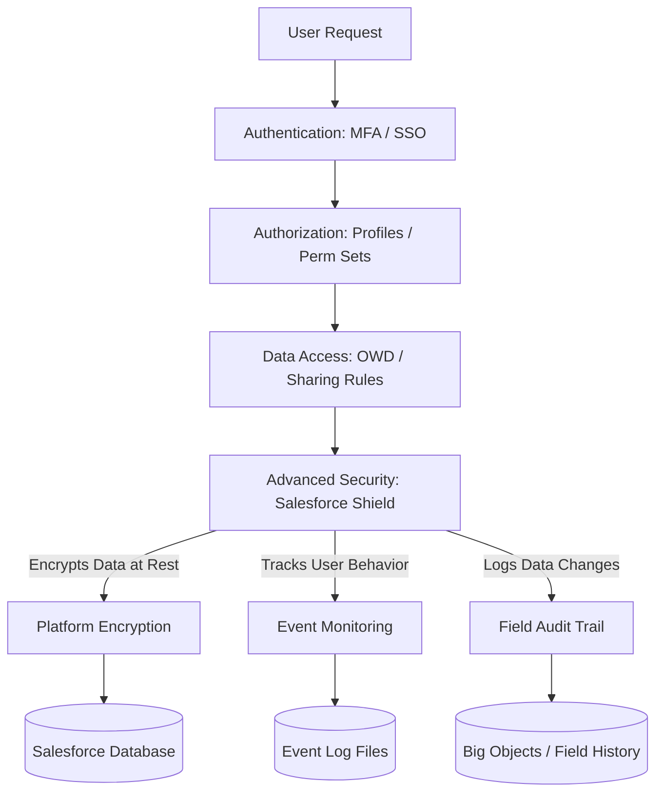
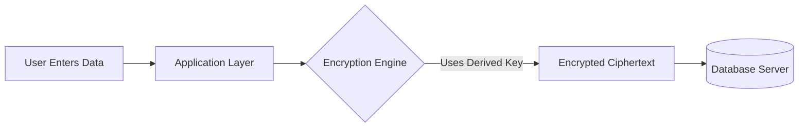
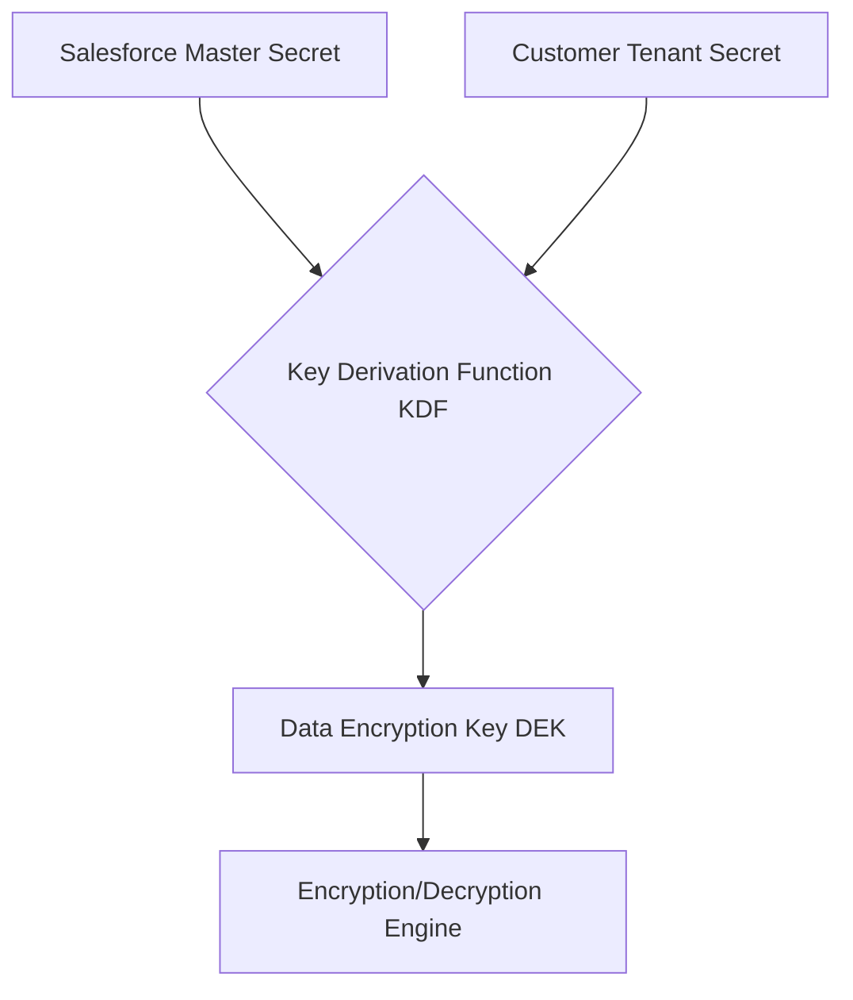
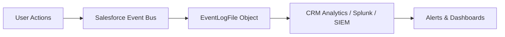
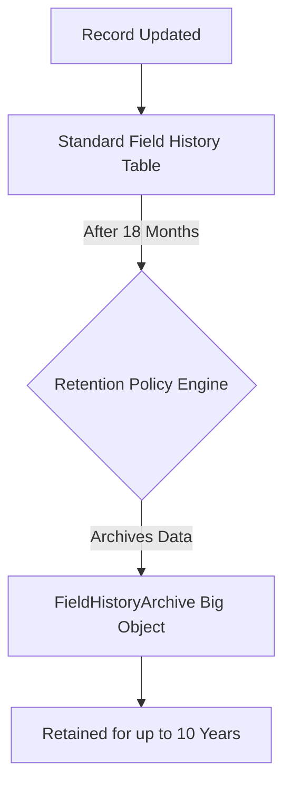

# Salesforce Shield: Advanced Security, Encryption, and Compliance

## 1. Introduction

### What is Salesforce Shield?
Salesforce Shield is a premium suite of security tools built natively into the Salesforce platform. It allows enterprises to comply with strict regulatory mandates and internal governance policies by providing enhanced encryption, detailed activity monitoring, and extended audit trailing. 

### Why Salesforce Introduced Shield
As Salesforce expanded into highly regulated industries (Healthcare, Finance, Government), standard platform security was no longer sufficient to meet strict compliance mandates. Shield was introduced to bridge the gap between standard cloud security and enterprise-grade data protection, allowing customers to track exactly who accessed what, when, and from where, while encrypting sensitive data at rest.

### Business and Compliance Requirements
Modern enterprises face severe penalties for data breaches. Frameworks like HIPAA, GDPR, and PCI-DSS mandate that Personally Identifiable Information (PII) and Protected Health Information (PHI) must be encrypted at rest and that access to this data must be logged and auditable.

### Importance of Advanced Security
Standard security limits visibility into micro-interactions (e.g., viewing a report, exporting a list). Advanced security ensures comprehensive protection against insider threats, credential compromise, and accidental data exposure.

> **Real-World Example:** A healthcare provider uses Salesforce Health Cloud. To comply with HIPAA, they must encrypt patient SSNs and medical conditions at rest (Platform Encryption), retain a 10-year history of field changes to patient records (Field Audit Trail), and monitor if an employee downloads a report containing thousands of patient records (Event Monitoring).

---

## 2. Salesforce Security Architecture Overview

The Salesforce Security Architecture is a multi-layered model designed to enforce the Principle of Least Privilege.

* **Authentication Security:** Validates *who* you are (SSO, SAML, Multi-Factor Authentication, My Domain).
* **Authorization Security:** Determines *what* you can do (Profiles, Permission Sets, Muting Permission Sets).
* **Object Security:** Controls access to tables (CRUD permissions).
* **Field Security:** Controls access to columns (Field-Level Security).
* **Record Security:** Controls access to specific rows (OWD, Role Hierarchy, Sharing Rules, Manual Sharing).
* **Advanced Security (Salesforce Shield):** Monitors behavior, encrypts the database, and stores long-term audits.

### Where Shield Fits: Architecture Diagram

---

## 3. What is Salesforce Shield?

### Definition
Salesforce Shield is an integrated trio of advanced security services—Platform Encryption, Event Monitoring, and Field Audit Trail—designed to build trust, transparency, and compliance directly into the Salesforce architecture.

### Components
1.  **Platform Encryption:** Native data-at-rest encryption.
2.  **Event Monitoring:** Granular API and UI event tracking.
3.  **Field Audit Trail:** Extended, high-volume data retention.

### Licensing
Shield is an add-on product. Customers can purchase the entire suite or individual components (e.g., only Event Monitoring). It is typically priced as a percentage of the organization's total net Salesforce spend.

### Business Value & Enterprise Use
Large enterprises use Shield to unlock cloud adoption. Without Shield, many banks or government agencies are legally forbidden from storing data in a public multi-tenant cloud. Shield provides the necessary cryptographic control and auditability to pass strict InfoSec reviews.

---

## 4. Salesforce Shield Components Overview

| Component | Purpose | Use Cases | Benefits |
| :--- | :--- | :--- | :--- |
| **Platform Encryption** | Encrypts sensitive data at rest in the database. | Securing PII/PHI (SSNs, credit cards, health records). | Meets compliance without breaking standard SF functionality. |
| **Event Monitoring** | Tracks granular user interactions and API usage. | Insider threat detection, adoption tracking, performance troubleshooting. | Deep visibility into potential data leaks and application usage. |
| **Field Audit Trail** | Retains field history data for up to 10 years. | Regulatory compliance, forensic auditing, resolving data disputes. | Massively expands standard 18-month tracking limits via Big Objects. |

---

## 5. Platform Encryption

### What Platform Encryption Is
Platform Encryption allows you to natively encrypt sensitive data at rest while preserving essential platform functionality (like search, workflow, and validation rules). It uses advanced 256-bit Advanced Encryption Standard (AES) with cipher block chaining (CBC).

### Why Encryption Is Needed
While Salesforce secures data in transit via TLS, data at rest (physically on Salesforce's servers) needs protection in case of physical disk theft, unauthorized database access, or multi-tenant bleed-over. 

### Encryption at Rest Architecture

---

## 6. Encryption Concepts

* **Plaintext:** Unencrypted, readable data (e.g., `John Doe`).
* **Ciphertext:** Encrypted, unreadable data (e.g., `8f9a2b4c6...`).
* **Encryption Keys:** Cryptographic strings used to lock and unlock data.
* **Key Derivation:** The process of combining multiple secrets (master secret + tenant secret) to create the final data encryption key (DEK).
* **Key Rotation:** Generating a new tenant secret periodically to ensure long-term cryptographic security.

---

## 7. Salesforce Encryption Architecture

Salesforce uses a split-key architecture. Salesforce never stores your actual Data Encryption Key (DEK).

* **Master Secret:** Generated by Salesforce at the start of each release.
* **Tenant Secret:** Generated by the customer (Org-specific).
* **Data Encryption Key (DEK):** Derived dynamically in memory by combining the Master Secret and Tenant Secret using a Key Derivation Function (KDF).

### Architecture Diagram

---

## 8. Encryption Key Management

Key management is the administrator's responsibility.

* **Key Generation:** You can generate a tenant secret natively in Salesforce, or use **Bring Your Own Key (BYOK)** to generate it in an external HSM (Hardware Security Module) and upload it.
* **Key Rotation:** Best practices mandate rotating the tenant secret every 90 to 365 days, depending on compliance.
* **Key Revocation / Destruction:** You can destroy a tenant secret. **Warning:** If a key is destroyed, the data encrypted with that key becomes permanently inaccessible (crypto-shredded).
* **Key Lifecycle:** Active -> Archived -> Destroyed.

---

## 9. Tenant Secrets

### What they are
A tenant secret is a piece of the cryptographic puzzle unique to your specific Salesforce Org. 

### How they work
When a user queries an encrypted field, the Shield encryption engine retrieves the active tenant secret, derives the DEK in memory, decrypts the ciphertext, and displays the plaintext to the user (if they have permission).

### Security Benefits
Because the customer controls the tenant secret, they control the data. If an enterprise detects a massive breach, they can destroy the tenant secret, instantly turning all encrypted database records into useless ciphertext.

---

## 10. Data Eligible for Encryption

| Data Type | Examples | Considerations |
| :--- | :--- | :--- |
| **Standard Fields** | Account Name, Contact Email, Lead Phone | Not all standard fields are supported. |
| **Custom Fields** | Text, Email, Phone, URL, Date, Date/Time | Long Text Area and Rich Text are supported. |
| **Files & Attachments** | PDFs, Word Docs uploaded to Files | Encrypts the file body, not necessarily the metadata. |
| **Searchable Data** | Deterministic encrypted fields | Requires specific index building for search functionality. |

**Limitations:** Number, Currency, and Picklist fields cannot be encrypted. 

---

## 11. Deterministic vs Probabilistic Encryption

| Feature | Probabilistic Encryption | Deterministic Encryption |
| :--- | :--- | :--- |
| **Ciphertext Generation** | Generates a *different* ciphertext every time for the same plaintext (e.g., "Apple" -> `123`, "Apple" -> `XYZ`). | Generates the *exact same* ciphertext for the same plaintext (e.g., "Apple" -> `123`). |
| **Security Level** | Highest (prevents pattern analysis). | High (but susceptible to frequency analysis). |
| **Platform Functionality** | Cannot be filtered in SOQL (`WHERE` clauses fail) or used in exact matches. | Can be used in exact-match SOQL queries and reports. |
| **Use Case** | Data that only needs to be stored and viewed (e.g., Medical Notes). | Data that needs to be filtered or searched (e.g., Email, SSN). |

---

## 12. Encryption Limitations

* **Formula Fields:** You cannot use encrypted fields in formula fields.
* **Search Restrictions:** Probabilistic fields cannot be searched.
* **Reporting Limitations:** Encrypted fields cannot be used to sort or group records in Reports/Dashboards.
* **Integration Impacts:** External systems (like MuleSoft or SAP) receiving raw data directly from the DB might receive ciphertext if the API user does not have the "View Encrypted Data" permission (though typically, standard API calls decrypt data on the fly if authorized).

---

## 13. Event Monitoring

### What Event Monitoring Is
Event Monitoring provides access to detailed performance, security, and usage data on all your Salesforce apps. 

### Why It Exists
Standard Salesforce logs are transient and lack granularity. Event Monitoring captures over 50 different event types, allowing InfoSec teams to feed this data into a SIEM (Security Information and Event Management) system like Splunk.

### Security Monitoring Architecture

---

## 14. Event Log Files

| Event Type | Description | Security Use Case |
| :--- | :--- | :--- |
| **Login Events** | Tracks successful and failed logins, IPs, and devices. | Detecting credential stuffing or impossible travel. |
| **Report Events** | Tracks report execution and exports. | Detecting massive data exfiltration (insider threat). |
| **API Events** | Tracks REST/SOAP API calls. | Monitoring integration behavior and unauthorized data access. |
| **Lightning Events** | Tracks page views and UI interactions. | Auditing specifically what a user viewed on their screen. |
| **URI Events** | Tracks web requests made to Salesforce. | Performance debugging and spotting malicious URLs. |

---

## 15. Event Monitoring Architecture

1.  **User Activity Tracking:** Interactions trigger internal platform events.
2.  **Log Generation:** Data is written to the immutable `EventLogFile` standard object daily (or hourly).
3.  **Event Collection:** External SIEMs or middleware pull these files via the REST API.
4.  **Event Analysis:** Threat detection algorithms analyze the logs for anomalies.

---

## 16. Security Investigation Use Cases

* **Suspicious Login Detection:** User logs in from New York, and 10 minutes later from Moscow. Event Monitoring captures the IP and login time.
* **Data Export Monitoring:** A sales rep whose resignation is pending runs a report of 50,000 Accounts and exports it to Excel.
* **Unauthorized API Access:** An old integration user account suddenly queries 1 million Contact records at 3:00 AM.
* **Insider Threat Detection:** A support agent views the VIP customer list 50 times in one hour without any associated support cases.

---

## 17. Event Monitoring Analytics

Included with Event Monitoring is the CRM Analytics (Einstein Analytics) app. 
* **Trend Analysis:** Visualizing login patterns over 30 days.
* **User Behavior Analysis:** Baselining normal activity vs. anomalous spikes.
* **Risk Detection:** Transaction Security Policies can act on Event data in real-time (e.g., blocking the report export and emailing the admin).

---

## 18. Field Audit Trail

### What Field Audit Trail Is
A system that captures the lifecycle of data changes. It uses big data backend systems (Big Objects) to store forensic-level data history.

### Why It Exists
Standard field history only lasts 18-24 months. Regulations like SOX or GDPR often require proof of data state over periods up to 10 years.

---

## 19. Field History Tracking vs Field Audit Trail

| Feature | Standard Field History Tracking | Shield Field Audit Trail |
| :--- | :--- | :--- |
| **Retention Period** | 18 months (UI) / 24 months (API) | Up to 10 Years |
| **Field Limit per Object** | Up to 20 fields | Up to 60 fields |
| **Storage Infrastructure** | Standard Relational Database | Big Objects (Non-relational, highly scalable) |
| **Compliance Support** | Basic internal audits | Meets rigorous regulatory standards (HIPAA, SOX) |

---

## 20. Field Audit Trail Architecture

---

## 21. Compliance and Regulatory Requirements

* **GDPR (Europe):** Mandates data protection and the right to be forgotten. Shield helps by encrypting PII and tracking who accessed European citizen data.
* **SOX (Financial):** Requires strict auditing of financial systems. Field Audit Trail tracks every change to revenue-impacting fields.
* **HIPAA (Healthcare):** Requires PHI to be encrypted at rest and access monitored. Platform Encryption and Event Monitoring satisfy this.
* **PCI-DSS (Payments):** Requires encryption of cardholder data.

---

## 22. Salesforce Shield in Enterprise Organizations

* **Banking:** Encrypting SSNs, monitoring API extractions of client portfolios.
* **Insurance:** Tracking policy modifications for 10 years (Field Audit Trail) to prevent claims fraud.
* **Healthcare:** Ensuring only authorized doctors access encrypted diagnostic fields.
* **Government:** Mandating BYOK (Bring Your Own Key) so the agency holds the master encryption keys.

---

## 23. Automotive CRM Security Scenarios

* **Warranty Claims:** Field Audit Trail ensures claim status changes are historically locked for 10 years to prevent dealership fraud.
* **Customer PII:** Platform Encryption secures driver's license numbers and financing details.
* **SAP Integration Logs:** Event Monitoring tracks API usage from the ERP to ensure the integration isn't extracting more customer data than necessary.

---

## 24. Security Monitoring Best Practices

* **Automate Log Ingestion:** Do not manually download EventLogFiles. Use MuleSoft or a Python script to push them to Splunk daily.
* **Set up Transaction Security:** Don't just log bad behavior; block it. Create policies to freeze users who fail login 5 times.
* **Annual Policy Review:** Review Field Audit Trail retention policies yearly to avoid storing data longer than legally permitted (reducing liability).

---

## 25. Shield and Salesforce Development

* **Apex:** Use `WITH SECURITY_ENFORCED` in SOQL. Be aware that filtering (`WHERE`) on probabilistically encrypted fields will throw runtime errors.
* **LWC:** Encrypted data appears in plaintext in LWC for users with the right permissions. No special decryption code is needed.
* **Integration:** API integrations must handle data volume limits. Querying Big Objects (Field Audit Trail) via API requires Async SOQL or targeted indexing.

---

## 26. Shield and Data Migration

* **Migration Challenges:** If you enable encryption *after* importing data, existing data is not automatically encrypted. You must contact Salesforce Support for a background encryption sync, or update the records via Data Loader.
* **Data Loading Impacts:** Encrypted fields may slow down large bulk data loads due to cryptographic processing overhead. 

---

## 27. Shield Limitations and Considerations

* **Licensing Costs:** Significant investment (often ~10% of total Salesforce spend).
* **Performance Impacts:** Minor latency in saving records with multiple encrypted fields.
* **AppExchange Compatibility:** Not all third-party Managed Packages support Platform Encryption. Always test in a sandbox.

---

## 28. Common Mistakes

* **Encrypting Unnecessary Data:** "Encrypt everything" is a terrible strategy. It breaks functionality and degrades performance. Only encrypt strictly sensitive PII/PHI.
* **Poor Key Management:** Forgetting to rotate keys annually, falling out of compliance.
* **Ignoring Monitoring Data:** Paying for Event Monitoring but not actively setting up alerts or dashboards.

---

## 29. Best Practices (Architect-Level)

* **Data Classification:** Run a strict data classification exercise (Public, Internal, Confidential, Restricted) before turning on Shield.
* **BYOK Strategy:** Use AWS KMS or Salesforce Cache-Only Keys for ultimate control if your CISO demands it.
* **Sandbox Syncing:** Remember that refreshing a sandbox copies the production data, but you might need to manage tenant secrets separately in lower environments.

---

## 30. Troubleshooting Shield Issues

* **Search Issues:** If users cannot search for an encrypted Account name, ensure it is set to *Deterministic* encryption, not Probabilistic.
* **Event Log Missing:** Event logs take up to 24 hours to generate. Use hourly log files if real-time monitoring is required.
* **Reporting Errors:** If a report fails to sort, check if a user grouped by an encrypted field (not allowed).

---

## 31. Interview Questions & Answers

**Beginner:**
*Q: Does Platform Encryption encrypt data in transit?*
A: No, Shield Platform Encryption is specifically for data *at rest*. Data in transit is protected by TLS/SSL.

**Intermediate:**
*Q: What is the difference between Field History Tracking and Field Audit Trail?*
A: Field History Tracking tracks up to 20 fields for 18 months in standard tables. Field Audit Trail tracks up to 60 fields for up to 10 years using big data (Big Objects).

**Advanced:**
*Q: A developer wrote a SOQL query: `SELECT Id FROM Contact WHERE SSN__c = '123'`. The query fails. Why?*
A: `SSN__c` is likely encrypted using Probabilistic encryption, which does not support exact match in `WHERE` clauses. It needs to be changed to Deterministic encryption.

**Architect:**
*Q: Your CISO wants to ensure that Salesforce admins cannot read the actual Data Encryption Keys (DEK). How does Shield architecture guarantee this?*
A: Salesforce uses a split-key architecture. The Master Secret and Tenant Secret are combined in memory using a KDF to derive the DEK on the fly. The actual DEK is never saved to disk, ensuring no admin (or Salesforce employee) can extract the final key.

---

## 32. Revision Summary

* **Salesforce Shield:** Suite of 3 tools (Encryption, Event Monitoring, Field Audit Trail).
* **Platform Encryption:** Secures data at rest; split-key architecture; Probabilistic vs. Deterministic.
* **Event Monitoring:** API/UI logging via `EventLogFile`; used for SIEM integration and insider threat detection.
* **Field Audit Trail:** Big Object storage for 10-year retention of 60 fields per object.
* **Key Management:** Customers control the Tenant Secret. Keys must be rotated.
* **Best Practices:** Classify data first, do not "encrypt everything," integrate logs with a SIEM.

---

## 33. Certification & Real Project Focus

**For the Salesforce Certified Sharing and Visibility Architect:**
* You must intimately understand **Platform Encryption limitations** (what it breaks, like SOQL filtering and report sorting).
* Know the difference between **Deterministic and Probabilistic**.
* Understand when to recommend **Field Audit Trail** over standard Field History Tracking.

**Real Enterprise Scenarios:**
In real-world implementations, Shield is rarely rolled out in isolation. Architects spend 80% of their time conducting a Data Classification matrix with the Legal and Compliance teams before writing any code or clicking any buttons. A successful Shield rollout relies heavily on analyzing AppExchange packages and Apex codebases to ensure encryption won't break existing business logic.