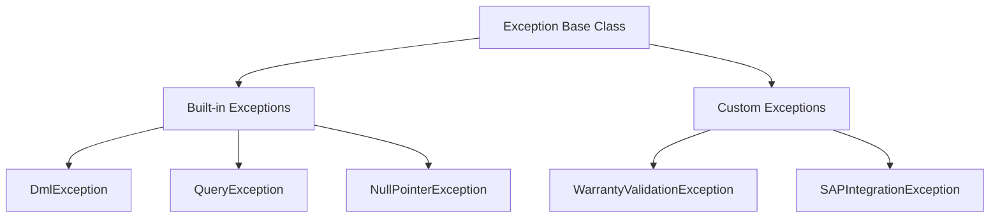

# Apex Exception Handling & Error Management

## 1. Introduction

### What Exceptions are
In Salesforce Apex, an **Exception** is an event that disrupts the normal flow of execution in a program. It is an object that represents an error or an unexpected condition that occurs during runtime.

### Why Exception Handling is important
Exception handling ensures that when an error occurs, the application does not crash abruptly. It allows developers to catch the error, log it, provide meaningful feedback to the user, and gracefully degrade or recover the application state.

### Benefits of Proper Error Handling
* **System Stability:** Prevents unhandled crashes.
* **User Experience:** Displays friendly error messages instead of raw system stack traces.
* **Data Integrity:** Allows for transaction rollbacks, ensuring partial data isn't committed.
* **Maintainability:** Centralized error logging makes debugging and fixing issues easier.

### Real-World Business Examples (Automotive CRM)
* **Warranty Claim Validation:** A dealer submits a claim for a vehicle, but the mileage exceeds the warranty limit. An exception prevents the claim from being saved.
* **SAP Integration Failures:** An Apex callout attempts to send a Spare Parts Order to SAP. If the SAP server is down, a `CalloutException` is handled, and the order is marked for retry.

---

## 2. What is an Exception?

### Definition
An exception is a runtime error. Unlike compile-time errors (syntax errors caught when saving code), runtime errors happen when the code is executed and encounters an illegal operation.

### Runtime Errors & Exception Objects
When an error occurs, Apex creates an **Exception Object** containing metadata about the error (message, line number, type). 

### Error Propagation & Program Termination
If the exception is not handled (caught), it **propagates** up the call stack. If it reaches the top level without being caught, the transaction terminates, and all database operations in that transaction are automatically rolled back.

---

## 3. Apex Exception Architecture

### Exception Class
At the root of the Apex exception hierarchy is the built-in `Exception` class. All exceptions, whether built-in or custom, extend from this class.

### Built-in vs Custom Exceptions
* **Built-in:** Provided by the Salesforce platform (e.g., `DmlException`, `NullPointerException`).
* **Custom:** Defined by developers to represent specific business logic errors.

### Exception Hierarchy


---

## 4. Exception Handling Flow

### Code Execution to Transaction Completion
1.  **Code Execution:** Apex executes instructions sequentially.
2.  **Exception Occurrence:** An illegal operation occurs (e.g., dividing by zero).
3.  **Exception Object Creation:** The system instantiates an Exception object.
4.  **Stack Unwinding:** Apex looks for a `catch` block in the current method. If none is found, it moves to the calling method, unwinding the call stack.
5.  **Matching Catch Block:** When a compatible `catch` block is found, execution jumps into it.
6.  **finally Block Execution:** Regardless of whether an exception occurred or was caught, the `finally` block always executes.
7.  **Transaction Completion:** Execution continues after the `finally` block, or terminates if the exception was unhandled.

---

## 5. try Block

### Purpose
The `try` block encloses the code that might generate an exception.

### Syntax & Scope
Variables declared inside the `try` block are limited to its scope and cannot be accessed in the `catch` or `finally` blocks.

### Example
```java
try {
    // Attempting to insert a vehicle record
    Vehicle__c v = new Vehicle__c();
    insert v; // Missing required fields will cause DmlException
}
```
**Line-by-line explanation:**
* `try {`: Initiates the block monitored for exceptions.
* `Vehicle__c v = new Vehicle__c();`: Instantiates a new sObject. (Scope: Local to try).
* `insert v;`: DML operation. If `v` lacks required fields, execution stops here and jumps to the catch block.
* `}`: Ends the try block.

---

## 6. catch Block

### Purpose
The `catch` block handles the exception thrown by the `try` block.

### Exception Matching
A `catch` block specifies the type of exception it can handle. If the thrown exception matches the type (or is a subclass), the block executes.

### Example
```java
catch (DmlException ex) {
    System.debug('Error inserting vehicle: ' + ex.getMessage());
}
```
**Line-by-line explanation:**
* `catch (DmlException ex) {`: Catches a `DmlException` and assigns it to the variable `ex`.
* `System.debug(...);`: Logs the specific error message to the debug log.
* `}`: Ends the catch block.

---

## 7. finally Block

### Purpose & Guaranteed Execution
The `finally` block is used to execute critical cleanup code. It executes **guaranteed**, whether an exception is thrown or not, unless the governor limits are exceeded (which terminates the entire transaction instantly).

### Example
```java
Boolean isProcessing = true;
try {
    // process data
} catch (Exception ex) {
    // handle error
} finally {
    isProcessing = false; 
}
```
**Line-by-line explanation:**
* `finally {`: Initiates the finally block.
* `isProcessing = false;`: Resets the flag. This runs even if a return statement exists in the try/catch, guaranteeing state cleanup.

---

## 8. Multiple Catch Blocks

### Handling Different Exceptions
You can stack multiple catch blocks to handle different types of errors differently.

### Order of Catch Blocks
**Rule:** Catch blocks must be ordered from the *most specific* exception type to the *most generic* (`Exception`).

### Example
```java
try {
    // Call SAP API
} catch (CalloutException ce) {
    // Specific to API failures
} catch (DmlException de) {
    // Specific to database failures
} catch (Exception e) {
    // Fallback for any other exceptions
}
```

---

## 9. Exception Methods

### Comparison Table

| Method | Description |
| :--- | :--- |
| `getMessage()` | Returns the error message string. |
| `getStackTraceString()`| Returns the execution stack trace as a string. Critical for debugging. |
| `getLineNumber()` | Returns the line number where the exception was thrown. |
| `getTypeName()` | Returns the type of exception (e.g., `System.DmlException`). |
| `getCause()` | Returns the underlying exception that caused this one (used in chained exceptions). |

---

## 10. Built-in Exceptions in Apex

| Exception Type | When it occurs | Resolution/Best Practice |
| :--- | :--- | :--- |
| `DmlException` | DML operation fails (e.g., validation rule). | Validate data before DML. |
| `QueryException` | SOQL fails (e.g., assigning multiple rows to a single sObject). | Use Lists to receive SOQL results. |
| `NullPointerException` | Dereferencing a null object. | Null checks (`if(obj != null)` or safe navigation `?.`). |
| `ListException` | Accessing out-of-bounds list index. | Check `List.size()` before access. |
| `MathException` | Invalid math operations (e.g., divide by zero). | Validate divisors. |
| `LimitException` | Exceeding governor limits. | **Cannot be caught.** Write bulkified code. |
| `CalloutException` | HTTP callout fails. | Implement retry logic. |

---

## 11. DML Exceptions

### Deep Dive
Occurs during `insert`, `update`, `delete`, or `undelete`. Includes validation rules, missing required fields, or duplicate rule failures.

### Example
```java
try {
    // Attempting to insert an empty list or invalid record
    Account acc = new Account();
    insert acc; // Fails if 'Name' is required
}
catch(DmlException ex) {
    System.debug(ex.getMessage());
}
```
**Line-by-line explanation:**
* `Account acc = new Account();`: Creates empty account.
* `insert acc;`: Throws DmlException because standard Account requires a Name.
* `catch(DmlException ex) {`: Catches the DML failure.
* `System.debug(ex.getMessage());`: Logs: "Insert failed. First exception on row 0; first error: REQUIRED_FIELD_MISSING..."

---

## 12. Query Exceptions

### Occurrences
1. **No rows returned:** When assigning a SOQL result to a single sObject variable and nothing matches.
2. **Too many rows returned:** When assigning a SOQL result returning >1 row to a single sObject variable.

### Example
```java
try {
    Account acc = [SELECT Id FROM Account WHERE Name = 'NonExistentDealer' LIMIT 1];
} catch (QueryException qe) {
    System.debug('Dealer not found.');
}
```
**Best Practice:** Always assign SOQL results to a `List<sObject>` to avoid `QueryException`.

---

## 13. Null Pointer Exceptions

### Causes & Prevention
Occurs when you call a method or access a field on a variable that is `null`.

### Example
```java
String vinNumber; // Currently null
try {
    Integer len = vinNumber.length(); // Throws NullPointerException
} catch (NullPointerException npe) {
    System.debug('VIN is not initialized');
}
```
**Prevention:** Use Safe Navigation Operator: `Integer len = vinNumber?.length();`

---

## 14. List Exceptions

### Causes
Accessing an index that doesn't exist in an array/list.

### Example
```java
List<String> dealers = new List<String>{'Dealer A'};
try {
    String dealerB = dealers[1]; // Throws ListException
} catch (ListException le) {
    System.debug('Index out of bounds');
}
```

---

## 15. Math Exceptions

### Causes
Arithmetic errors.

### Example
```java
Integer claimsProcessed = 10;
Integer timeTaken = 0;
try {
    Integer rate = claimsProcessed / timeTaken;
} catch (MathException me) {
    System.debug('Cannot divide by zero');
}
```

---

## 16. Limit Exceptions

### Deep Dive
Governor limits (e.g., SOQL 101, CPU Time, Heap Size) protect the multitenant environment.

**IMPORTANT:** `LimitException` **CANNOT** be caught by a `catch` block.
Salesforce designed it this way because a limit breach means the transaction is actively harming platform stability; the system kills it immediately. 

### Example (Uncatchable)
```java
// DO NOT DO THIS. Even with try-catch, this will crash the transaction.
try {
    for(Integer i=0; i<150; i++) {
        List<Account> accs = [SELECT Id FROM Account]; // SOQL 101 Limit Exception
    }
} catch (Exception e) {
    // THIS BLOCK WILL NEVER EXECUTE ON A LIMIT EXCEPTION
}
```

---

## 17. Custom Exceptions

### Creating Business Exceptions
Extend the base `Exception` class. The class name must end with `Exception`.

### Example
```java
public class InvalidMileageException extends Exception {}

// Usage
if (claim.Mileage__c > 100000) {
    throw new InvalidMileageException('Mileage exceeds warranty limits.');
}
```

---

## 18. throw Keyword

### Throwing Exceptions
Used to manually trigger an exception, usually for business validation that standard validation rules cannot handle complexly.

### Example
```java
public void processClaim(Warranty_Claim__c claim) {
    if (claim.Status__c == 'Closed') {
        throw new CustomValidationException('Cannot modify a closed claim.');
    }
}
```

---

## 19. Exception Propagation

### Call Stack Mechanism
If Method C throws an exception, and doesn't catch it, it propagates to Method B. If B doesn't catch it, it goes to Method A.

```text
[Call Stack]
Method A -> calls Method B -> calls Method C (Throws Exception)
   ^                                   |
   |___________________________________| (Propagates if uncaught)
```

---

## 20. Savepoints and Rollbacks

### Transaction Management
By default, an unhandled exception rolls back the entire transaction. If you handle an exception, the transaction **is not rolled back automatically**. You must use Savepoints to roll back manually.

### Example
```java
Savepoint sp = Database.setSavepoint();
try {
    insert workOrder;
    insert invoice; // If this fails, DmlException is caught
} catch (Exception e) {
    Database.rollback(sp); // Rolls back the workOrder insertion
    System.debug('Transaction rolled back: ' + e.getMessage());
}
```

---

## 21. Partial Success Operations

### allOrNone Parameter
`Database.insert(records, false)` allows partial success. Valid records are committed, invalid ones are rejected, and **no DmlException is thrown**.

### Example
```java
Database.SaveResult[] results = Database.insert(claimsList, false);

for (Database.SaveResult sr : results) {
    if (!sr.isSuccess()) {
        for(Database.Error err : sr.getErrors()) {
            System.debug('Error on claim: ' + err.getMessage());
        }
    }
}
```

---

## 22. Exception Handling in Triggers

### Bulk-safe Error Handling
Do not throw exceptions in a way that stops the whole transaction if only one record is bad. Use the `.addError()` method on the sObject.

### Example
```java
for (Vehicle__c v : Trigger.new) {
    if (v.VIN__c == null) {
        v.addError('VIN is required for new vehicles.'); // Partial failure, transaction continues for valid records
    }
}
```

---

## 23. Exception Handling in Batch Apex

### Batch Failures
Each `execute` method runs in its own transaction. A failure in one batch does not stop other batches.
Use `Database.Stateful` to collect errors and log them in the `finish` method.

---

## 24. Exception Handling in Queueable Apex

### Async Failures
Queueable jobs can be chained. If a job fails, the chain breaks. Implement `Database.AllowsCallouts` if making API calls, and utilize custom logging inside the try-catch block to record failures since debug logs might not be easily accessible.

---

## 25. Exception Handling in Future Methods

### Limitations
Future methods return `void`. You cannot return success/failure to the caller. Always log errors to a Custom Object (`Error_Log__c`) so administrators can see asynchronous failures.

---

## 26. Exception Handling in LWC

### AuraHandledException
To pass a meaningful error message from Apex to Lightning Web Components, you MUST throw an `AuraHandledException`.

### Example
```java
@AuraEnabled
public static void processOrder() {
    try {
        // processing
    } catch (Exception e) {
        throw new AuraHandledException('Custom error for LWC: ' + e.getMessage());
    }
}
```

---

## 27. Enterprise Error Logging

### Custom Log Objects
Create an `Error_Log__c` object to track exceptions persistently. Platform Events (`Error_Event__e`) are preferred because they commit independently of the current transaction's rollback state.

### Example Strategy
```java
// Inside a Catch block
Error_Event__e evt = new Error_Event__e(
    Message__c = e.getMessage(),
    Stack_Trace__c = e.getStackTraceString()
);
EventBus.publish(evt);
```

---

## 28. Real Project Scenarios (Automotive CRM)

* **Warranty Claim Validation Errors:** Using `addError()` in triggers to reject claims missing labor codes.
* **SAP Integration Failures:** Catching `CalloutException` when syncing Dealer Info and logging to `Integration_Log__c`.
* **Invoice Generation Errors:** Using Savepoints to ensure Work Orders and Invoices are generated completely or not at all.
* **Vehicle Data Validation:** Catching `NullPointerException` when processing JSON from an external IoT API.
* **Bulk Claim Processing:** Using `Database.update(claims, false)` to ensure a single bad claim doesn't prevent 199 valid ones from updating.

---

## 29. Performance Considerations

### Overhead
Exception handling has a CPU cost. Do not use exceptions for standard control flow (e.g., throwing an exception to exit a loop). Use `break` or `return`.
Beware of logging too heavily synchronously; use Platform Events to offload logging costs.

---

## 30. Best Practices

1.  **Catch specific exceptions** before generic `Exception`.
2.  **Never swallow exceptions silently:** An empty catch block `catch(Exception e){}` hides fatal errors.
3.  **Use custom exceptions** for business logic (e.g., `InvalidVINException`).
4.  **Use `Database.setSavepoint()`** for multi-DML transactions.
5.  **Use Platform Events** for logging so errors are recorded even if the transaction rolls back.

---

## 31. Common Mistakes

* **Empty catch blocks:** Destroys traceability.
* **Trying to catch LimitException:** Impossible. Fix the architecture instead.
* **Not resetting data on rollback:** Variables modified before a rollback retain their modified values in Apex memory, even though the database is rolled back.

---

## 32. Debugging Exceptions

### Tools
* **Developer Console:** View Execution Logs and Stack Traces.
* **Debug Logs:** Set Trace Flags for specific users to capture runtime exceptions.
* **VS Code Replay Debugger:** Download the log and step backward/forward to see the exact state before the exception.

---

## 33. Interview Questions & Answers

**Q (Beginner): What is the difference between `finally` and `catch`?**
*A:* `catch` only executes if an exception occurs. `finally` executes regardless, used for cleanup.

**Q (Intermediate): Can you catch a LimitException?**
*A:* No. LimitExceptions terminate the transaction immediately to protect the multitenant environment.

**Q (Advanced): How do you log an error in the database when the transaction rolls back?**
*A:* Publish a Platform Event configured to "Publish Immediately", or use an asynchronous `@future` method (though future methods are subject to limit context).

**Q (Architect): Compare `insert` vs `Database.insert(records, false)` in bulk processing.**
*A:* `insert` is all-or-none. One failure throws a DmlException and rolls back all. `Database.insert(..., false)` processes successful records and returns an array of SaveResults containing errors for the failed ones.

---

## 34. Revision Summary

* **try/catch/finally:** Enclose risky code, handle errors, guarantee cleanup.
* **Built-in:** `DmlException`, `QueryException`, `NullPointerException`.
* **Custom Exceptions:** Extend `Exception`, use for business logic.
* **throw:** Manually instantiate and throw exceptions.
* **Savepoints/Rollback:** Explicit transaction control when catching DML errors.
* **Partial Success:** `Database.insert(list, false)` avoids exceptions.
* **Error Logging:** Use Platform Events to bypass transaction rollbacks.
* **Best Practices:** Never swallow exceptions, use specific catches, never catch generic Exception unless as a final fallback.