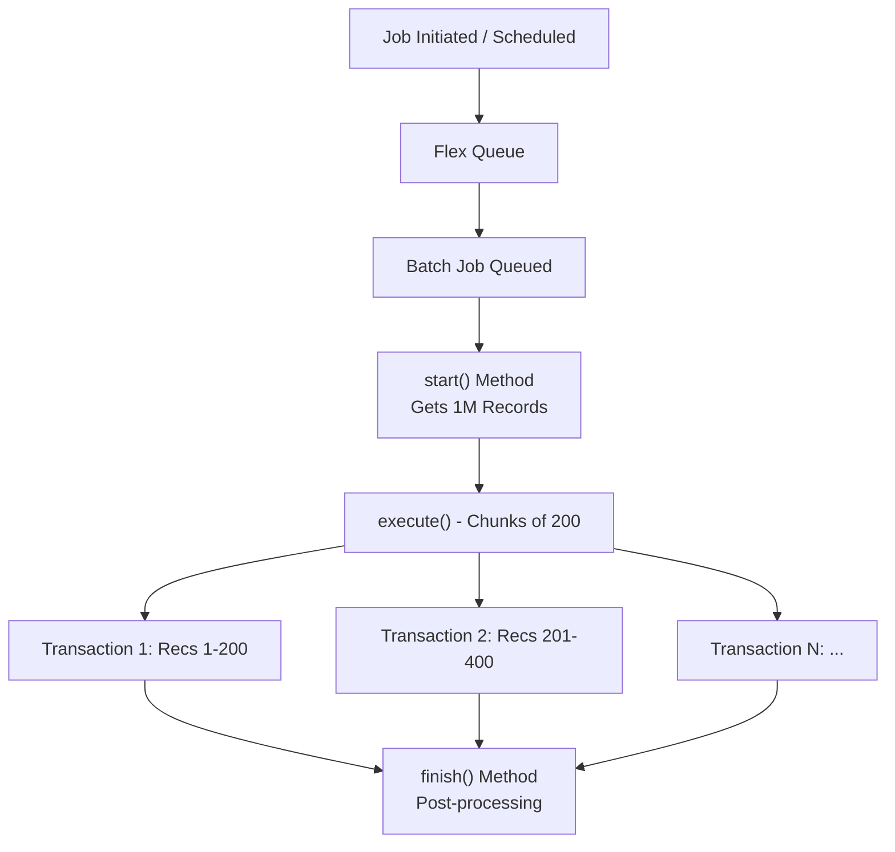
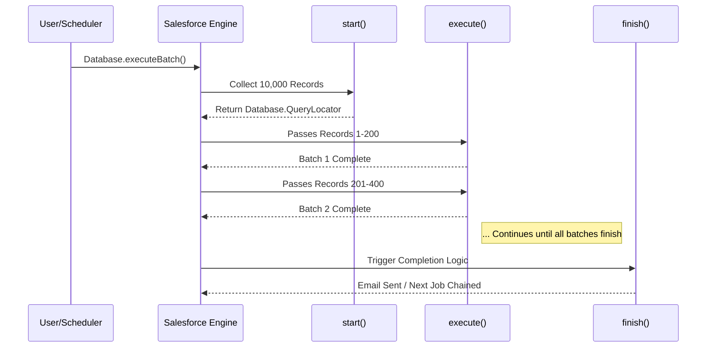

# Batch Apex – Large Data Processing

## 1. Introduction

### What is Asynchronous Apex?
Asynchronous Apex runs in the background, in a separate thread, without holding up the user interface or current transaction. It provides higher governor limits (like CPU time and heap size) to handle complex computations and integrations.

### What is Batch Apex?
Batch Apex is a specific type of Asynchronous Apex designed to process Large Data Volumes (LDV) — up to 50 million records. It divides a massive dataset into smaller, manageable chunks (batches) and processes each chunk as a separate, independent transaction.

### Why Salesforce Introduced Batch Apex
Salesforce operates on a multi-tenant architecture strictly regulated by Governor Limits (e.g., 10,000 DML rows, 50,000 SOQL rows per transaction). Processing millions of records synchronously would instantly hit these limits. Batch Apex was introduced to safely bypass synchronous limits by breaking large jobs into sequential micro-transactions.

### Benefits Over Synchronous Processing
* **Higher Limits:** CPU time limit is 60 seconds (vs 10s sync), heap size is 12MB (vs 6MB sync).
* **Limit Resets:** Governor limits are reset for every batch chunk.
* **Massive Scale:** Safely query up to 50 million records.
* **Non-blocking:** End-users can continue working while the system processes data in the background.

**Real-world Example:** An Automotive Manufacturer needs to automatically expire 2 million Warranty Policies at midnight. A synchronous script would crash immediately. Batch Apex processes them 200 at a time over several minutes without impacting system performance.

---

## 2. What is Batch Apex?

### Definition
Batch Apex is programmatic execution of business logic across thousands or millions of records using the `Database.Batchable` interface. 

### Purpose & Background Execution
Its primary purpose is to handle heavy, data-intensive operations asynchronously. It is placed in the Salesforce Flex Queue and executes when system resources become available.

### Large Data Volume (LDV) & Scalability
Batch Apex is the cornerstone of Salesforce's LDV strategy. Whether it's end-of-year data archival, mass territory realignments, or syncing a million records to SAP, Batch Apex scales seamlessly because it strictly partitions data processing.

### Architecture Diagram



---

## 3. Why Do We Need Batch Apex?

Batch Apex is strictly necessary whenever data operations exceed synchronous governor limits. Common enterprise scenarios include:

* **Processing millions of records:** Recalculating dealer commission for 5 million Closed Won Opportunities.
* **Data cleanup:** Identifying and purging duplicate `Customer__c` records created by legacy integrations.
* **Record migration:** Transforming data structures when a company merges two Salesforce orgs.
* **Nightly processing:** Generating daily `Invoice__c` records from aggregated `WorkOrder__c` and `ClaimLine__c` records.
* **Scheduled maintenance:** Updating the `Status__c` of vehicles to 'Out of Warranty' based on date.
* **External system synchronization:** Fetching large sets of spare parts from an ERP system (SAP/Oracle) via callouts.

---

## 4. Understanding the Batch Apex Lifecycle

The lifecycle consists of three sequential phases:

1.  **`start()`**: 
    * Executes exactly once. 
    * Collects the records or objects to be passed to the interface. 
    * Bypasses the 50,000 SOQL limit, allowing up to 50 million records.
2.  **`execute()`**: 
    * Executes multiple times. 
    * Takes a chunk (batch) of records returned by `start()` (default 200).
    * Applies the business logic (DML, callouts, calculations).
    * Governor limits reset at the start of *each* `execute()` block.
3.  **`finish()`**: 
    * Executes exactly once after all batches are processed.
    * Used for post-job actions like sending summary emails or chaining another batch job.



---

## 5. Database.Batchable Interface

To create a batch class, it must implement `Database.Batchable<SObject>`.

```apex
// Implementing the Batchable interface for SObjects
public class WarrantyClaimBatch implements Database.Batchable<SObject> {

    // 1. START METHOD
    public Database.QueryLocator start(Database.BatchableContext bc) {
        return Database.getQueryLocator([
            SELECT Id, Status__c FROM Warranty_Claim__c WHERE Status__c = 'Pending'
        ]);
    }

    // 2. EXECUTE METHOD
    public void execute(Database.BatchableContext bc, List<Warranty_Claim__c> scope) {
        for (Warranty_Claim__c claim : scope) {
            claim.Status__c = 'Processed';
        }
        update scope;
    }

    // 3. FINISH METHOD
    public void finish(Database.BatchableContext bc) {
        System.debug('Warranty Claim Processing Completed.');
    }
}
```

### Line-by-Line Explanation:
* `public class WarrantyClaimBatch implements Database.Batchable<SObject>`: Class definition implementing the required interface.
* `public Database.QueryLocator start(Database.BatchableContext bc)`: Method signature for `start()`. Receives context variable `bc` containing the Job ID.
* `return Database.getQueryLocator(...)`: Safely queries up to 50M records.
* `public void execute(Database.BatchableContext bc, List<Warranty_Claim__c> scope)`: The chunk processor. `scope` holds max 2,000 records (default 200).
* `update scope;`: Performs a bulkified DML operation on the chunk.
* `public void finish(Database.BatchableContext bc)`: Cleanup method, executed after all chunks are committed.

---

## 6. The start() Method

The `start()` method is the data sourcing engine. It is responsible for gathering all records to be processed.

**Return Types:**
It can return either a `Database.QueryLocator` or an `Iterable<sObject>`.

| Feature | QueryLocator | Iterable |
| :--- | :--- | :--- |
| **Max Records** | 50,000,000 (50 Million) | 50,000 (Governor Limit applies) |
| **Use Case** | Standard SOQL queries on Salesforce records. | Complex logic, custom classes, API callouts, non-SObject processing. |
| **Memory** | Highly optimized, doesn't load all in heap. | Loads collection into heap size. |

---

## 7. Database.QueryLocator

`Database.QueryLocator` allows you to bypass the standard SOQL limit (50k) and fetch up to **50 million records**. 

### Internal Working
It does not pull 50 million records into CPU memory (which would instantly crash the heap). Instead, it acts as a server-side cursor, keeping track of the query and fetching records sequentially in chunks as the `execute()` method requests them.

```apex
public Database.QueryLocator start(Database.BatchableContext bc) {
    // String query allows dynamic SOQL generation if needed
    String query = 'SELECT Id, VIN__c FROM Vehicle__c WHERE Odometer_Reading__c > 100000';
    
    // Returns the QueryLocator cursor, bypassing the 50K SOQL limit
    return Database.getQueryLocator(query);
}
```

---

## 8. Iterable in Batch Apex

When you need to process a custom data structure (e.g., parsing a complex JSON payload, calculating data across multiple related objects, or making an API callout to get a list of IDs), you use an `Iterable`.

```apex
public class CustomDataIterableBatch implements Database.Batchable<String> {
    
    public Iterable<String> start(Database.BatchableContext bc) {
        List<String> apiEndpoints = new List<String>();
        apiEndpoints.add('[https://api.sap.com/dealer/1001](https://api.sap.com/dealer/1001)');
        apiEndpoints.add('[https://api.sap.com/dealer/1002](https://api.sap.com/dealer/1002)');
        return apiEndpoints; // Returning a standard List acts as an Iterable
    }

    public void execute(Database.BatchableContext bc, List<String> scope) {
        // scope contains strings, not SObjects
        for(String endpoint : scope) {
            // perform logic
        }
    }

    public void finish(Database.BatchableContext bc) {}
}
```
*Note: With Iterables, the standard 50,000 limit for lists/SOQL applies during the `start()` method.*

---

## 9. The execute() Method

The `execute()` method does the actual heavy lifting.

### Independent Transactions
Every execution of `execute()` is a completely separate Salesforce transaction. If your job has 1,000 records and a batch size of 200, `execute()` runs 5 times. 
* If Batch 3 fails due to a DML exception, Batches 1, 2, 4, and 5 still succeed. There is **no overall rollback** for the entire batch job.

```apex
public void execute(Database.BatchableContext bc, List<Invoice__c> scope) {
    // 1. Extract IDs or data if needed for mapping
    Set<Id> accountIds = new Set<Id>();
    
    // 2. Process records
    for (Invoice__c inv : scope) {
        inv.Status__c = 'Overdue';
        inv.Penalty_Applied__c = true;
    }
    
    // 3. Perform DML (Always outside the loop!)
    // Using Database.update with allOrNone=false to prevent whole chunk failure on single record error
    Database.SaveResult[] results = Database.update(scope, false);
    
    // 4. Log errors via a utility class
    ErrorLoggerService.logErrors(results, 'InvoiceBatch');
}
```

---

## 10. Batch Size

Batch size dictates how many records are sent to the `execute()` method at a time.

* **Default Batch Size:** 200
* **Maximum Batch Size:** 2000
* **Minimum Batch Size:** 1

```apex
// Executing with default size (200)
Id jobId = Database.executeBatch(new WarrantyBatch());

// Executing with custom size (e.g., 50 for heavy processing)
Id jobIdCustom = Database.executeBatch(new WarrantyBatch(), 50);
```

### Sizing Strategy
| Batch Size | Best For | Risk |
| :--- | :--- | :--- |
| **Small (1 - 50)** | Heavy CPU operations, API callouts, complex trigger frameworks running on objects. | Takes longer to complete overall job. Uses more Async executions. |
| **Default (200)** | Standard operations. | Trigger limits might hit if triggers are poorly written. |
| **Large (201 - 2000)** | Simple field updates, highly optimized environments. | High risk of hitting CPU Time limits (60s) or Heap limits. |

---

## 11. The finish() Method

The `finish()` method runs exactly once at the very end. It is normally used for sending status notifications or chaining the next process in an enterprise pipeline.

```apex
public void finish(Database.BatchableContext bc) {
    // Query job metrics
    AsyncApexJob job = [SELECT Id, Status, NumberOfErrors, JobItemsProcessed, TotalJobItems
                        FROM AsyncApexJob WHERE Id = :bc.getJobId()];
                        
    // Send notification
    Messaging.SingleEmailMessage mail = new Messaging.SingleEmailMessage();
    mail.setToAddresses(new String[] {'admin@automotive.com'});
    mail.setSubject('Warranty Processing Complete: ' + job.Status);
    mail.setPlainTextBody('Batches Processed: ' + job.TotalJobItems + ' Errors: ' + job.NumberOfErrors);
    Messaging.sendEmail(new Messaging.SingleEmailMessage[] { mail });
    
    // Chain next batch
    if(job.NumberOfErrors == 0) {
        Database.executeBatch(new InvoiceGenerationBatch(), 200);
    }
}
```

---

## 12. Database.Stateful

By default, Batch Apex is **stateless**. This means instance variables (class-level variables) lose their values between `execute()` calls.
If you need to count records, sum up revenue, or retain lists of failed IDs across multiple batches, you must implement `Database.Stateful`.

```apex
public class DealerRevenueBatch implements Database.Batchable<sObject>, Database.Stateful {
    
    // State is preserved across execute() calls
    public Decimal totalRevenueProcessed = 0;
    public Integer totalFailedRecords = 0;

    public Database.QueryLocator start(Database.BatchableContext bc) {
        return Database.getQueryLocator([SELECT Amount__c FROM Opportunity WHERE IsWon = TRUE]);
    }

    public void execute(Database.BatchableContext bc, List<Opportunity> scope) {
        for(Opportunity opp : scope) {
            totalRevenueProcessed += opp.Amount__c; // Incrementing stateful variable
        }
    }

    public void finish(Database.BatchableContext bc) {
        System.debug('Grand Total Revenue: ' + totalRevenueProcessed);
        // Can save this to a custom setting or logging object
    }
}
```
*Warning: Using `Database.Stateful` consumes more memory. Do not use it to store large lists of SObjects, or you will hit the 12MB heap limit during the job run.*

---

## 13. Database.AllowsCallouts

To make HTTP REST or SOAP callouts inside a Batch class, you must implement `Database.AllowsCallouts`. Without this, Salesforce will throw a `CalloutException`.

```apex
public class SAPInventorySyncBatch implements Database.Batchable<sObject>, Database.AllowsCallouts {
    
    public Database.QueryLocator start(Database.BatchableContext bc) {
        return Database.getQueryLocator([SELECT Id, SAP_ID__c FROM Part__c WHERE Needs_Sync__c = TRUE]);
    }

    public void execute(Database.BatchableContext bc, List<Part__c> scope) {
        for (Part__c part : scope) {
            // 1. Prepare HTTP request
            Http http = new Http();
            HttpRequest req = new HttpRequest();
            req.setEndpoint('callout:SAP_Credentials/api/inventory/' + part.SAP_ID__c);
            req.setMethod('GET');
            
            // 2. Perform Callout (Governor limit: 100 callouts per execute() chunk)
            HttpResponse res = http.send(req);
            
            if (res.getStatusCode() == 200) {
                part.Inventory_Level__c = Decimal.valueOf(res.getBody());
                part.Needs_Sync__c = false;
            }
        }
        update scope;
    }
    
    public void finish(Database.BatchableContext bc) {}
}
```
*Best Practice:* If doing 1 API call per record, limit your batch size to 100, as the maximum callouts per transaction (execute block) is 100.

---

## 14. Batch Chaining

Batch Chaining is calling another Batch class from the `finish()` method of the current Batch class. This creates sequential enterprise pipelines.

**Use Case:** 1. Process all daily Work Orders (Batch 1).
2. Create Invoices for those Work Orders (Batch 2).
3. Send Email PDFs to customers (Batch 3).

```apex
public void finish(Database.BatchableContext bc) {
    // Check if limits allow launching another batch
    if(Limits.getBatchJobs() < Limits.getLimitBatchJobs()) {
        Database.executeBatch(new InvoiceGenerationBatch(), 200);
    }
}
```
*Note:* You can only chain ONE batch job per `finish()` method.

---

## 15. Scheduling Batch Apex

To automate Batch Apex, the class must implement the `Schedulable` interface. You can implement both interfaces on the same class.

```apex
public class NightlyCleanupBatch implements Database.Batchable<sObject>, Schedulable {
    
    // Batch Methods
    public Database.QueryLocator start(Database.BatchableContext bc) { ... }
    public void execute(Database.BatchableContext bc, List<SObject> scope) { ... }
    public void finish(Database.BatchableContext bc) { ... }
    
    // Schedulable Method
    public void execute(SchedulableContext sc) {
        NightlyCleanupBatch batchJob = new NightlyCleanupBatch();
        Database.executeBatch(batchJob, 200);
    }
}
```

**Scheduling via Developer Console (CRON):**
```apex
// Sec Min Hour Day Month DayOfWeek Year
String cronExp = '0 0 2 * * ?'; // Run at 2 AM every day
System.schedule('Nightly Data Cleanup', cronExp, new NightlyCleanupBatch());
```

---

## 16. Monitoring Batch Apex

Batch jobs can be monitored via UI and SOQL.

**1. UI Monitoring:**
Setup -> Environments -> Jobs -> **Apex Jobs**

**2. SOQL Monitoring (`AsyncApexJob`):**
```apex
SELECT Id, Status, JobItemsProcessed, TotalJobItems, NumberOfErrors, MethodName 
FROM AsyncApexJob 
WHERE JobType = 'BatchApex' AND CreatedDate = TODAY
```
**Status Values:** Queued, Processing, Aborted, Completed, Failed, Preparing.

---

## 17. Governor Limits

Governor limits behave differently for Batch Apex.

| Limit Type | Sync Apex Limit | Batch Apex Limit | Reset Behavior |
| :--- | :--- | :--- | :--- |
| **Max Records via QueryLocator** | 50,000 | **50,000,000** | Only for `start()` |
| **SOQL Queries** | 100 | **200** | Resets per `execute()` |
| **DML Statements** | 150 | 150 | Resets per `execute()` |
| **Heap Size** | 6 MB | **12 MB** | Resets per `execute()` |
| **CPU Time** | 10,000 ms (10s) | **60,000 ms (60s)** | Resets per `execute()` |
| **Callouts** | 100 | 100 | Resets per `execute()` |
| **Active Batch Jobs** | N/A | **5 concurrent** | Org-wide limit |
| **Flex Queue Limit** | N/A | **100 queued** | Org-wide limit |

---

## 18. Transaction Separation

A critical concept for Architects: **Partial Success**.

* If you have a batch of 1,000 records, chunked into 5 sizes of 200.
* Chunk 1 (1-200): Success (Committed to DB)
* Chunk 2 (201-400): Throws a `NullPointerException`. Execution halts for Chunk 2, rolls back *only* Chunk 2.
* Chunk 3 (401-600): Processes normally. Success (Committed to DB).

To prevent a single record from failing a whole chunk, use `Database.update(records, false)`.

---

## 19. Error Handling

Proper error handling is vital for large data processing.

```apex
public void execute(Database.BatchableContext bc, List<Account> scope) {
    try {
        // ... logic ...
        Database.SaveResult[] results = Database.update(scope, false); // allOrNone = false
        
        for (Database.SaveResult sr : results) {
            if (!sr.isSuccess()) {
                for(Database.Error err : sr.getErrors()) {
                    // Log custom object record
                    System.debug('Error: ' + err.getStatusCode() + ': ' + err.getMessage());
                    // Real project: Insert an Error_Log__c record here
                }
            }
        }
    } catch (Exception e) {
        // Catch catastrophic execution errors
        // Real project: Log to Error_Log__c
        System.debug('Critical Batch Error: ' + e.getMessage());
    }
}
```

---

## 20. Testing Batch Apex

Testing Async Apex requires encapsulating the execution within `Test.startTest()` and `Test.stopTest()`. The `Test.stopTest()` method forces the asynchronous batch to run synchronously right then, allowing you to assert the results.

```apex
@isTest
private class WarrantyBatchTest {
    
    @testSetup
    static void setupData() {
        List<Warranty_Claim__c> claims = new List<Warranty_Claim__c>();
        for(Integer i = 0; i < 200; i++) {
            claims.add(new Warranty_Claim__c(Status__c = 'Pending', Amount__c = 100));
        }
        insert claims;
    }

    @isTest
    static void testBatchExecution() {
        // Arrange
        WarrantyClaimBatch batch = new WarrantyClaimBatch();
        
        // Act
        Test.startTest();
        Id batchId = Database.executeBatch(batch);
        Test.stopTest(); // Forces the batch to complete synchronously
        
        // Assert
        List<Warranty_Claim__c> updatedClaims = [SELECT Status__c FROM Warranty_Claim__c];
        for (Warranty_Claim__c wc : updatedClaims) {
            System.assertEquals('Processed', wc.Status__c, 'Status should be updated');
        }
    }
}
```
*Limits Note:* You can only call `Database.executeBatch()` **once** per test method.

---

## 21. Batch Apex vs Future Methods

| Feature | Batch Apex | @future Method |
| :--- | :--- | :--- |
| **Data Volume** | Millions (LDV) | Small sets (Lists of IDs, primitives) |
| **Monitoring** | UI and SOQL (AsyncApexJob) | No built-in UI tracking |
| **Chaining** | Yes (via finish method) | No (Future cannot call Future) |
| **Limits Reset** | Resets per chunk (Batch Size) | Single async transaction |

---

## 22. Batch Apex vs Queueable Apex

| Feature | Batch Apex | Queueable Apex |
| :--- | :--- | :--- |
| **Use Case** | Processing 50k+ records. Heavy logic. | Complex integrations, chaining multiple jobs fast. |
| **Parameters** | Primitives via Stateful only. | Can pass complex objects/sObjects natively via constructor. |
| **Chaining** | Only at the end `finish()` (1 chain). | Limitless chaining (Job A calls Job B calls Job C). |
| **Execution Delay** | High (must wait in Flex Queue). | Faster execution time generally. |

---

## 23. Batch Apex vs Scheduled Apex

| Feature | Batch Apex | Scheduled Apex |
| :--- | :--- | :--- |
| **Purpose** | Process records. | Trigger code at a specific time. |
| **Interface** | `Database.Batchable` | `Schedulable` |
| **Combined** | Often implemented together so Batch runs nightly. | Can schedule normal Apex or Queueable. |

---

## 24. Performance Optimization

For enterprise deployments:
* **Selective SOQL:** Always index fields used in the `WHERE` clause of `start()`. Unindexed queries over 200k records will time out.
* **Tune Batch Size:** Don't blindly use 200. If code hits CPU limits, drop to 100 or 50. If code is just updating 1 field, raise to 2000.
* **Optimize `execute()` loops:** Never put SOQL or DML inside a `for` loop.
* **Heap Management:** Set list references to `null` after use to free up heap space before DML. Use `Map` efficiently.

---

## 25. Enterprise Design Patterns

Modern Salesforce architectures avoid putting raw logic in the batch class.

```apex
public void execute(Database.BatchableContext bc, List<Invoice__c> scope) {
    // Bad Pattern: Writing 300 lines of logic here
    
    // Good Pattern: Separation of Concerns (Service Layer)
    InvoiceService.applyOverduePenalties(scope);
    
    // Good Pattern: Unit of Work for DML handling
    fflib_SObjectUnitOfWork uow = new fflib_SObjectUnitOfWork(...);
    uow.commitWork();
}
```

---

## 26. Real Project Scenarios (Automotive CRM)

* **Nightly Warranty Claim Processing:** Batch runs at 1 AM, queries all `Claims` in 'Approved' status, calculates payouts per dealer, and updates status to 'Ready for Payment'.
* **SAP Synchronization:** A batch job polls `Part__c` records updated today. Using `Database.AllowsCallouts`, it pushes price changes to SAP via REST API.
* **Bulk Customer Notifications:** When a vehicle model is recalled, a batch queries 300,000 `Vehicle__c` records, creates `Task` records for dealers, and sends `SingleEmailMessage` to customers.

---

## 27. Common Mistakes

* **Stateful Memory Leaks:** Storing a `List<SObject>` as a class variable in a Stateful batch. It will accumulate across batches and hit the 12MB limit, crashing the whole job.
* **Over-querying in start():** Running `SELECT Id, Description (Large Text) FROM Object` when Description isn't needed. Use targeted SOQL.
* **Hardcoded IDs:** Never hardcode Record Type IDs or User IDs. Query them or use custom labels/settings.
* **Missing Error Logs:** Failing to catch exceptions in `execute()` leads to silent failures. End users won't know data wasn't processed.

---

## 28. Best Practices Checklist

* [x] **Use QueryLocator for large datasets:** Unless you need complex pre-processing API data, rely on QueryLocator.
* [x] **Keep execute() bulkified:** Handle the `scope` list as a bulk operation. No DML/SOQL in loops.
* [x] **Use Database.Stateful only when required:** It slows down execution and limits serialization.
* [x] **Use Database.update(list, false):** Prevent one bad apple from ruining the whole chunk.
* [x] **Separate business logic:** Keep batch classes thin; delegate logic to a Service layer or Handler.
* [x] **Include a Custom Error Logging object:** Track failed batch chunks for admin review.

---

## 29. Debugging Batch Apex

* **AsyncApexJob Query:** Always start by checking `NumberOfErrors` on `AsyncApexJob`.
* **Developer Console:** Switch log filtering to 'Future' or 'Batch' to see individual `execute()` chunk logs. Each chunk creates a distinct log file.
* **System.abortJob(jobId):** If a batch goes rogue, get the ID from setup and abort it via anonymous apex.

---

## 30. Interview Questions & Answers

### Beginner
**Q: What is the default batch size?**
A: 200. Min is 1, max is 2000.

**Q: Can a batch job be called synchronously?**
A: No, except within a test context using `Test.startTest()` and `Test.stopTest()`.

### Intermediate
**Q: How do you bypass the 50,000 SOQL limit in Batch?**
A: By returning a `Database.QueryLocator` in the `start()` method, which handles up to 50 million records.

**Q: How do you track the total number of processed records across batches?**
A: Implement `Database.Stateful` and use a class-level integer variable to aggregate counts in `execute()`.

### Advanced
**Q: What happens if chunk 3 out of 10 throws an unhandled exception?**
A: Chunk 3 fails and rolls back. The remaining chunks (4-10) will still execute. The overall job status might reflect failures.

**Q: Can you do a callout from Batch Apex?**
A: Yes, by implementing the `Database.AllowsCallouts` marker interface.

### Architect-Level
**Q: Your batch job fails due to hitting CPU limits on a 200 batch size, but the logic is optimized. What is your architectural solution?**
A: First, reduce the batch size (e.g., to 100 or 50). Second, analyze any trigger logic executing on the target objects during DML. Third, consider moving complex calculations to an external system (Heroku/AWS) or use platform events to decouple processing.

---

## 31. Revision Summary

* **Batch Apex:** For LDV processing up to 50M records.
* **Interfaces:** `Database.Batchable`, `Database.Stateful`, `Database.AllowsCallouts`, `Schedulable`.
* **Lifecycle:** `start()` -> multiple `execute()` chunks -> `finish()`.
* **QueryLocator vs Iterable:** QueryLocator for SOQL (50M). Iterable for custom lists/API (50k).
* **Limits:** Reset every `execute()` chunk (CPU 60s, Heap 12MB, SOQL 200).
* **Transactions:** Each `execute()` block is a separate transaction.
* **Testing:** Requires `Test.startTest()` and `Test.stopTest()` to execute synchronously. Maximum 1 batch run per test method.