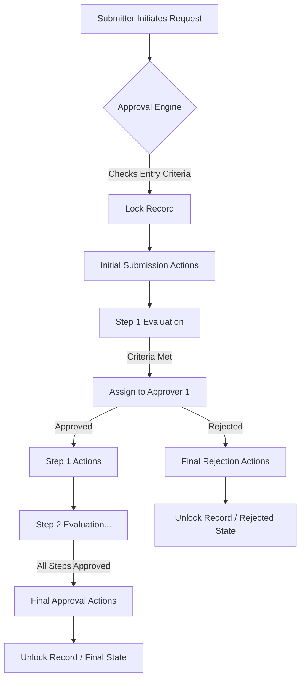
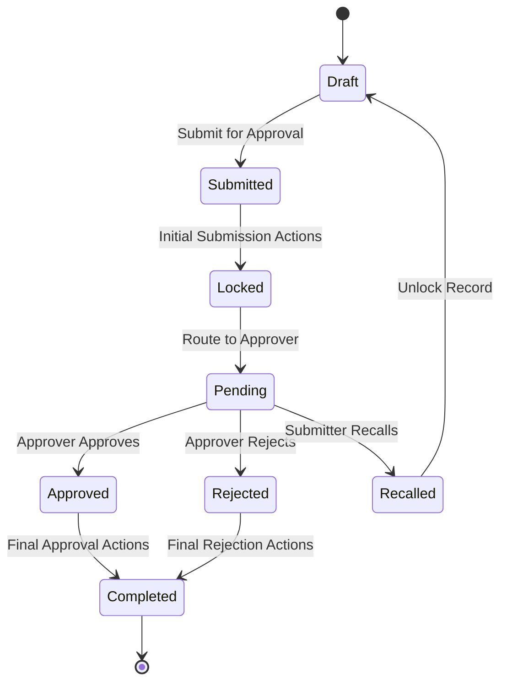

# Salesforce Approval Processes

## 1. Introduction

**What Approval Processes Are**
A Salesforce Approval Process is an automated system mechanism that dictates how records are approved in Salesforce. It specifies each step of the approval, including who must approve it, what happens when it is approved or rejected, and under what conditions the record enters the process.

**Why Businesses Require Approvals**
Organizations use Approval Processes to enforce standardized business rules, maintain data integrity, and ensure proper oversight before critical business actions (like executing a contract or issuing a discount) take place. 

**Governance and Compliance Requirements**
In enterprise environments, approvals are critical for regulatory compliance (e.g., SOX compliance for financial approvals), auditability, and risk management. Approval tracking ensures a historical record of "who approved what and when."

**Real-World Business Examples**
* **Loan Approval:** A loan application exceeding a specific risk score must be approved by a Senior Credit Analyst.
* **Warranty Claim Approval:** Claims over $1,000 require validation by a Technical Service Manager.
* **Discount Approval:** Sales reps offering more than a 15% discount on an Opportunity must get VP approval.
* **Purchase Order Approval:** POs require sequential approval from a Department Head, followed by the CFO if the amount exceeds $50,000.
* **Leave Approval:** Employee time-off requests are routed to their direct manager.

---

## 2. Approval Process Architecture

The architecture of an Approval Process is built on a declarative engine that evaluates criteria and routes work items to designated users.

**Core Architecture Components**
* **Submitter:** The user (or automated process) that triggers the approval request.
* **Approval Request:** The system-generated work item representing the pending decision.
* **Approval Engine:** The Salesforce backend service that evaluates entry criteria, step criteria, and handles routing.
* **Approver:** The assigned user, queue, or delegate authorized to approve or reject the request.
* **Approval Steps:** Sequential nodes in the process. Each step can have its own criteria and assigned approvers.
* **Final Approval:** The concluding state when all required steps are approved.
* **Final Rejection:** The concluding state triggered immediately when any required approver rejects the request.

**Architecture Diagram**



---

## 3. Approval Lifecycle

The lifecycle represents the journey of a single record through the Approval Engine.

**The Complete Lifecycle**
1.  **Record Created:** A user creates or updates a record.
2.  **Submission:** The record is submitted manually by a user via the UI, or automatically via Apex/Flow.
3.  **Entry Criteria Evaluation:** The system checks if the record meets the initial requirements to enter the process.
4.  **Approver Assignment:** The engine routes the request to the first step's designated approver(s).
5.  **Approval Steps:** The approver receives a notification and makes a decision (Approve, Reject, Reassign).
6.  **Final Decision:** The process reaches its terminal state (Approved, Rejected, or Recalled).
7.  **Post-Approval Actions:** The system executes final automated actions (e.g., updating a Status field to "Approved", sending an email).



---

## 4. Components of an Approval Process

**Entry Criteria**
The conditions a record must meet to be submitted for approval. If the criteria are not met, Salesforce throws an error preventing submission.

**Approval Steps**
The sequential tiers of the approval. A process can have one or multiple steps, each with unique criteria (e.g., Step 2 only executes if Discount > 20%).

**Approver Assignment**
The mechanism defining who receives the approval request (e.g., a specific user, a manager, a queue).

**Initial Submission Actions**
Actions that fire the moment a record enters the process. Commonly used to change a "Status" field to "Pending Approval" and lock the record.

**Approval Actions (Step-Level)**
Actions that fire when a specific step is approved.

**Rejection Actions (Step-Level)**
Actions that fire when a specific step is rejected.

**Recall Actions**
Actions that fire if the original submitter withdraws the request.

**Final Approval Actions**
Actions that execute only after all required steps are successfully approved.

**Final Rejection Actions**
Actions that execute when the record is rejected at any point, terminating the process.

---

## 5. Entry Criteria

Entry criteria act as the gatekeeper for the approval process.

**Formula-Based Criteria**
Uses logical formulas to evaluate complex conditions crossing multiple objects.
* **Example:** `AND(Amount > 10000, ISPICKVAL(StageName, "Negotiation"), Owner.Profile.Name = "Sales Rep")`

**Field-Based Criteria**
Uses standard declarative filter logic (Field, Operator, Value).
* **Example:** `Discount_Percentage__c GREATER THAN 15`

**Business Rule Design**
Design entry criteria to be mutually exclusive if multiple approval processes exist on the same object. Salesforce evaluates approval processes in their given order; the record enters the *first* process where the entry criteria are met.

---

## 6. Approval Steps

**Single-Step Approval**
A simple process requiring a decision from one person or queue.
* **Example:** All PTO requests go directly to the direct manager.

**Multi-Step Approval**
Requires consecutive approvals. Each step handles a different tier of authority.
* **Example:** Step 1: Manager. Step 2: VP. Step 3: CEO.

**Sequential Approval**
Approvers must act one after another in a strict order.

**Parallel Approval (Unanimous vs. First Response)**
Assigning a single step to multiple approvers simultaneously.
* **Unanimous:** All assigned approvers must approve.
* **First Response:** The first approver to act decides the outcome for that step.

---

## 7. Approver Assignment Methods

| Assignment Method | Description | Best Use Case |
| :--- | :--- | :--- |
| **User** | A specific, hardcoded Salesforce User. | Rarely recommended, only for static org structures (e.g., single CFO). |
| **Role / Role Hierarchy** | Uses the Salesforce Role Hierarchy to find the submitter's manager. | Standard management escalations. |
| **Manager Field** | Uses the standard `ManagerId` field on the User record. | Direct reports and standard HR approvals. |
| **Related User** | Uses a User Lookup field on the submitted record. | Dynamic routing based on record data (e.g., `Regional_Director__c`). |
| **Queue** | Assigns the request to a group of users. | Tier 1 support or shared service centers. |
| **Dynamic Approver** | Populated via Apex or Flow before submission. | Highly complex matrix organizations. |

---

## 8. Dynamic Approvers

**What Dynamic Approvers Are**
Instead of hardcoding a user or relying on the standard Manager field, dynamic approvers are determined at runtime based on complex business logic, usually stored in a custom lookup field on the record.

**Runtime Approver Selection**
Before the approval process fires, automation evaluates the context (e.g., State, Product Line, Amount) and populates a user lookup field (e.g., `Next_Approver__c`). The Approval Process uses the "Related User" assignment method pointing to this field.

**Flow Integration**
A Before-Save Flow evaluates a custom metadata matrix, finds the correct approver ID, and updates the `Next_Approver__c` field on the record.

**Apex Integration**
Apex Triggers calculate the required approver using complex SOQL queries against territory management or quota objects, populating the designated lookup field prior to submission.

---

## 9. Delegated Approvers

**Purpose**
Allows an assigned approver to nominate another user to approve or reject requests on their behalf, typically during PTO or leave.

**Configuration**
Set on the User record in the "Delegated Approver" field. The approval process step must have the "The approver's delegate may also approve this request" setting checked.

**Business Use Cases**
A VP goes on vacation for two weeks and sets a Director as their delegated approver to prevent bottlenecks in contract approvals.

**Limitations**
* Delegates cannot reassign approval requests.
* Delegated approvers do not receive approval email notifications by default unless specifically configured in their user settings.

---

## 10. Approval Actions

**Field Update**
Updates a specific field on the record. 
* **Example:** Changing `Status__c` from "Pending" to "Approved".

**Email Alert**
Sends a template-based email to specific users.
* **Example:** Notifying the original submitter that their quote was rejected.

**Task Creation**
Generates a Salesforce Task assigned to a user.
* **Example:** Creating a task for Legal to review the approved contract terms.

**Outbound Message**
Sends a SOAP message to an external system.
* **Example:** Notifying an external ERP system (like SAP) that a Purchase Order is approved.

**Flow Invocation**
Approval processes cannot *directly* invoke Flows as an action. However, a Field Update action can trigger an After-Save Flow.

**Apex Integration**
Similar to Flow, Approval Processes cannot directly call Apex. A Field Update triggers an Apex Trigger to handle complex post-approval logic.

---

## 11. Record Locking and Unlocking

**Why Records Are Locked**
To prevent data manipulation while stakeholders are making a business decision. If a user alters the discount percentage *while* the VP is approving it, the approval loses validity.

**Lock Behavior**
Initiated during "Initial Submission Actions". Only System Administrators and the currently assigned Approver (if configured) can edit the record.

**Unlock Behavior**
Typically occurs during "Final Approval Actions", "Final Rejection Actions", or "Recall Actions".

**User Permissions**
Administrators have "Modify All Data" and can bypass locks. You can configure the process to allow the currently assigned approver to edit the record during their step.

**Developer Considerations**
Apex can interact with locked records using `Approval.lock(recordId)` and `Approval.unlock(recordId)`. When writing triggers on objects that undergo approvals, ensure your code handles `System.LimitException: Record is in an approval process` gracefully.

---

## 12. Approval Process Objects

Salesforce stores approval data in specialized system objects, which are critical for reporting and Apex development.

* **ProcessInstance:** Represents a single end-to-end execution of an approval process on a record.
* **ProcessInstanceStep:** Represents a completed step within the ProcessInstance (historical record of an approval/rejection).
* **ProcessInstanceWorkitem:** Represents a pending approval request currently waiting for a user's action.
* **ProcessNode:** Represents the declarative configuration of an approval step.

**SOQL Query Examples**

**Find all Pending Approvals for a specific record:**
```sql
SELECT Id, ProcessInstanceId, ActorId 
FROM ProcessInstanceWorkitem 
WHERE ProcessInstance.TargetObjectId = '001xx000003DabcAAE'
```

**Find Approval History (Steps) for a specific record:**
```sql
SELECT Id, StepStatus, Comments, Actor.Name, CreatedDate 
FROM ProcessInstanceStep 
WHERE ProcessInstance.TargetObjectId = '001xx000003DabcAAE'
ORDER BY CreatedDate DESC
```

---

## 13. Approval Process and Flow

**Approval Actions Invoking Flows**
Use an Approval Process Field Update (e.g., `Trigger_Flow__c = true`) to trigger a Record-Triggered Flow.

**Flow Submitting Records for Approval**
A Flow can use the "Submit for Approval" Core Action.
* **Example:** An Auto-Launched Flow evaluates a closed-won opportunity and automatically submits it for compliance review, removing the need for manual user submission.

**Flow Handling Approval Outcomes**
By monitoring the `Status` field updated by the Approval Process, a Record-Triggered Flow can execute complex logic (like generating a PDF or creating related records) once the approval is finalized.

---

## 14. Approval Process and Apex

**Approval Namespace**
Apex provides the `Approval` namespace to programmatically interact with approvals.

**Approval.ProcessSubmitRequest**
Used to submit a record for approval via code.

```java
Approval.ProcessSubmitRequest req = new Approval.ProcessSubmitRequest();
req.setComments('Submitting request via Apex.');
req.setObjectId(myRecordId);
// Optionally specify a specific approval process by name
// req.setProcessDefinitionNameOrId('My_Approval_Process');
Approval.ProcessResult result = Approval.process(req);
```

**Approval.ProcessWorkitemRequest**
Used to approve, reject, or recall a pending request.

```java
Approval.ProcessWorkitemRequest req = new Approval.ProcessWorkitemRequest();
req.setComments('Approved via Automated Apex Logic.');
req.setAction('Approve'); // 'Approve', 'Reject', or 'Removed'
req.setNextApproverIds(new Id[] {nextApproverId});
// Requires the Workitem Id, not the Record Id
req.setWorkitemId(workItemId); 
Approval.ProcessResult result =  Approval.process(req);
```

**Approval.ProcessResult**
The object returned after an approval operation, containing methods like `isSuccess()`, `getErrors()`, and `getInstanceStatus()`.

---

## 15. Approval Process and Order of Execution

Understanding where approvals sit in the Salesforce Order of Execution is critical to prevent recursive loops and locked record errors.

**Execution Diagram Flow**
1. System validation rules
2. Before triggers
3. Custom validation rules
4. After triggers
5. Assignment rules
6. Auto-response rules
7. Workflow rules
8. Escalation rules
9. Flow / Process Builder
10. **Approval Processes (Submission / Field Updates)**
11. Entitlement rules
12. Roll-up summary calculation

**Interactions**
* **Validation Rules:** Approvals respect Validation Rules. If an approval field update violates a validation rule, the approval action fails.
* **Triggers:** Field updates in an approval process will fire Apex triggers. If a record is locked, "Before" triggers still fire but DML on the locked record by unauthorized users will fail.

---

## 16. Real Project Scenarios

**Warranty Claim Approval**
* **Business Rule:** Claims > $5,000 need Tech Manager approval. Claims > $20,000 need Director approval.
* **Architecture:** Two-step approval. Step 1 evaluates amount > 5000. Step 2 evaluates amount > 20000. Field updates drive claim status.

**Dealer Registration Approval**
* **Business Rule:** New dealers require background checks and legal approval.
* **Architecture:** Parallel approval step. Legal team and Compliance queue are assigned simultaneously. Both must approve (Unanimous).

**Vehicle Discount Approval**
* **Business Rule:** Sales margins must be protected.
* **Architecture:** Dynamic approvers. A Before-Save flow calculates the margin percentage. Based on the vehicle model and margin drop, it assigns a specific regional manager to a custom user lookup, which the Approval Process uses for routing.

**Employee Leave Approval**
* **Business Rule:** Employees request PTO; managers approve.
* **Architecture:** Simple single-step approval utilizing the standard User `ManagerId` field.

---

## 17. Multi-Level Approval Chains

Deep hierarchical approvals are common in finance and enterprise procurement.

**Hierarchy Example:**
* **Submitter:** Sales Rep
* **Step 1 (Manager):** Approves amounts up to $10,000.
* **Step 2 (Director):** Approves amounts up to $50,000.
* **Step 3 (VP):** Approves amounts up to $250,000.
* **Step 4 (CFO):** Approves amounts > $250,000.

**Implementation Design:**
Use the "Manager" assignment method with the "Use Approver Field of [Manager]" setting. Each step configures entry criteria: Step 2 only enters if `Amount > 10000`, Step 3 if `Amount > 50000`, etc. If a VP submits a $5,000 request, it bypasses steps 1 and 2 and goes straight to their manager (CFO).

---

## 18. Enterprise Approval Design Patterns

**Hierarchical Approval Pattern**
Relies on standard reporting structures (ManagerId or Role Hierarchy) for linear escalation.

**Threshold-Based Approval Pattern**
Uses numeric boundaries (Amount, Discount) to dynamically determine if a step should execute. Prevents executive fatigue by auto-approving low-risk items.

**Matrix Approval Pattern**
Uses Custom Metadata Types mapping dimensions (e.g., Region + Product Line) to specific Approver IDs. A Flow determines the ID and populates a lookup on the record, which the Approval Process consumes.

**Escalation Approval Pattern**
If an approver does not respond within an SLA (e.g., 48 hours), Time-Based Workflows or Scheduled Paths in Flows reassign the work item to their manager.

**Compliance Approval Pattern**
Enforces "Four-Eyes" principles. The submitter can NEVER be the approver. Enforced using entry criteria `Submitter.Id <> Approver.Id` and strict parallel queue assignments for audit tracking.

---

## 19. Approval Process Limits

| Limit | Maximum Value | Implications |
| :--- | :--- | :--- |
| **Active Approval Processes per Object** | 300 | Complex orgs must consolidate processes using dynamic routing instead of creating separate processes per record type. |
| **Total Approval Processes per Object** | 1,000 | Includes inactive ones. Periodically delete obsolete processes. |
| **Steps per Approval Process** | 30 | If a process requires > 30 steps, the business process is fundamentally flawed and requires re-engineering. |
| **Approvers per Step** | 25 | Keep parallel approvals lean. |
| **Pending Approvals** | Varies by Org | Keep queues clean; use reporting to monitor stale requests. |
| **Field Updates per Action** | 40 | Consolidate logic into Flows or Apex if exceeding declarative limits. |

---

## 20. Common Mistakes

**Overcomplicated Approval Chains**
Creating 15 steps when only 3 decision-makers exist.
* **Solution:** Use matrix routing to find the ultimate decision-maker immediately rather than traversing redundant middle management.

**Hardcoded Approvers**
Assigning User "John Doe" directly to a step. When John leaves, the process breaks.
* **Solution:** Use Queues, Public Groups, or Custom Metadata lookups.

**Missing Escalation Paths**
Records sit pending forever if an approver is out sick without a delegate.
* **Solution:** Implement SLA monitoring via Flow to auto-reassign after X days.

**Poor Entry Criteria**
Records error out on submission because they don't match the criteria.
* **Solution:** Add UI validation rules mirroring the entry criteria so users know *before* they click submit.

---

## 21. Best Practices

**Naming Conventions**
Use clear, descriptive names: `OBJ_ProcessName_V1` (e.g., `OPP_DiscountApproval_V1`).

**Approval Governance**
Maintain an external data dictionary or lucid chart documenting all active approval logic to prevent conflicts.

**Dynamic Approver Strategies**
Decouple the "Who" from the "How". Use Custom Metadata Types for approver assignments so admins can change approvers without modifying the actual Approval Process.

**Documentation Standards**
Fill out the "Description" field on every step and action.

**Scalability Considerations**
Limit the number of active processes per object. Use Flow to evaluate complex logic and simply use the Approval Process as a routing and locking engine.

---

## 22. Performance and Scalability Considerations

**Large Organizations**
Data skew can occur if thousands of records are assigned to a single integration user or queue. Disperse approvals across appropriate regional queues.

**Thousands of Approval Requests**
High volumes of `ProcessInstance` records consume data storage. Implement archival strategies for old approval histories if data limits become a concern.

**Reporting Considerations**
Creating custom report types linking `ProcessInstance` to target objects is necessary for robust enterprise dashboards.

**Automation Interactions**
When approvals trigger bulk field updates, ensure subsequent Apex Triggers are bulkified to prevent CPU timeout limits.

---

## 23. Reporting and Monitoring

**Approval History Reports**
Create a Custom Report Type: `Target Object` with or without `Process Instances`. This allows management to see approval cycle times.

**Pending Approvals**
Use the standard "Items to Approve" component on the Home Page. Build reports filtering `ProcessInstanceWorkitem` by user or queue to identify bottlenecks.

**SLA Monitoring**
Calculate the time difference between `CreatedDate` and `CompletedDate` on the `ProcessInstanceStep` object to measure approver efficiency.

**Audit Requirements**
Approval histories cannot be edited, fulfilling strict non-repudiation requirements for SOX/HIPAA auditors.

---

## 24. Debugging and Troubleshooting

**Approval Failures (No Applicable Process)**
* **Issue:** "No applicable approval process was found."
* **Fix:** Check Entry Criteria. Ensure the record meets all conditions and the process is Active.

**Locked Record Issues**
* **Issue:** "Record is currently in an approval process."
* **Fix:** Ensure Apex triggers or integrations are not trying to update locked records without system context or explicit `Approval.unlock()` logic.

**Missing Approver Problems**
* **Issue:** Step assigned to Manager, but User has no Manager.
* **Fix:** Make the `ManagerId` field required via validation rule or default to a fallback queue.

**Apex Approval Issues**
* **Issue:** Bulk submissions failing due to governor limits.
* **Fix:** Process submissions in asynchronous Apex (Batch/Queueable) if submitting hundreds of records simultaneously.

---

## 25. Approval Process vs Flow Approvals

While Flows can orchestrate approvals, native Approval Processes remain the standard for locking and routing.

| Feature | Salesforce Approval Process | Flow Orchestration / Custom Flow Approvals |
| :--- | :--- | :--- |
| **Complexity to Build** | Low/Medium (Declarative UI) | High (Requires custom objects, screens, heavy logic) |
| **Flexibility** | Rigid (Linear/Parallel steps) | Highly Flexible (Loops, external API callouts, custom screens) |
| **Record Locking** | Native and automatic | Requires Apex Invocable actions (`Approval.lock`) |
| **User Experience** | Standard "Items to Approve" component | Fully customizable via Screen Flows and custom LWC |
| **Delegation** | Native out-of-the-box | Must build custom delegate logic |
| **Future Direction** | Stable, mature feature. | Salesforce is heavily investing in Flow Orchestration for complex workflows. |

**When to Use Which:**
Use **Approval Processes** for standard record locking, manager routing, and standard compliance.
Use **Flow Orchestration** when the approval requires gathering data across multiple screens, integrating with external ERPs during the step, or requires highly dynamic, non-linear routing.

---

## 26. Interview Questions & Answers

**Beginner Questions**
**Q: Can a user modify a record once it is submitted for approval?**
**A:** Generally no, the record is locked. However, System Administrators and the currently assigned approver (if configured) can edit it.

**Intermediate Questions**
**Q: How do you bypass an approval process entirely for a System Administrator data load?**
**A:** Add a custom hierarchical custom setting or permission set check in the Entry Criteria (e.g., `Bypass_Approvals__c = FALSE`). Ensure the data load user has this flag set to TRUE.

**Advanced Questions**
**Q: How do you handle a scenario where an approval needs to go to a dynamically determined user who changes based on the Opportunity Product's family?**
**A:** Use a Record-Triggered Flow on Opportunity creation/update to query Custom Metadata. Find the Approver ID based on the Product Family, update a custom User lookup field (`Next_Approver__c`) on the Opportunity. Configure the Approval Process to use "Related User" pointing to `Next_Approver__c`.

**Architect-Level Questions**
**Q: An organization has 50 different approval matrices based on geography, amount, and risk tier. How do you design a scalable approval architecture to prevent hitting the 300 processes per object limit and reduce maintenance overhead?**
**A:** Implement the Matrix Approval Pattern. Build a custom Rules Engine using Custom Metadata Types. Use a Before-Save Flow or Apex Trigger to evaluate the record against the CMDT rules, determine the appropriate Approver IDs, and populate custom fields on the record. Create a single, generic Approval Process with generic steps that map sequentially to these populated user lookup fields. This decouples the business logic from the approval engine, making it infinitely scalable and easy to maintain.

---

## 27. Revision Summary

* **Approval Architecture:** Comprises the Submitter, Engine, Steps, and designated Approvers. Actions trigger at Entry, Step completion, Final Approval, Rejection, and Recall.
* **Approval Steps:** Can be single, multi, sequential, or parallel (unanimous/first response).
* **Dynamic Approvers:** Best practice for enterprise orgs. Determine approvers via Flow/Apex and route via "Related User".
* **Delegated Approvers:** Standard feature for out-of-office scenarios, but delegates cannot reassign.
* **Record Locking:** Native feature to preserve data integrity. Apex handles this via `Approval.lock()` and `Approval.unlock()`.
* **Approval Objects:** Understand `ProcessInstance`, `ProcessInstanceStep`, and `ProcessInstanceWorkitem` for custom SOQL reporting and Apex handling.
* **Flow Integration:** Flows cannot natively replace all Approval Process UI features, but they pair perfectly to initiate submissions and handle complex post-approval logic.
* **Best Practices:** Never hardcode users. Keep limits in mind (30 steps, 300 active processes). Use Custom Metadata for routing matrices. Maintain thorough documentation for compliance.