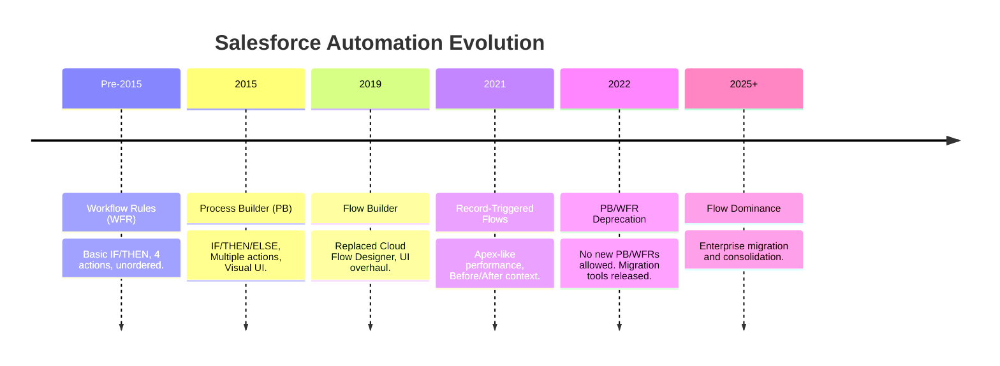
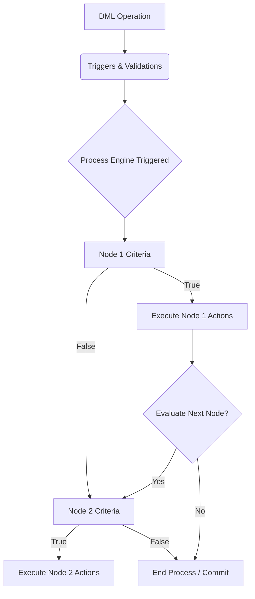
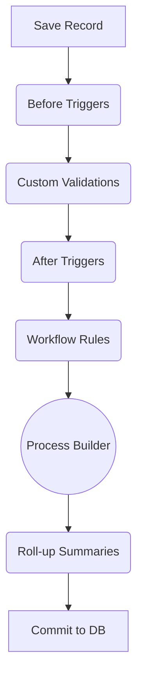

# Salesforce Process Builder

## 1. Introduction

### What is Process Builder?
Process Builder is a legacy, declarative automation tool in Salesforce that allows administrators and developers to automate business processes with a visual, point-and-click interface. It executes automatically in the background when specific criteria are met, primarily triggered by record creations or updates.

### Why Salesforce Introduced It
Before Process Builder, Salesforce automation relied heavily on **Workflow Rules** (which were limited to single if/then evaluations and four specific actions) and **Apex Triggers** (which required coding expertise). Process Builder was introduced to bridge this gap, offering an "if/then/else" logical structure, a broader range of actions (like updating related child records, creating records, and invoking Apex), and a more intuitive visual canvas.

### Evolution of Salesforce Automation: Workflow Rules → Process Builder → Flow
1. **Workflow Rules (Legacy):** The original declarative tool. Fast, but highly limited (only field updates, email alerts, tasks, and outbound messages).
2. **Process Builder (Legacy):** Introduced multiple decision nodes, ordered execution, and complex actions (creating records, calling Apex/Flows).
3. **Flow (Modern):** The ultimate automation engine. Combines the speed of Apex with the visual interface of Process Builder, adding complex data retrieval, loops, screen interactions, and sophisticated error handling.

### Why Developers Still Need to Understand Process Builder
Salesforce has retired Process Builder (no new automations can be built using it), but millions of Process Builders still run in enterprise production environments. Architects and Developers must understand its internal workings to:
* Troubleshoot existing legacy bugs.
* Understand the technical debt in an org.
* Successfully and safely migrate legacy processes to modern Record-Triggered Flows.

---

## 2. History of Salesforce Automation

### The Eras of Automation
* **Workflow Rules Era (Pre-2015):** Highly fragmented automation. Admins had to create dozens of separate rules for a single object. Order of execution between multiple workflow rules was not guaranteed.
* **Process Builder Era (2015 - 2021):** The push for "One Process per Object." Admins consolidated rules into visually structured, sequenced nodes. It brought power but introduced massive performance overhead and recursion issues.
* **Flow Era (2021 - Present):** Salesforce rebuilt Flow on a faster architecture. Record-Triggered Flows operate at almost the speed of Apex. Process Builder and WFRs were officially deprecated.

### Automation Evolution Timeline

---

## 3. Process Builder Architecture

### Internal Architecture
Process Builder is essentially a visual wrapper over the earlier **Flow engine architecture**. When you activate a Process Builder, Salesforce actually compiles it into an auto-launched Flow in the metadata.

* **Process Engine:** Evaluates the transaction boundary and queues the defined actions. 
* **Record Change Detection:** Subscribes to the `after save` context of the Salesforce order of execution.
* **Criteria Evaluation:** Evaluates each criteria node sequentially. Unlike WFRs, PB stops at the first `TRUE` node unless explicitly configured to "Evaluate the next criteria."
* **Action Execution:** Executes immediate actions synchronously in the transaction. Scheduled actions are placed in the `FlowPause` and `Workflow Time Queue` tables.

### Architecture Diagram

---

## 4. Components of Process Builder

1. **Process/Trigger:** Defines *when* the automation runs (e.g., Object: Account, Trigger: "When a record is created or edited").
2. **Criteria Nodes:** The decision blocks (Diamonds). They define *if* the actions should run.
3. **Actions:** The operations (Rectangles) performed when criteria are met (Immediate or Scheduled).
4. **Scheduled Actions:** Actions placed in a time-based queue (e.g., "3 Days after Close Date").
5. **Process Variables:** Unlike Flow, PB abstracts variables. The only "variable" is the triggering record `[Object]`.
6. **Related Records:** Traversal of lookup relationships. PB can traverse up to 10 levels of parent relationships (e.g., `[Contact].Account.Owner.Manager.Email`).

---

## 5. Process Types

1. **Record Change Process:** Triggers when a record is created or edited. (Most common).
2. **Event-Based Process:** Triggers upon the receipt of a Platform Event. Useful for decoupled integration architectures.
3. **Invocable Process:** Designed to be called by another Process Builder. Useful for modularizing repeating logic (Process Chaining).

---

## 6. Criteria Evaluation

Process Builder provides three ways to evaluate criteria:

1. **Conditions are met:** Standard UI filter logic (e.g., `StageName` Equals `Closed Won` AND `Amount` > `50000`).
2. **Formula evaluates to true:** Advanced logic using Salesforce functions. Ideal for bypassing validation rules or evaluating `ISCHANGED()`, `PRIORVALUE()`, or complex cross-object math.
3. **No criteria—just execute the actions:** Always runs if it reaches this node. Usually placed at the end of a process as a catch-all.

*Internal Behavior:* PB evaluates fields at the exact moment the node is reached. If an action in Node 1 updates the record, Node 2 evaluates the *updated* state of the record.

---

## 7. Immediate Actions

| Action | Purpose & Use Cases | Limitations |
| :--- | :--- | :--- |
| **Create Record** | Create any record (related or unrelated). | Cannot dynamically assign Record Types easily without querying. Cannot capture the new Record ID for subsequent actions in the same node. |
| **Update Records** | Update the triggering record, parent records, or *all* child records. | Updating child records updates *all* children (no filtering natively). High risk of locking errors. |
| **Submit for Approval** | Auto-submit records to Approval Processes. | Requires exact match on Approval Process entry criteria. |
| **Email Alerts** | Send templated emails. | Uses legacy Workflow Email Alerts. |
| **Quick Actions** | Invoke Object-Specific or Global Actions. | Limited to what the Quick Action UI exposes. |
| **Post to Chatter** | Automate Chatter @mentions and group posts. | Hardcoded text can be difficult to manage. |
| **Apex Invocation** | Call `@InvocableMethod` Apex. | Passes a `List<ID>` to Apex. Bulkification depends entirely on the Apex code. |
| **Flow Invocation** | Launch an Autolaunched Flow. | Complex to debug variable passing. |
| **Process Invocation** | Call an Invocable Process. | Introduces recursion risks if not managed. |

---

## 8. Scheduled Actions

* **Time-Based Logic:** Triggers a set number of hours/days before or after a Date/DateTime field on the record, or relative to the rule trigger date.
* **Scheduling Behavior:** When a process executes and schedules an action, the action sits in the `Time-Based Workflow` queue.
* **Criteria Re-evaluation:** If the record is edited and no longer meets the original criteria before the scheduled time arrives, the scheduled action is **automatically removed** from the queue.

---

## 9. Advanced Capabilities

* **Cross-Object Updates:** Updating a parent record (e.g., updating the Account when an Opportunity is Closed Won).
* **Child Record Updates:** PB can update related child records, but it updates **all** related children. E.g., Updating all Contacts to "Inactive" when the Account is marked "Inactive".
* **Chaining Processes:** Passing the triggering record from a Master Process to an Invocable Process. This was an early attempt at reducing PB overhead by modularizing logic.

---

## 10. Process Builder vs Workflow Rules

| Feature | Workflow Rules | Process Builder |
| :--- | :--- | :--- |
| **Complexity** | Simple (Single IF/THEN) | Moderate (IF/THEN/ELSE) |
| **Order of Execution** | Unpredictable between multiple rules | Predictable (Top to Bottom) |
| **Create Records** | Tasks Only | Any Object |
| **Update Related Records** | Master-Detail Parents only | Any Lookup Parent, All Children |
| **Call Apex/Flow** | No (Except Outbound Messages) | Yes |
| **Performance** | Extremely Fast (Compiled natively) | Very Slow (Flow engine overhead) |

*Conclusion:* PB was an upgrade in capability but a downgrade in pure processing speed.

---

## 11. Process Builder vs Flow

| Feature | Process Builder | Record-Triggered Flow |
| :--- | :--- | :--- |
| **Architecture** | Legacy Flow Engine (Heavy) | Modern Lightning Flow Engine (Optimized) |
| **Trigger Timing** | After Save Only | Before Save (Fast Field Updates) & After Save |
| **Data Operations** | Blind updates/creates | Full SOQL Queries, Loops, targeted DML |
| **Performance** | Slow, prone to SOQL limits | Fast, excellent bulkification handling |
| **Error Handling** | Generic email to Admin | Fault Paths, custom error messages |

*Conclusion:* Flow is superior in every architectural metric. 

---

## 12. Process Builder and Order of Execution

Understanding where PB sits is critical for debugging "Too many SOQL queries" or "Maximum trigger depth exceeded" errors.

1. System Validations
2. **Before Triggers**
3. Custom Validation Rules
4. **After Triggers**
5. Assignment / Auto-Response Rules
6. **Workflow Rules** (If WFR does field updates, 2-5 run again)
7. Escalation Rules
8. **PROCESS BUILDER & FLOWS**
9. Roll-up Summary Fields
10. Database Commit

*Crucial Detail:* Because PB runs *after* Apex Triggers, any record update done by PB forces the system to run Triggers **AGAIN**, effectively doubling transaction time.

---

## 13. Internal Execution Behavior

* **Transaction Boundaries:** A Process Builder executes synchronously. If it fails, the entire transaction (including user DML) rolls back.
* **Bulkification:** PB attempts to bulkify internal actions, but it is deeply flawed. When processing 200 records, PB processes node evaluations in chunks, often causing CPU timeouts if complex formulas are used.
* **Recursive Behavior:** By default, PB evaluates once per transaction. If "Recursion" is checked in the Advanced settings, PB can evaluate the same record up to 5 times in a single transaction if other automations update it. This is a massive cause of CPU Limit exceptions.

---

## 14. Process Builder Limitations

1. **Performance Overhead:** The underlying metadata translation is slow. Multiple PBs on an object exponentially increase save times.
2. **No Deletion:** PB cannot delete records.
3. **No Filtering on Children:** Updating child records updates *all* of them.
4. **Poor Bulkification:** Notorious for hitting 101 SOQL errors when updating parent records in bulk API data loads.
5. **Opaque Error Messages:** "The flow failed to access the value for..." errors are notoriously difficult to decipher without heavy debug log analysis.

---

## 15. Why Salesforce Retired Process Builder

Salesforce officially retired PB to consolidate automation onto **Flow Builder**. 
* **Technical Debt:** Maintaining three engines (Workflow, PB, Flow) was unsustainable for Salesforce's server infrastructure.
* **CPU Limitations:** As customers scaled, PB's architecture caused massive CPU time limit breaches.
* **Flow Superiority:** With the release of *Before-Save* Flows, admins could perform field updates 10x faster than Process Builder, making PB obsolete overnight.

---

## 16. Migrating Process Builder to Flow

### Migration Strategy
1. **Inventory:** Document all existing PBs and WFRs.
2. **Analyze & Consolidate:** Do not do a 1:1 migration. If you have 3 PBs on Account, consolidate them into 1 After-Save Flow.
3. **Before vs. After:** Move same-record field updates to *Before-Save* flows (Fast Field Updates) for massive performance gains.

### The Migration Tool
Salesforce provides a native "Migrate to Flow" tool. 
* *Pros:* Fast, easy for simple PBs.
* *Cons:* Often creates poorly optimized, ugly Flow canvases with redundant variables.

### Manual Migration (Recommended for Architects)
1. Rebuild the logic in a new Record-Triggered Flow.
2. Utilize `Decision` elements for PB Nodes.
3. Deactivate the PB, Activate the Flow in a Sandbox.
4. Run Apex Regression Tests to ensure functional parity.

---

## 17. Real Project Scenarios

* **Lead Qualification:** PB updates `Lead Status` to "Qualified" when `Score` > 80 and invokes an Auto-launched Flow to provision external LMS user access.
* **Opportunity Management (Cross-Object):** When Opportunity is `Closed Won`, PB updates the parent `Account.Type` to "Customer" and fires an Email Alert to the Account Team.
* **Case Escalation:** If Case Priority is "High" and remains untouched for 4 hours, a scheduled action alerts the VP of Support and updates the Case `Escalated` checkbox.

---

## 18. Common Process Builder Design Patterns

1. **The "One Process Per Object" Pattern:** Combining all nodes into a single PB to control the order of execution.
2. **The "Router" Pattern:** A master PB evaluates criteria and invokes separate, smaller Invocable Processes based on Record Type to prevent a massively bloated visual canvas.
3. **Notification Pattern:** Using PB strictly to listen for Stage changes and post Chatter notifications or send Email alerts.

---

## 19. Common Mistakes & Troubleshooting

* **Mistake: Evaluating Unchanged Data.**
  * *Issue:* Not using `ISCHANGED()` or "Do you want to execute the actions only when specified changes are made to the record?". Result: Actions fire on every edit.
* **Mistake: Cross-Object Loop.**
  * *Issue:* PB on Opportunity updates Account. PB on Account updates Opportunity. Result: Recursion and APEX CPU Timeouts.
* **Troubleshooting:**
  * Always check `Paused and Failed Flow Interviews` in Setup.
  * In Debug Logs, search for `FLOW_START_INTERVIEWS` to trace the Process Builder execution.

---

## 20. Best Practices (Legacy Maintenance)

* **Naming Conventions:** `[Object] - [Trigger Time] - [Purpose]`. (e.g., `Account - After Save - Master Process`).
* **Node Naming:** Clearly describe the condition (e.g., `Is Closed Won?`).
* **Bypass Flags:** Always include a custom permission or hierarchical custom setting in the first criteria node (e.g., `$Setup.Automation_Settings__c.Disable_PB__c == False`) to allow data loading without triggering PB.

---

## 21. Enterprise Architecture Considerations

* **Technical Debt Management:** PBs are now technical debt. Architects must budget time in enterprise roadmaps for Flow migration.
* **Large Data Volumes (LDV):** If an org processes millions of records nightly via API, PB must be disabled or replaced with Before-Save Flows/Apex to prevent lock contention and bulkification failures.
* **Governance:** Implement strict CI/CD gates that reject new Process Builder deployments.

---

## 22. Debugging and Troubleshooting

* **Debug Logs:** Set the "Workflow" category to `Finer`. You will see `WF_PROCESS_NODE` entries showing exactly which criteria evaluated to true/false.
* **Monitoring Scheduled Actions:** Use the "Time-Based Workflow" UI in Setup to view or delete pending PB actions. If an action is stuck, it is usually because the user who triggered it has been deactivated.

---

## 23. Interview Questions & Answers

**Beginner:** * **Q:** Can Process Builder delete records? 
* **A:** No, PB can create and update records, but deletion requires Flow or Apex.

**Intermediate:** * **Q:** What is the difference between a before-save Flow and a Process Builder?
* **A:** PB only runs *after* the record is saved to the database, meaning updating the same record requires a second DML statement. Before-Save flows update the record in memory *before* it hits the database, making them significantly faster.

**Advanced:** * **Q:** Describe the recursion impact of Process Builder updating a parent record.
* **A:** When PB updates a parent record, it initiates a completely new transaction context for that parent, firing all parent Before/After Triggers, WFRs, and PBs. If the parent updates the child again, you risk hitting maximum trigger depth (16) or CPU limits.

**Architect:**
* **Q:** An org has massive CPU timeouts during data loads. You see 5 Process Builders on Account. How do you resolve this?
* **A:** Combine them. Move all same-record field updates to a Before-Save Record-Triggered Flow. Move related-record updates to a single After-Save Flow. Ensure integration users bypass automations using a Hierarchical Custom Setting bypass flag.

---

## 24. Real Migration Case Study

**Scenario:** A financial services org had 15 Workflow Rules and 3 Process Builders on the `Loan_Application__c` object. Every time an underwriter saved a record, it took 8 seconds to load.
* **Challenge:** Order of execution was chaotic. WFRs fired, updated fields, which triggered PB, which updated the record again, causing Apex triggers to fire 3 times per save.
* **Solution:** 1. Mapped all WFR/PB logic.
  2. Moved 12 WFR field updates into a single **Before-Save Flow** (Execution time dropped from 2s to 0.05s).
  3. Moved email alerts and cross-object updates (Updating Contact status) into a single **After-Save Flow** with asynchronous paths for emails.
* **Result:** Save times dropped from 8 seconds to 1.5 seconds.

---

## 25. Revision Summary

* **Architecture:** Auto-launched flow in the backend; runs in the *After* context.
* **Actions:** Create, Update (Parent/All Children), Email, Chatter, Apex, Flow, Approval.
* **Limitations:** Cannot delete, poor bulkification, high CPU usage, cannot filter child updates.
* **Deprecation:** Replaced by Record-Triggered Flows due to superior architecture and performance.
* **Migration Rule:** Don't just migrate 1:1; optimize into Before/After save paradigms in Flow.