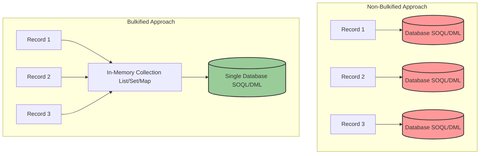
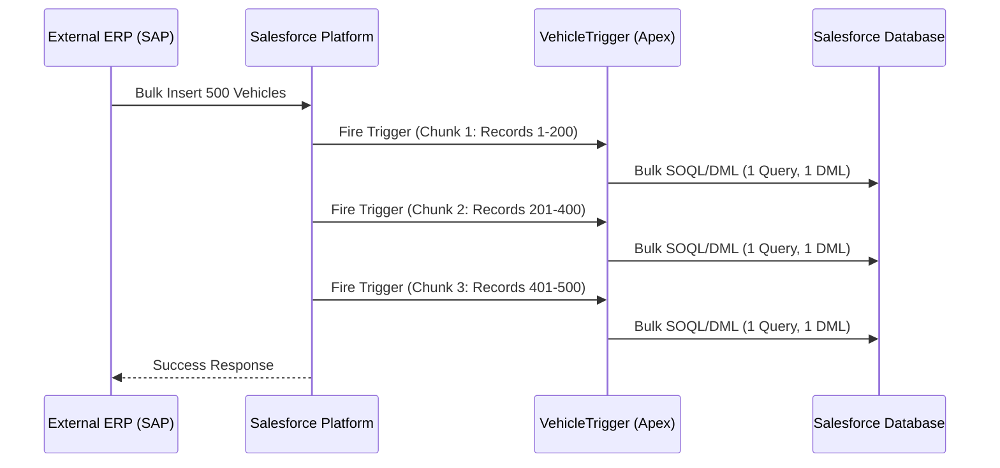
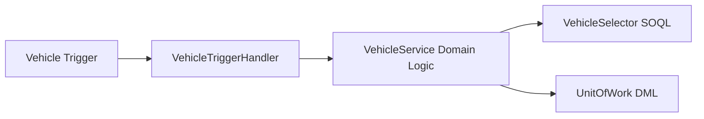

# Bulkification – Handle Multiple Records

# 1. Introduction

**Bulkification** is the fundamental design principle in Salesforce Apex programming that ensures code properly handles multiple records at a time, rather than just a single record. 

Because Salesforce operates on a **Multi-Tenant Architecture**, resources (CPU, Memory, Database Threads) are shared among thousands of customers (tenants) on a single pod/server. To prevent any single tenant from monopolizing these resources, Salesforce enforces strict **Governor Limits**. Bulkification is the developer's primary defense against hitting these limits.

In enterprise development, especially in complex environments like an **Automotive CRM** (managing millions of Vehicles, Warranty Claims, and Dealer records), scalable code is not optional—it is mandatory. If a trigger is written to handle only a single `Warranty_Claim__c`, it will instantly fail when an external ERP system (like SAP) pushes a batch of 1,000 claims via the API, paralyzing business operations.

Bulkified code scales effortlessly, executes faster, and protects the org from catastrophic runtime exceptions.

---

# 2. What is Bulkification?

Bulkification is the practice of designing Apex code—especially Triggers and methods invoked by automated processes—to process large collections of records simultaneously using Lists, Sets, and Maps, rather than processing records sequentially one by one.

### Purpose
- **Efficient Resource Utilization:** Grouping database operations minimizes context switching and database round-trips.
- **Scalability:** Code behaves consistently whether processing 1 record or 50,000 records.
- **Governor Limit Protection:** Prevents exceeding `SOQL Queries (100)`, `DML Statements (150)`, and `CPU Time (10,000ms)` limits.

### Architecture Diagram: The Bulkification Concept



**Example:** Instead of querying the `Dealer__c` record 200 times for 200 different `Vehicle__c` records, a bulkified approach extracts all `Dealer__c` IDs into a `Set<Id>`, performs **one** SOQL query, stores the results in a `Map<Id, Dealer__c>`, and matches them in memory.

---

# 3. Why Bulkification is Necessary

Salesforce's ecosystem is heavily integrated and automated. You can never guarantee how many records will enter your Apex code at any given time.

| Origin | Why Bulkification is Required |
| :--- | :--- |
| **Multi-Tenant Environment** | You share server resources. Un-bulkified code hogs resources, leading to immediate platform intervention (exceptions). |
| **Governor Limits** | You only have 100 synchronous SOQL queries. Processing 101 records individually will crash your code. |
| **Batch Processing** | Apex Batch processes up to 2,000 records per execution. Methods called from batches must handle collections. |
| **API Operations** | External systems (e.g., SAP, MuleSoft) send payloads containing hundreds or thousands of records at once. |
| **Data Loader** | Admins perform mass updates/inserts in chunks of up to 200. Triggers fire once per chunk (200 records). |
| **Flow & Process Automation** | Record-Triggered Flows bulkify operations internally, but invocable Apex called by Flows receives `List<T>`. |
| **Platform Events** | Event triggers process events in batches (up to 2,000). |

---

# 4. Salesforce Record Processing

Salesforce chunks data processing based on the entry point. 

### Processing Chunk Sizes

*   **UI Operations:** 1 record per transaction.
*   **Data Loader / SOAP API:** Up to 200 records per transaction chunk.
*   **REST API:** Varies, but Bulk API can handle up to 10,000 records per batch.
*   **Batch Apex:** Default 200, Max 2,000 records per `execute` method.
*   **Platform Events:** Up to 2,000 events per trigger execution.

### Sequence Diagram: Trigger Execution Lifecycle



---

# 5. Understanding Trigger.new

`Trigger.new` is an implicit Apex variable that returns a `List<sObject>` containing the new versions of the records attempting to be inserted or updated. 

### Why Trigger.new is Always a Collection
Salesforce triggers are optimized for bulk data. Whether an Admin creates one `Warranty_Claim__c` in the UI, or MuleSoft pushes 200, Salesforce routes them through the exact same trigger architecture. Therefore, `Trigger.new` is **always** a List.

*   **Single Record Insert:** `Trigger.new` has a size of 1.
*   **Bulk Insert:** `Trigger.new` has a size up to 200.
*   **Bulk Update:** `Trigger.new` has a size up to 200.
*   **Bulk Delete:** `Trigger.old` has a size up to 200.

### Production-Quality Example

```apex
trigger WarrantyClaimTrigger on Warranty_Claim__c (before insert) {
    // 1. We NEVER assume Trigger.new has only 1 record.
    // 2. We extract necessary foreign keys to query in bulk.
    Set<Id> vehicleIds = new Set<Id>();
    
    // Loop through the collection (could be 1, could be 200)
    for (Warranty_Claim__c claim : Trigger.new) {
        if (claim.Vehicle__c != null) {
            vehicleIds.add(claim.Vehicle__c);
        }
    }
    
    // One single query for all related Vehicles, regardless of trigger chunk size
    Map<Id, Vehicle__c> vehicleMap = new Map<Id, Vehicle__c>([
        SELECT Id, Warranty_Status__c FROM Vehicle__c WHERE Id IN :vehicleIds
    ]);
    
    // Second loop to apply logic in-memory
    for (Warranty_Claim__c claim : Trigger.new) {
        if (claim.Vehicle__c != null && vehicleMap.containsKey(claim.Vehicle__c)) {
            Vehicle__c relatedVehicle = vehicleMap.get(claim.Vehicle__c);
            if (relatedVehicle.Warranty_Status__c == 'Expired') {
                claim.addError('Cannot create a claim for a vehicle with an expired warranty.');
            }
        }
    }
}
```

---

# 6. Single Record vs Bulkified Code

Understanding the difference between bad (single-record) and good (bulkified) code is critical for performance engineering.

### Comparison Table

| Feature | Single Record Code (Bad) | Bulkified Code (Good) |
| :--- | :--- | :--- |
| **SOQL Placement** | Inside `for` loops | Outside `for` loops |
| **DML Placement** | Inside `for` loops | Outside `for` loops |
| **Data Structures** | Single Variables (`Id`, `String`) | Collections (`List`, `Set`, `Map`) |
| **Governor Limits** | High risk of `Too Many SOQL: 101` | Extremely safe, predictable consumption |
| **Data Loader Compatibility** | Fails on >1 record | Processes 200 records seamlessly |
| **Execution Time** | Extremely slow (DB round trips) | Extremely fast (In-memory processing) |

### The Bad Example (Anti-Pattern)

```apex
// ANTI-PATTERN: DO NOT USE
public void processClaims(List<Warranty_Claim__c> claims) {
    for (Warranty_Claim__c claim : claims) {
        // FATAL MISTAKE: SOQL inside a loop!
        Vehicle__c v = [SELECT Id, OwnerId FROM Vehicle__c WHERE Id = :claim.Vehicle__c];
        
        claim.OwnerId = v.OwnerId;
        
        // FATAL MISTAKE: DML inside a loop!
        update claim; 
    }
}
```
*   **Performance Impact:** If `claims.size()` is 101, this crashes at record 101 with `System.LimitException: Too many SOQL queries: 101`.

### The Good Example (Enterprise Pattern)

```apex
// ENTERPRISE PATTERN: BULKIFIED
public void processClaims(List<Warranty_Claim__c> claims) {
    Set<Id> vehicleIds = new Set<Id>();
    List<Warranty_Claim__c> claimsToUpdate = new List<Warranty_Claim__c>();
    
    // Step 1: Gather Ids
    for (Warranty_Claim__c claim : claims) {
        if (claim.Vehicle__c != null) {
            vehicleIds.add(claim.Vehicle__c);
        }
    }
    
    // Step 2: SOQL Outside Loop
    Map<Id, Vehicle__c> vehicleMap = new Map<Id, Vehicle__c>([
        SELECT Id, OwnerId FROM Vehicle__c WHERE Id IN :vehicleIds
    ]);
    
    // Step 3: In-Memory Processing
    for (Warranty_Claim__c claim : claims) {
        if (vehicleMap.containsKey(claim.Vehicle__c)) {
            // Clone or instantiate new record to avoid 'Record is read-only' in after triggers
            Warranty_Claim__c claimToUpdate = new Warranty_Claim__c();
            claimToUpdate.Id = claim.Id;
            claimToUpdate.OwnerId = vehicleMap.get(claim.Vehicle__c).OwnerId;
            claimsToUpdate.add(claimToUpdate);
        }
    }
    
    // Step 4: DML Outside Loop
    if (!claimsToUpdate.isEmpty()) {
        update claimsToUpdate;
    }
}
```

---

# 7. SOQL Best Practices

### SOQL Outside Loops
Never put a `[SELECT ... ]` statement inside a `for`, `while`, or `do-while` loop. Always collect the necessary filtering criteria into a `Set<Id>` or `Set<String>` and use the `IN` bind variable (`:mySet`) to query everything at once.

### Selective Queries
Ensure your SOQL queries use indexed fields (like `Id`, `Name`, `CreatedDate`, or custom External IDs) in the `WHERE` clause to avoid full table scans, especially in LDV environments.

### Relationship Queries
Use subqueries (Child-to-Parent or Parent-to-Child) to reduce the number of discrete SOQL statements.

### Production-Quality Example

```apex
// Bulkifying Parent and Child records using a single SOQL statement
public static void retrieveDealerData(Set<Id> dealerIds) {
    // 1 Query retrieves the Dealer AND all related Vehicles and Work Orders
    List<Dealer__c> dealersWithInventory = [
        SELECT Id, Name, Region__c,
            (SELECT Id, VIN__c, Model__c FROM Vehicles__r WHERE Status__c = 'Available'),
            (SELECT Id, Subject, Status FROM WorkOrders)
        FROM Dealer__c 
        WHERE Id IN :dealerIds
    ];

    // Explain Line-by-Line:
    // Line 3-8: SOQL Query spanning multiple objects.
    // Line 5: Inner query fetches Child Vehicles. Limits query to 'Available' status.
    // Line 6: Inner query fetches Standard Child WorkOrders.
    // Line 8: Filters the primary object using a Set to bulkify.
}
```

---

# 8. DML Best Practices

Executing DML (Data Manipulation Language) statements directly interacts with the database, firing triggers, flows, and platform events. Doing this inside a loop multiplies execution time exponentially and quickly violates the 150 DML limit.

### Core Rule
**Insert, Update, Delete, and Upsert must always operate on a `List<sObject>`, never an individual `sObject` inside a loop.**

### Production-Quality Example

```apex
public static void updateVehicleStatus(Set<Id> vehicleIds, String newStatus) {
    // Instantiate a list to hold all records needing an update
    List<Vehicle__c> vehiclesToUpdate = new List<Vehicle__c>();
    
    // Iterate over the IDs
    for (Id vId : vehicleIds) {
        // Create an sObject in memory with only the ID and fields to update
        Vehicle__c v = new Vehicle__c(
            Id = vId,
            Status__c = newStatus
        );
        // Add to the collection
        vehiclesToUpdate.add(v);
    }
    
    // Perform one DML statement for the entire collection
    if (!vehiclesToUpdate.isEmpty()) {
        try {
            update vehiclesToUpdate;
        } catch (DmlException e) {
            // Log bulk errors appropriately
            System.debug('Error updating vehicles: ' + e.getMessage());
        }
    }
}
```
*Line-by-line explanation:*
*   `List<Vehicle__c> vehiclesToUpdate`: Collection built specifically to hold bulk DML operations.
*   `Vehicle__c v = new Vehicle__c(...)`: Efficient memory usage; no SOQL required to update if we already know the `Id`.
*   `if (!vehiclesToUpdate.isEmpty())`: Best practice to ensure we don't consume a DML statement on an empty list.
*   `update vehiclesToUpdate`: A single database transaction for up to 10,000 records (if async) or standard sync limits.

---

# 9. Collections for Bulkification

Collections are the absolute backbone of Apex Bulkification.

| Collection | Description | Time Complexity (Search) | Best Use Case |
| :--- | :--- | :--- | :--- |
| **List** | Ordered collection of primitives or sObjects. Allows duplicates. | O(N) - Linear | Storing `Trigger.new`, records for DML (`update myList`), preserving order. |
| **Set** | Unordered collection of unique primitives or IDs. No duplicates. | O(1) - Constant | Gathering unique Ids to be used in a SOQL `IN :mySet` clause. |
| **Map** | Key-Value pairs. Keys are unique, values can be anything. | O(1) - Constant | Looking up related records instantly without nested loops. |

---

# 10. Using Maps Efficiently

Maps are the most powerful tool for optimizing CPU time and eliminating nested loops. The most common pattern is `Map<Id, sObject>`.

### Production-Quality Example: Parent Record Lookup

```apex
public static void processWorkOrders(List<WorkOrder> wos) {
    Set<Id> vehicleIds = new Set<Id>();
    
    // 1. Gather foreign keys
    for(WorkOrder wo : wos) {
        if(wo.Vehicle__c != null) vehicleIds.add(wo.Vehicle__c);
    }
    
    // 2. Query and instantly cast to Map
    Map<Id, Vehicle__c> vehicleMap = new Map<Id, Vehicle__c>([
        SELECT Id, VIN__c, Warranty_Type__c 
        FROM Vehicle__c 
        WHERE Id IN :vehicleIds
    ]);
    
    // 3. Process
    for(WorkOrder wo : wos) {
        // O(1) Time Complexity Lookup! No nested loops.
        if(wo.Vehicle__c != null && vehicleMap.containsKey(wo.Vehicle__c)) {
            Vehicle__c parentVehicle = vehicleMap.get(wo.Vehicle__c);
            wo.Description = 'Servicing VIN: ' + parentVehicle.VIN__c;
        }
    }
}
```

---

# 11. Parent-Child Bulk Processing

When dealing with related data (e.g., `Claim__c` -> `Claim_Line__c`), you often need to process children based on criteria of the parent, or vice versa.

### Relationship Diagram

```text
Dealer__c (1)
  └── Vehicle__c (N)
        └── Warranty_Claim__c (N)
              └── Claim_Line_Item__c (N)
```

### Production-Quality Example: Child Record Processing

```apex
public static void calculateTotalClaimAmount(Set<Id> claimIds) {
    List<Warranty_Claim__c> claimsToUpdate = new List<Warranty_Claim__c>();
    
    // Aggregate query grouped by Parent Id
    for (AggregateResult ar : [
        SELECT Warranty_Claim__c claimId, SUM(Line_Amount__c) totalAmount 
        FROM Claim_Line_Item__c 
        WHERE Warranty_Claim__c IN :claimIds 
        GROUP BY Warranty_Claim__c
    ]) {
        // Extract dynamically aggregated data
        Id claimId = (Id)ar.get('claimId');
        Decimal amount = (Decimal)ar.get('totalAmount');
        
        // Build Parent for update
        claimsToUpdate.add(new Warranty_Claim__c(
            Id = claimId,
            Total_Approved_Amount__c = amount
        ));
    }
    
    if(!claimsToUpdate.isEmpty()){
        update claimsToUpdate;
    }
}
```

---

# 12. Avoiding Nested Loops

Nested loops (`for` loop inside a `for` loop) over sObjects exponentially increase CPU Time limits. If you have 200 Parents and 1000 Children, a nested loop runs 200,000 iterations. A Map-based solution runs 1,200 iterations.

### The Problem (Nested Loops) - O(N * M)
```apex
// BAD
for (Dealer__c d : dealers) {
    for (Vehicle__c v : allVehicles) {
        if (v.Dealer__c == d.Id) {
            // Found child. Inefficient!
        }
    }
}
```

### The Solution (Map-Based) - O(N + M)
```apex
// GOOD
Map<Id, List<Vehicle__c>> dealerToVehiclesMap = new Map<Id, List<Vehicle__c>>();

// 1. Build the Map (1000 iterations)
for(Vehicle__c v : allVehicles) {
    if(!dealerToVehiclesMap.containsKey(v.Dealer__c)) {
        dealerToVehiclesMap.put(v.Dealer__c, new List<Vehicle__c>());
    }
    dealerToVehiclesMap.get(v.Dealer__c).add(v);
}

// 2. Consume the Map (200 iterations)
for (Dealer__c d : dealers) {
    if(dealerToVehiclesMap.containsKey(d.Id)) {
        List<Vehicle__c> myVehicles = dealerToVehiclesMap.get(d.Id);
        // Process children instantly
    }
}
```

---

# 13. Governor Limits & Bulkification

Bulkification is specifically designed to mitigate these synchronous limits.

| Governor Limit | Synchronous Limit | Asynchronous Limit | How Bulkification Helps |
| :--- | :--- | :--- | :--- |
| **SOQL Queries** | 100 | 200 | Moving queries outside loops ensures 1 query per object instead of `N` queries. |
| **SOQL Query Rows** | 50,000 | 50,000 | Bulkification combined with `LIMIT` and strict `WHERE` clauses (selectivity) prevents row limit exceptions. |
| **DML Statements** | 150 | 150 | Passing lists to `insert`/`update` uses 1 statement instead of `N`. |
| **DML Rows** | 10,000 | 10,000 | Only processing required data. (Hard limit, requires Batch Apex for >10k). |
| **CPU Time** | 10,000 ms | 60,000 ms | Using Maps (O(1)) instead of nested loops (O(N^2)) drastically cuts script execution time. |
| **Heap Size** | 6 MB | 12 MB | Clearing collections after use and querying only required fields keeps memory footprints low. |

---

# 14. Performance Optimization

Enterprise guidelines for absolute performance:

1.  **Reduce SOQL Queries:** Leverage `Trigger.oldMap` and `Trigger.newMap` to check if a relevant field *actually changed* before querying related data.
2.  **Query Only Required Fields:** `SELECT Id, Name` instead of `SELECT Id, Name, Description, Rich_Text_Field__c`. Large text fields consume Heap Size rapidly.
3.  **SOQL For-Loops:** For large data sets that risk heap limits, use `for (Vehicle__c v : [SELECT Id FROM Vehicle__c])`. This processes records in chunks of 200 internally, saving heap space.
4.  **Minimize CPU Time:** Avoid heavy Regular Expressions in loops. Use formula fields or UI validation rules where possible instead of Apex.

---

# 15. Bulkification in Triggers

Triggers must be logicless. All bulkification logic should exist in a Handler class following the **One Trigger Per Object** pattern.

### Trigger Architecture
```apex
trigger VehicleTrigger on Vehicle__c (before insert, before update, after insert, after update) {
    // Delegate entirely to a handler
    VehicleTriggerHandler.execute();
}
```

### Before vs After Trigger Bulkification Rules
*   **Before Triggers (`before insert`, `before update`):** Used to update fields on the record itself. You do *not* need DML. Modifying the `Trigger.new` instance directly saves a DML statement.
*   **After Triggers (`after insert`, `after update`):** Used to update related records (e.g., updating a `Dealer__c` based on a new `Vehicle__c`). Requires lists and explicit DML outside the loop. Records in `Trigger.new` are read-only here.

---

# 16. Bulkification in Apex Classes

Bulkification isn't just for triggers; it applies to all Apex.

*   **Service Classes:** Methods should accept `List<Id>` or `Set<Id>`, never a single `Id`. e.g., `public void provisionVehicles(Set<Id> vehicleIds)`.
*   **Batch Classes:** The `execute(Database.BatchableContext BC, List<sObject> scope)` method is inherently bulkified. The `scope` size can be up to 2000. All code here must follow standard trigger bulkification rules.
*   **Queueable Classes:** Accept collections in the constructor. `public SyncToSAPQueueable(List<Id> claimIds)` allows processing chunks asynchronously.

---

# 17. Handling Large Data Volumes (LDV)

When bulkifying operations on millions of records, standard synchronous Apex will hit CPU or Heap limits even if perfectly bulkified.

### Strategies for LDV:
1.  **Batch Processing (Batch Apex):** The gold standard. Chunks data into max 2,000 record transactions.
2.  **Query Selectivity:** Ensure the fields in your `WHERE` clauses are custom indexed (External ID, Unique) or standard indexed.
3.  **Bulk API 2.0:** Use for data migration or external system integrations. Processes records in massive asynchronous batches (up to 100M records/24 hours).
4.  **Skinny Tables:** For extremely high read volumes, contact Salesforce Support to enable Skinny Tables to reduce DB read times.

---

# 18. Enterprise Design Patterns

Modern Salesforce architectures utilize patterns to enforce bulkification organically.

### Trigger Handler Pattern
Centralizes trigger logic and separates execution contexts (`onBeforeInsert`, `onAfterUpdate`), preventing duplicate loops over `Trigger.new`.

### Service Layer Pattern
Encapsulates business logic. Methods always accept collections.
`VehicleService.calculateWarranty(List<Vehicle__c> vehicles);`

### Selector Pattern
Centralizes all SOQL queries. Prevents rogue SOQL inside loops and promotes reusing bulk queries.
`VehicleSelector.getVehiclesByIds(Set<Id> vehicleIds);`

### Architecture Flow


---

# 19. Real Project Scenarios

### Scenario: Bulk Warranty Claim Creation via SAP Integration
**Requirement:** Nightly, SAP pushes up to 10,000 approved `Warranty_Claim__c` records via REST API. When approved, the related `Vehicle__c` must have its `Last_Claim_Date__c` updated, and an `Invoice__c` record must be generated.

**Bulkified Implementation:**
1.  **Entry:** REST API Custom Endpoint or Bulk API receives JSON array.
2.  **Bulk Deserialization:** Parse JSON into `List<Warranty_Claim__c>`.
3.  **Insert Claims:** `insert claimsList;` (Fires Trigger in chunks of 200).
4.  **Trigger Handler (After Insert):**
    *   Iterate `Trigger.new`, extract `Vehicle__c` Ids into `Set<Id>`.
    *   Iterate `Trigger.new`, create `Invoice__c` records into `List<Invoice__c>`.
    *   Instantiate `List<Vehicle__c>` with new `Last_Claim_Date__c`.
5.  **DML:** `update vehiclesList; insert invoicesList;`

**Why Bulkification Prevents Failure:** If SAP pushes 10,000 claims and we used a single-record approach, we would attempt 10,000 SOQL queries and 20,000 DML statements, failing immediately at record 101.

---

# 20. Common Mistakes

| Mistake | Consequence | Solution |
| :--- | :--- | :--- |
| **SOQL inside loops** | Hits 101 SOQL limit instantly. | Gather criteria in a `Set`, query outside the loop using `IN`. |
| **DML inside loops** | Hits 151 DML limit instantly. | Add records to a `List`, perform DML on the List outside the loop. |
| **Nested Loops** | CPU Time Limit Exceeded (10s). | Use `Map<Id, sObject>` for O(1) in-memory lookups. |
| **Not checking `isEmpty()`** | Unnecessary DB transactions; Null Pointer Exceptions. | Always wrap DML: `if(!myList.isEmpty()){ update myList; }` |
| **Hardcoding IDs** | Deployment failures between environments. | Query record types by `DeveloperName` outside loops. |
| **Duplicate Queries** | Re-querying the same object multiple times in a trigger. | Use a shared Selector layer or cache results in a static Map. |

---

# 21. Best Practices Checklist

- [x] **Always assume multiple records:** Code must work for 1 record or 200 records equally well.
- [x] **Query outside loops:** Inspect every `for` loop. If there is a `[SELECT` inside, rewrite it.
- [x] **Perform DML outside loops:** Inspect every `for` loop. If there is an `insert`, `update`, `delete`, or `upsert`, move it below the loop.
- [x] **Use Lists, Sets, and Maps effectively:** Master collections. Sets for unique keys, Maps for relation-mapping.
- [x] **Avoid nested loops:** Replace `for` within `for` with a `Map` lookup.
- [x] **Minimize SOQL and DML operations:** Consolidate updates. Don't run two update statements on `Vehicle__c` in the same execution context.
- [x] **Bulkify triggers and Apex classes:** Service methods should take `List<T>` or `Set<Id>`.
- [x] **Optimize queries:** Only query fields you will use. Avoid `SELECT Id, (SELECT Id FROM Big_Child_Object__c)` if not strictly necessary.
- [x] **Use asynchronous processing for large jobs:** If heavy calculation is needed, delegate to `@future`, `Queueable`, or `Batchable`.

---

# 22. Interview Questions & Answers

### Beginner Questions
**Q: What is bulkification in Salesforce?**
A: Bulkification is the process of designing Apex code to handle multiple records simultaneously (usually via Collections) to stay within Salesforce's strict governor limits (like 100 SOQL / 150 DML per transaction).

**Q: Can you put an update statement inside a for-loop?**
A: No, never. Doing so consumes one of the 150 available synchronous DML statements per iteration. If the loop runs 151 times, the transaction fails. You must add the records to a `List` and update the list outside the loop.

### Intermediate Questions
**Q: How do you avoid nested loops when matching a Parent to a Child?**
A: By using a `Map<Id, sObject>`. First, loop through the records to build a Map where the Key is the ID you want to match on. In the second loop, instead of iterating over everything again, use `myMap.get(id)` to instantly retrieve the related record. This changes O(N*M) time complexity to O(N+M).

**Q: In an after-update trigger on Account, how do you bulk-update related Contacts only if the Account Status changes?**
A: Iterate over `Trigger.new`, check `if(acc.Status != Trigger.oldMap.get(acc.Id).Status)`. If true, add `acc.Id` to a `Set<Id>`. Outside the loop, query `[SELECT Id FROM Contact WHERE AccountId IN :mySet]`, modify the contacts, add them to a list, and perform a single DML update.

### Advanced Questions
**Q: You have properly bulkified your code (1 query, 1 DML), but you are hitting a "CPU Time Limit Exceeded" error. Why?**
A: CPU time limits (10,000ms) measure the time executing Apex logic. Common culprits include deeply nested loops, massive data structures, inefficient Map processing, recursive triggers, or heavy string manipulations/regex. To fix this, refactor algorithms for O(1) complexity using Maps, remove unnecessary logic, or move the processing to asynchronous Apex (Batch/Queueable) which has a 60,000ms limit.

### Architect-Level Questions
**Q: Describe how the Selector and Unit of Work patterns aid in bulkification in an Enterprise architecture.**
A: The Selector pattern centralizes SOQL queries. By forcing developers to use `Selector.getByIds(Set<Id>)`, it inherently prevents single-record SOQL queries and promotes caching, drastically reducing the SOQL limit footprint. The Unit of Work pattern registers records for DML operations in memory across the entire execution transaction, allowing a single `commitWork()` call at the end of the process, ensuring minimal DML statements and preventing partial database commits, thereby maximizing bulk efficiency and data integrity.

---

# 23. Revision Summary

*   **Bulkification Core:** Never perform SOQL or DML inside a loop.
*   **Trigger.new:** Always treat it as a `List`, handling up to 200 records at a time.
*   **Collections are King:** Use `Set<Id>` to gather IDs. Use `List<sObject>` to execute DML. Use `Map<Id, sObject>` to eliminate nested loops and process relationships efficiently.
*   **Before vs After Triggers:** Bulkify both. Before triggers modify `Trigger.new` directly (no DML). After triggers query related records and explicitly call DML on Lists.
*   **Performance Limits:** Bulkification protects against 100 SOQL, 150 DML, 10,000ms CPU time, and 6MB Heap limits.
*   **Enterprise Scaling:** Code that is not bulkified will fail in production when Data Loader, Bulk API, or Batch Apex operations are performed. Always design for volume.