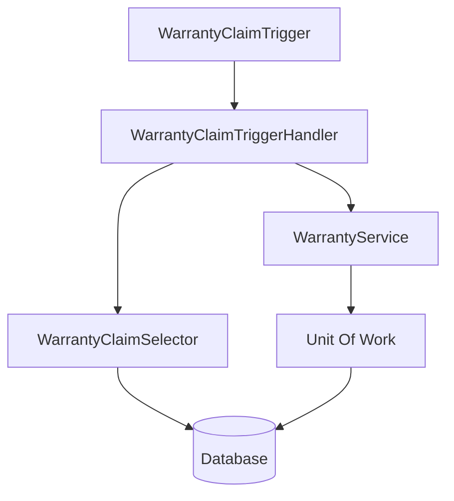

# Governor Limits & Performance Optimization

## 1. Introduction

Salesforce operates on a cloud-computing model where a single instance of the software and its supporting infrastructure serves multiple customers. To ensure that no single customer monopolizes the shared resources, Salesforce enforces **Governor Limits**. 

**What are Governor Limits?**
Governor Limits are runtime limits enforced by the Apex runtime engine. They ensure that code executing on the Lightning Platform does not monopolize shared resources such as CPU time, memory (heap size), database connections (SOQL/DML), and network bandwidth (callouts).

**Why Salesforce introduced Governor Limits:**
*   **Multi-Tenant Platform:** Salesforce is a multi-tenant environment. Without limits, one poorly written Apex script could consume all available CPU or database threads, degrading performance for every other organization on the same server instance.
*   **Fair Resource Sharing:** Limits guarantee a baseline level of performance and availability for all tenants.
*   **Predictable Performance:** By enforcing maximum execution times and memory allocations, Salesforce ensures system stability.

**Benefits of Governor Limits:**
*   Encourages developers to write efficient, scalable, and bulkified code.
*   Prevents infinite loops and runaway processes.
*   Maintains the 99.9% uptime and reliability of the Salesforce platform.

**Real-world example:** Imagine a scenario in an Automotive CRM where a developer writes a script to update 50,000 `Warranty_Claim__c` records. If the developer puts a database update statement inside a `for` loop, they will quickly hit the maximum DML statements limit (150). The limit forces the developer to use a list and perform a single DML operation outside the loop, protecting the database from 50,000 consecutive connections.

---

## 2. Multi-Tenant Architecture

To understand Governor Limits, you must understand Multi-Tenancy.

**Multi-Tenant Concept:**
Multi-tenancy means that a single instance of a software application serves multiple customers (tenants). All tenants share the same physical infrastructure (servers, database, network) but their data, metadata, and customizations are logically isolated.

*   **Shared Infrastructure:** App servers and web servers process requests for multiple orgs.
*   **Shared Database:** A massive, shared relational database stores the data for thousands of orgs. 
*   **Shared CPU & Memory:** The processors and RAM on Salesforce servers are divided among concurrent transactions.
*   **Resource Isolation:** A metadata-driven architecture ensures Tenant A cannot see Tenant B's data, even though they sit in the same physical table.

```mermaid
graph TD
    subgraph Salesforce Instance (e.g., NA150)
        APP[App Servers - Shared CPU & RAM]
        DB[(Shared Multitenant Database)]
        
        APP --> DB
        
        subgraph Tenant A (Automotive CRM)
            A_Data[Data]
            A_Code[Apex/LWC]
        end
        
        subgraph Tenant B (Healthcare Org)
            B_Data[Data]
            B_Code[Apex/LWC]
        end
        
        TenantA_Req(User Request A) --> APP
        TenantB_Req(User Request B) --> APP
        
        APP --> A_Code
        APP --> B_Code
    end
```

**How Multi-Tenancy leads to Governor Limits:**
Because CPU, memory, and database threads are shared, a "noisy neighbor" could theoretically write an infinite loop that crashes the server. Governor Limits act as the bouncer, forcefully terminating any transaction that exceeds its allocated share of the server's resources.

---

## 3. What are Governor Limits?

*   **Definition:** Strict boundaries applied to Apex execution by the Salesforce runtime engine.
*   **Purpose:** To prevent rogue scripts from degrading platform performance for other tenants.
*   **Protection:** They protect the database from connection exhaustion, memory from heap overflows, and the CPU from infinite processing.
*   **Bypassing:** Developers **cannot** bypass Governor Limits. They are hard-coded into the platform architecture.
*   **LimitException:** When a limit is breached, Salesforce throws a `System.LimitException`. This exception **cannot be caught** by a `try/catch` block. The entire transaction is rolled back, and all uncommitted database changes are discarded.

**Example:**
If your transaction executes 151 DML statements, the 151st statement triggers a `LimitException`. Even if it was wrapped in a `try/catch` block, the execution halts immediately.

---

## 4. Types of Governor Limits

Salesforce limits are categorized based on when and how they are applied.

| Limit Type | Description |
|---|---|
| **Per-Transaction Apex Limits** | Limits applied to a single execution context (e.g., a trigger execution, a single API call, or a button click). |
| **Certified Managed Package Limits** | ISV managed packages that pass security review get their own separate transaction limits for SOQL and DML, not counting against the subscriber org's limits. |
| **Lightning Platform Limits** | Limits on platform features like API requests per 24 hours, Concurrent API requests, and data storage. |
| **Static Apex Limits** | Limitations on the physical structure of code, such as maximum characters in a class or maximum trigger size. |
| **Size-Specific Apex Limits** | Limits on request/response sizes, such as max heap size or max HTTP callout size. |
| **Miscellaneous Apex Limits** | Limits on things like maximum number of method iterations or maximum describe calls. |

---

## 5. Per-Transaction Apex Limits

These limits apply to a single Apex transaction. They differ slightly depending on whether the transaction is Synchronous (user-facing, like a trigger) or Asynchronous (background processing, like Batch Apex).

| Description | Synchronous Limit | Asynchronous Limit |
|---|---|---|
| **SOQL Queries** | 100 | 200 |
| **SOQL Query Rows** | 50,000 | 50,000 |
| **SOSL Queries** | 20 | 20 |
| **DML Statements** | 150 | 150 |
| **DML Rows** | 10,000 | 10,000 |
| **CPU Time** | 10,000 ms (10s) | 60,000 ms (60s) |
| **Heap Size** | 6 MB | 12 MB |
| **Callouts** | 100 | 100 |
| **Future Calls** | 50 | 50 (or 0 from future/batch) |
| **Queueable Jobs** | 50 | 1 |
| **Email Invocations** | 10 | 10 |

**Best Practices:**
*   Always use Collections (Lists, Sets, Maps) to group records.
*   Never place SOQL or DML inside `for` loops.
*   Offload heavy processing to Asynchronous Apex to take advantage of higher CPU and Heap limits.

---

## 6. Static Apex Limits

These limits dictate the physical structure and size of your code.

*   **Code Size:** 6 MB of Apex code per org (excluding test classes).
*   **Class / Trigger Size:** 1 million characters per class/trigger.
*   **Method Size:** Maximum 65,535 bytes of bytecode per method.
*   **Test Code:** Test classes do not count against the 6 MB org limit.

**Examples:**
If an org has massive monolithic classes, you may hit the 1 million character limit. You must modularize the code into helper or service classes.

---

## 7. Lightning Platform Limits

These apply to the broader Salesforce platform, not just Apex.

*   **API Requests:** Limited per 24-hour period based on org edition and user licenses. (e.g., Enterprise Edition grants 100,000 API calls + 1,000 per user).
*   **Concurrent Requests:** Max 10 long-running synchronous Apex requests (>5 seconds) at a time.
*   **Data Storage:** Minimum 1 GB per org, scaled by user licenses (20 MB per user in Enterprise).
*   **File Storage:** Minimum 10 GB per org.
*   **Platform Cache:** Depends on edition, provides fast memory allocation to avoid DB queries.

---

## 8. Org-Level Limits

Org-level limits govern the metadata configuration. They vary heavily by Salesforce Edition (Developer, Enterprise, Unlimited).

| Feature | Enterprise Limit | Unlimited Limit |
|---|---|---|
| **Custom Objects** | 200 | 2,000 |
| **Custom Fields per Object** | 500 | 800 |
| **Master-Detail Relationships** | 2 per object | 2 per object |
| **Lookup Relationships** | 40 per object | 40 per object |
| **Roll-Up Summary Fields** | 25 per object | 25 per object |
| **Validation Rules** | 100 per object | 500 per object |
| **Active Flows** | 2,000 | 2,000 |
| **Custom Metadata Records** | 10 million characters | 10 million characters |

*Note: Some limits are Governor limits (hard) and some are contractual/configurable (soft).*

---

## 9. SOQL Governor Limits

**Maximum SOQL Queries:** 100 (Sync) / 200 (Async).
**Maximum Query Rows:** 50,000 total across all queries in the transaction.

### Optimizing SOQL Usage
*   **Selective Queries:** Use indexed fields (Id, Name, External IDs, Lookups) in your `WHERE` clause.
*   **Relationship Queries:** Instead of querying parent and child separately (2 queries), use inner queries to do it in 1 query.
*   **Aggregate Queries:** Use `COUNT()`, `SUM()` to offload processing to the database instead of iterating over rows in Apex. Note: `COUNT()` returns a single row, but `COUNT(Id)` combined with `GROUP BY` returns a row per group.

```apex
// Production-quality example: Querying Work Orders and related child Claim Lines efficiently
List<Work_Order__c> workOrders = [
    SELECT Id, Status__c, 
           (SELECT Id, Part_Cost__c FROM Claim_Lines__r WHERE Status__c = 'Pending')
    FROM Work_Order__c
    WHERE Status__c = 'Open' 
    AND Dealer__c IN :dealerIds // Using an indexed lookup field
];
```

---

## 10. DML Governor Limits

**Maximum DML Statements:** 150 per transaction.
**Maximum DML Rows:** 10,000 records processed per transaction.

### Bulk DML
You must operate on Lists of sObjects, not individual sObjects.

**Mixed DML Errors:** Occurs when you try to insert/update a Setup Object (like `User` or `Group`) and a Non-Setup Object (like `Warranty_Claim__c`) in the same synchronous transaction. 
*Solution:* Wrap the Setup Object DML in an `@future` method.

---

## 11. Heap Size Limits

**What is Heap Memory?** The temporary RAM allocated to your transaction to hold variables, objects, and collections in memory.
**Limits:** 6 MB (Sync) / 12 MB (Async).

### Heap Optimization
*   Use `transient` variables for visualforce controllers to clear memory between requests.
*   Remove items from collections when they are no longer needed.
*   Use SOQL `for` loops (querying directly into the loop definition) to process records in batches of 200 without loading the entire 50,000 list into memory.

```apex
// Efficient Heap Usage: SOQL For Loop
for(List<Warranty_Claim__c> claimBatch : [SELECT Id, Amount__c FROM Warranty_Claim__c WHERE Status__c = 'Pending']) {
    // claimBatch contains a max of 200 records at a time
    // This prevents a 50,000 record list from consuming all 6MB of Heap space
    processClaims(claimBatch);
}
```

---

## 12. CPU Time Limits

**CPU Time Limits:** 10,000 ms (10 seconds) for Sync, 60,000 ms (60 seconds) for Async.

**What consumes CPU?**
*   Apex execution (loops, logic).
*   Formula field evaluation within triggers.
*   Managed package code (shares the same CPU limit).

**Optimization Techniques:**
*   **Map usage:** Use Maps instead of nested loops. Nested loops multiply iterations (e.g., 1000 x 1000 = 1,000,000 iterations), which quickly drains CPU time.
*   **Early exits:** Use `break` and `continue` to exit loops as soon as a condition is met.

---

## 13. Callout Limits

**Limits:** 100 callouts per transaction.
**Timeout Limit:** Maximum 120 seconds of total wait time across all callouts in a transaction.
**Size Limits:** Max 6 MB request/response payload (12 MB for async).

If an Automotive CRM integrates with SAP for Parts Inventory, it must bulkify its callouts. You cannot make 1 API call per part. You must send an array of Parts in a single JSON payload to SAP.

---

## 14. Asynchronous Governor Limits

Salesforce grants higher limits to Asynchronous operations because they run in the background when server resources are available.

| Feature | Best For | Callout Limit | CPU Limit | Heap Limit |
|---|---|---|---|---|
| **Future Methods** | Fire-and-forget, simple primitive data. | 100 | 60s | 12 MB |
| **Queueable Apex** | Complex objects, chaining jobs. | 100 | 60s | 12 MB |
| **Batch Apex** | Large data volumes (up to 50M records). | 100/exec | 60s/exec | 12 MB |
| **Scheduled Apex** | Running tasks at a specific time. | N/A | 60s | 12 MB |

*Note: You can only enqueue 1 Queueable job from within a Batch Apex execution or another Queueable job.*

---

## 15. Org Limits vs Governor Limits

| Category | Governor Limits | Org Limits |
|---|---|---|
| **Definition** | Runtime execution limits. | Metadata and feature allocation limits. |
| **Type** | Hard Limits (Cannot be bypassed). | Often Soft Limits (Can be purchased/increased). |
| **Examples** | 100 SOQL, 150 DML, 10s CPU. | 200 Custom Objects, 1000 API calls/day. |
| **Edition Based?** | No. Same for all editions. | Yes. Varies by Dev/Enterprise/Unlimited. |

---

## 16. Using the Limits Class

The `Limits` class allows developers to programmatically monitor resource consumption at runtime.

### Production-Quality Example

```apex
public class PerformanceMonitor {
    public static void checkLimits() {
        // 1. Get current queries vs max allowed
        Integer queriesUsed = Limits.getQueries();
        Integer maxQueries = Limits.getLimitQueries();
        System.debug('SOQL Queries: ' + queriesUsed + ' / ' + maxQueries);
        
        // 2. Get DML usage
        Integer dmlUsed = Limits.getDMLStatements();
        Integer maxDml = Limits.getLimitDMLStatements();
        System.debug('DML Statements: ' + dmlUsed + ' / ' + maxDml);
        
        // 3. Prevent hitting CPU limits preemptively
        if(Limits.getCpuTime() > (Limits.getLimitCpuTime() * 0.8)) {
            // We have used 80% of CPU time
            // Queue the remaining work asynchronously to prevent LimitException
            System.debug('Approaching CPU limit, deferring logic.');
            // EnqueueJob(...)
        }
    }
}
```
**Explanation:**
*   `Limits.getQueries()` returns how many queries have been executed.
*   `Limits.getLimitQueries()` returns the hard limit (100 or 200).
*   By comparing them dynamically, you can write defensive code that offloads work before crashing.

---

## 17. Common Governor Limit Exceptions

1.  **System.LimitException: Too many SOQL queries: 101**
    *   *Cause:* A query is inside a `for` loop, or recursive triggers are querying unnecessarily.
2.  **System.LimitException: Too many DML statements: 151**
    *   *Cause:* DML inside a `for` loop, or processing one record at a time instead of bulkifying.
3.  **System.LimitException: Apex CPU time limit exceeded**
    *   *Cause:* Inefficient nested loops, heavy declarative automation (Flows/Formulas) firing alongside Apex.
4.  **System.LimitException: Too many query rows: 50001**
    *   *Cause:* Querying massive datasets without `LIMIT` or proper `WHERE` clauses.
5.  **System.Exception: Maximum trigger depth exceeded**
    *   *Cause:* A trigger updates a record, which fires the trigger again, recursively up to 16 times.

---

## 18. How to Avoid Governor Limits

**Bulkification is the #1 rule of Salesforce Development.**

### Bad Code (Hits Limits)
```apex
public void approveClaims(List<Warranty_Claim__c> claims) {
    for(Warranty_Claim__c claim : claims) {
        // ERROR: SOQL inside loop. Will crash if claims.size() > 100
        Claim_Line__c line = [SELECT Id FROM Claim_Line__c WHERE Claim__c = :claim.Id];
        line.Status__c = 'Approved';
        
        // ERROR: DML inside loop. Will crash if claims.size() > 150
        update line;
    }
}
```

### Production-Quality Bulkified Code
```apex
public void approveClaims(List<Warranty_Claim__c> claims) {
    // 1. Extract IDs into a Set
    Set<Id> claimIds = new Set<Id>();
    for(Warranty_Claim__c claim : claims) {
        claimIds.add(claim.Id);
    }
    
    // 2. ONE Query outside the loop
    List<Claim_Line__c> linesToUpdate = new List<Claim_Line__c>();
    for(Claim_Line__c line : [SELECT Id FROM Claim_Line__c WHERE Claim__c IN :claimIds]) {
        line.Status__c = 'Approved';
        linesToUpdate.add(line);
    }
    
    // 3. ONE DML statement outside the loop
    if(!linesToUpdate.isEmpty()) {
        update linesToUpdate;
    }
}
```

---

## 19. Performance Optimization

*   **Reduce SOQL:** Cache configuration data using Platform Cache or Custom Settings instead of querying custom objects constantly.
*   **Map Collections:** When you need to match two lists, don't use nested loops. Put one list in a `Map<Id, Object>` and use `.get(Id)` for O(1) time complexity.
*   **Avoid large queries:** Use standard pagination (StandardSetController) or SOQL `OFFSET` and `LIMIT`.
*   **Disable unwanted automation:** Use trigger bypass frameworks to stop validation rules or triggers from running during heavy data loads.

---

## 20. Enterprise Design Patterns

Using proper architectural patterns prevents redundant processing and query limits.

*   **Trigger Handler Pattern:** Ensures only ONE trigger per object. Controls the execution order and groups logic, preventing recursive DML.
*   **Selector Pattern (fflib):** Centralizes all SOQL queries. Prevents 10 different classes from writing the same query 10 times, saving SOQL statements.
*   **Service Layer Pattern:** Encapsulates business logic. Ensures logic operates on Lists/Sets.
*   **Unit of Work Pattern:** Centralizes DML operations. Instead of multiple classes performing `insert`, they register their records with the UoW, which performs a single bulk `insert` at the end of the transaction.



---

## 21. Monitoring Governor Limits

*   **Developer Console:** Check the "Limits" panel in an execution log.
*   **Debug Logs:** Search for `LIMIT_USAGE_FOR_NS` to see detailed consumption.
*   **Salesforce CLI:** Use `sf apex run test` to view limits during test execution.
*   **Event Monitoring:** Paid add-on via Salesforce Shield. Tracks API limits and CPU time trends across the entire org over time.

---

## 22. Real Project Scenarios (Automotive CRM)

**Scenario 1: Bulk Warranty Claim Processing**
*   *Process:* Dealership uploads 5,000 warranty claims at night.
*   *Risk:* DML Row limit (10,000) or CPU timeout.
*   *Solution:* Use **Batch Apex**. Set scope size to 200. Each batch of 200 gets its own independent limits (100 SOQL, 150 DML), securely processing all 5,000 claims.

**Scenario 2: SAP Integration for Invoice Generation**
*   *Process:* When a Work Order closes, call SAP to generate an invoice.
*   *Risk:* Callout limit (100) or holding up the UI (sync callouts block screens).
*   *Solution:* Use an `@future(callout=true)` method or **Queueable Apex**. This separates the heavy HTTP callout from the local Salesforce transaction.

**Scenario 3: Vehicle Synchronization (Avoid Nested Loops)**
*   *Process:* Updating 1,000 Vehicles and assigning their recent 1,000 Work Orders.
*   *Risk:* CPU Time Limit (1,000 x 1,000 = 1M iterations).
*   *Solution:* Populate a `Map<Id, List<Work_Order__c>>` mapping Vehicle ID to its Work Orders. Retrieve them in O(1) time without nested iterations.

---

## 23. Common Mistakes

| Mistake | Consequence | Solution |
|---|---|---|
| **SOQL inside loop** | 101 Limit Exception | Extract IDs to a Set, Query outside with `IN` clause. |
| **DML inside loop** | 151 Limit Exception | Add records to a `List<sObject>`, run DML on list outside loop. |
| **Nested Loops matching IDs** | CPU Timeout (10s) | Use `Map<Id, sObject>` for constant time lookups. |
| **Recursive Triggers** | Depth limit exceeded | Implement a static `Set<Id>` variable in a Handler to track already processed records. |
| **Ignoring Asynchronous Apex** | Sync limits exhausted | Move API callouts and heavy roll-up logic to Queueable or Batch Apex. |

---

## 24. Best Practices Checklist

*   ✅ **Bulkify all Apex code:** Assume every method will receive a List of 200 records, not just one.
*   ✅ **Query outside loops:** Never place `[SELECT...]` inside a `for` or `while` loop.
*   ✅ **Perform DML outside loops:** Populate Lists/Maps, run `insert/update` as the last step.
*   ✅ **Use Collections effectively:** Leverage `Map`, `List`, and `Set` to structure data.
*   ✅ **Monitor Limits class:** Use `Limits.get...` to defensively check resources.
*   ✅ **Use relationship queries:** Use parent-child subqueries to bundle data fetches.
*   ✅ **Use asynchronous Apex when appropriate:** Move heavy, non-critical logic to the background.
*   ✅ **Optimize heap usage:** Use SOQL for-loops for massive data sets; avoid large String concatenations.
*   ✅ **Avoid recursion:** Use static booleans or bypass sets in trigger handlers.
*   ✅ **Write scalable code:** Implement frameworks like fflib (Selector/Service/UoW).

---

## 25. Interview Questions & Answers

### Beginner Questions
**Q: What is the SOQL query limit in a synchronous transaction?**
A: 100 queries. 

**Q: Can you catch a LimitException using a try/catch block?**
A: No. Governor limit exceptions are fatal and cannot be caught. The transaction is instantly rolled back.

### Intermediate Questions
**Q: How do you bypass the 50,000 query row limit?**
A: By using Batch Apex (can query up to 50 million records via the `Database.QueryLocator`), or by using a SOQL `for` loop for heap management, though total rows in a sync transaction still maxes at 50k. You can also make the query read-only on a Visualforce page to increase the limit to 1 million.

**Q: What is a Mixed DML error and how do you resolve it?**
A: It happens when you try to perform DML on Setup objects (like `User`) and Non-Setup objects (like `Account`) in the same transaction. Resolve it by wrapping the Setup object DML in an `@future` method or a Queueable job.

### Advanced Questions
**Q: How does the platform handle limits for Managed Packages?**
A: Packages that pass the Salesforce Security Review get their own dedicated namespace limits for SOQL and DML. If an org has a limit of 100 queries, the managed package gets its own separate 100 queries. However, they share the same CPU time and Heap size limit as the subscriber org.

### Architect-Level Questions
**Q: In a heavy integration scenario, you are hitting the 10-second CPU time limit constantly due to complex JSON parsing and trigger logic. What architectural changes do you recommend?**
A: 
1. Shift the JSON parsing to an asynchronous process (Queueable Apex) which grants 60 seconds of CPU time.
2. Implement Platform Cache to reduce repeated database queries and complex calculations.
3. Review declarative automation (Flows/Process Builders) on the object, as they consume the same CPU limit. Move non-critical UI flows to async execution paths.
4. Implement a Unit of Work pattern to ensure DML is executed exactly once per object type.

---

## 26. Revision Summary

*   **Governor Limits** protect the **Multi-Tenant Architecture** from resource monopolization.
*   **Types of Limits** include Per-Transaction (Sync/Async), Static (code size), Lightning Platform (API limits), and Org-Level limits (feature allocations by Edition).
*   **SOQL Limits:** 100 Sync / 200 Async. 50,000 query rows total.
*   **DML Limits:** 150 Sync/Async. 10,000 rows processed total.
*   **CPU Limits:** 10s Sync / 60s Async. Prevented by avoiding nested loops.
*   **Heap Limits:** 6MB Sync / 12MB Async. Managed via SOQL for-loops and transient variables.
*   **Callout Limits:** 100 callouts, max 120s timeout total.
*   **Limits Class:** Use `Limits.getQueries()` and `Limits.getLimitQueries()` for dynamic monitoring.
*   **Optimization:** Bulkify code, use Maps for O(1) lookups, implement Selector/Service layers.