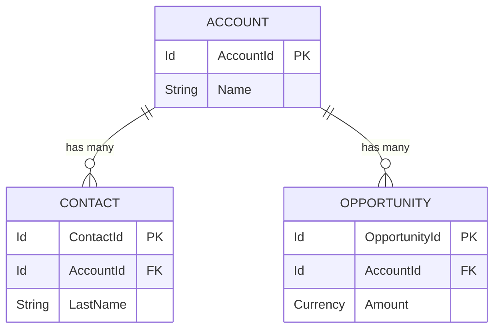
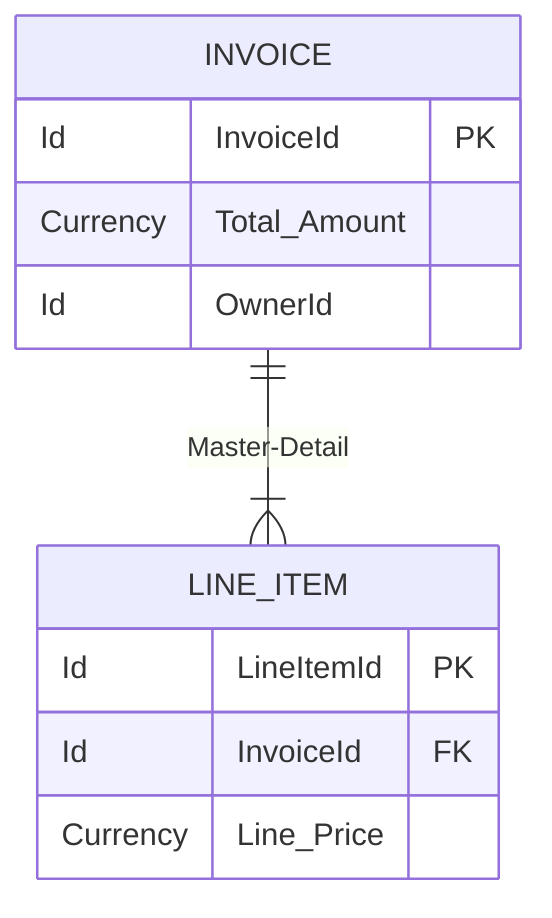
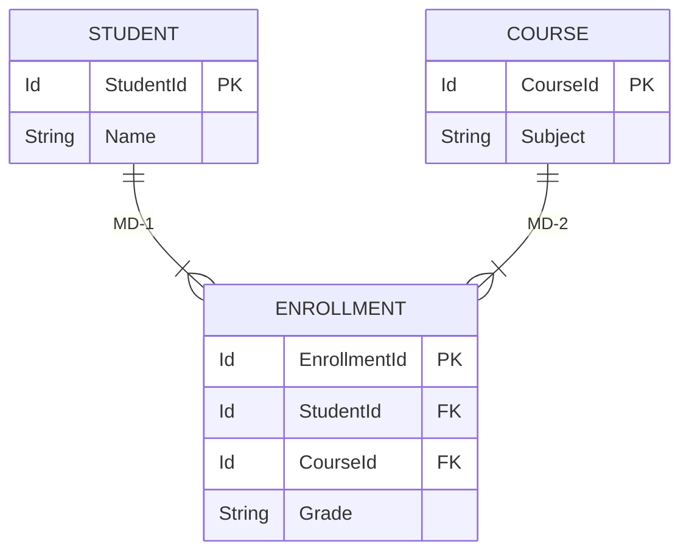

# Salesforce Relationships:

## 1. Introduction

### What are Relationships in Salesforce?
In Salesforce, relationships are special field types that connect two objects together, allowing users to associate records with one another. Fundamentally, they represent the logical connections between different entities within a relational database structure, specifically adapted for the multi-tenant Salesforce architecture.

### Why Relationships are Important
Relationships are the backbone of any relational database. In Salesforce, they:
- **Prevent Data Duplication:** Instead of typing a customer's details on every single order, an Order record simply references an Account record.
- **Enable Complex Business Logic:** Relationships drive workflow rules, roll-up summaries, and cross-object formulas.
- **Dictate Security & Access:** Certain relationships dictate who can see, edit, or delete a record based on the parent record's ownership.
- **Drive Reporting & Analytics:** They allow cross-object reporting, enabling businesses to query "All Opportunities for Accounts in the Technology Sector."

### Role in Data Modeling
Data modeling is the process of mapping business requirements to database tables (Objects) and defining how they interact (Relationships). A poor data model leads to excessive code (Apex), difficult reporting, and performance bottlenecks (Large Data Volumes). 

### Business Problems Solved
- **Sales Process:** Tracking which Contacts belong to which Account.
- **Support Operations:** Linking Cases back to specific Assets and Customers.
- **HR Systems:** Tracking Employees, their assigned Hardware, and their Managers.

---

## 2. Understanding Relationship Architecture

### Parent and Child Records
Relationships in Salesforce inherently follow a Parent-to-Child (One-to-Many) architecture.
- **Parent Record (The "One"):** The primary record that dictates the context. (e.g., Account)
- **Child Record (The "Many"):** The related records that look up to the parent. (e.g., Contacts, Opportunities)

### Referential Integrity
Referential integrity ensures that relationships between tables remain consistent. In Salesforce, this is handled via UI configurations:
- **Cascade Delete:** Deleting a parent automatically deletes children (Standard in Master-Detail).
- **Restrict Delete:** Prevents deleting a parent if child records exist (Configurable in Lookups).
- **Clear Value:** The lookup field on the child is cleared if the parent is deleted (Configurable in Lookups).

### Data Associations
Salesforce handles the mapping natively under the hood using foreign keys (the 18-character Salesforce ID).

### Relationship Queries
Because of this architecture, Salesforce Object Query Language (SOQL) is optimized to traverse these paths:
- **Upward (Child to Parent):** Fetching the child and fields from the parent (`Account.Name`).
- **Downward (Parent to Child):** Fetching the parent and a list of children (`(SELECT Name FROM Contacts)`).



---

## 3. Types of Salesforce Relationships

| Relationship Type | Purpose | Use Cases | Advantages | Limitations |
| :--- | :--- | :--- | :--- | :--- |
| **Lookup** | Loosely couples two objects. | Employee -> Asset, Case -> User. | Flexible, independent security, optional. | No roll-up summaries, no inherited sharing. |
| **Master-Detail (M-D)** | Tightly couples two objects; child depends on parent. | Invoice -> Line Item, Expense -> Expense Item. | Roll-up summaries, automatic inherited security. | Max 2 per object, parent is strictly required. |
| **Many-to-Many** | Associates many records to many records via a Junction Object. | Student <-> Course, Doctor <-> Patient. | Solves complex M:M mapping natively. | Requires a custom junction object, reporting can be complex. |
| **Self** | A lookup to the same object. | Account Hierarchy, Contact-to-Contact (Referral). | Great for hierarchical data. | Cannot be Master-Detail. |
| **Hierarchical** | Special self-relationship only available on the User object. | User -> Manager. | Powers approval processes and role hierarchies. | Exclusively available on User object. |
| **External Lookup** | Links a child standard/custom object to a parent External Object. | Opportunity -> External SAP Order. | Seamlessly integrates off-platform data. | Requires Salesforce Connect/OData. |
| **Indirect Lookup** | Links a child External Object to a parent Standard/Custom object. | External Payment -> Account. | Matches records via an External ID field. | Requires unique External ID on parent. |

---

## 4. Lookup Relationship

### What is a Lookup Relationship?
A Lookup relationship essentially links two objects together so that you can "look up" one object from the related items on another object. They are loosely coupled.

### Architecture
- The foreign key exists on the Child object.
- The parent can exist without the child, and the child can exist without the parent (if the lookup is optional).

### Record Ownership & Security Behavior
- **Independent Ownership:** The child record has its own Owner field.
- **Independent Security:** Sharing settings (OWD) for the child are determined independently of the parent. A user might see the child but not the parent, or vice versa.

### Delete Behavior
When configuring a custom lookup field, the architect must define the deletion behavior:
1. **Clear the value of this field:** (Default) The child remains, but the lookup field becomes blank.
2. **Don't allow deletion of the lookup record that's part of a lookup relationship:** Restricts deletion of the parent.
3. **Delete this record also:** (Cascade Delete - must be enabled by Salesforce Support for custom objects).

### Lookup Filters
Lookup filters restrict the valid values and lookup dialog results for lookup, master-detail, and hierarchical relationship fields. 
*Example:* On Case, a lookup to Asset can be filtered so `Asset.AccountId` must equal `Case.AccountId`.

### Lookup Relationship Queries
```sql
// Child to Parent (Traversing the lookup)
SELECT Id, Name, Asset_Tag__c, Assigned_To__r.Name, Assigned_To__r.Department 
FROM Hardware_Asset__c
```

---

## 5. Lookup Relationship Real Project Scenarios

1. **Employee ↔ Vehicle**
   * **Scenario:** A company assigns fleet vehicles to employees. Vehicles can be unassigned (parked in the lot).
   * **Why Lookup:** The relationship must be optional. A vehicle exists without an employee. Vehicle security might be public, while Employee security is private.
2. **Claim ↔ Dealer**
   * **Scenario:** An insurance claim is processed by a specific dealer.
   * **Why Lookup:** The Claim owner is an Adjuster, but the Dealer is just a reference point.
3. **Vendor ↔ Case**
   * **Scenario:** A support case might need to be escalated to a third-party vendor.
   * **Why Lookup:** The Case is owned by Support, not the Vendor. 
4. **Branch ↔ Customer**
   * **Scenario:** A retail bank customer is primarily associated with one home branch.
   * **Why Lookup:** Branches are public reference data; Customers have strict private OWD.
5. **Student ↔ Mentor**
   * **Scenario:** A university pairs incoming freshmen with senior mentors (Contact to Contact).
   * **Why Lookup:** Both are Contacts. A Self-Lookup is required.

---

## 6. Master-Detail Relationship

### What is a Master-Detail Relationship?
A tightly coupled relationship where the detail (child) record cannot exist without the master (parent) record. 

### Parent-Child Architecture
- The "Master" controls the behaviors of the "Detail".
- The lookup field on the detail record is always intrinsically **Required**.

### Ownership & Security Inheritance
- **No Ownership:** Detail records do *not* have an Owner field.
- **Security Inheritance:** The OWD of the Detail object is intrinsically set to "Controlled by Parent". If you can view the parent, you can view the child. (There are nuances like Read/Write vs Read Only setting on the relationship).

### Cascade Delete
When the Master record is deleted, all Detail records are automatically deleted. If the Master is undeleted (from the Recycle Bin), the Detail records are also undeleted.

### Reparenting
By default, once a Master-Detail relationship is created, the child cannot be reparented (moved to another master). However, administrators can check the **"Allow reparenting"** box to allow this.

### Roll-Up Summary Support
Only Master-Detail relationships support Roll-Up Summary Fields (RSF). The parent can automatically `COUNT`, `SUM`, `MIN`, or `MAX` fields from the child records.



---

## 7. Master-Detail Relationship Real Project Scenarios

1. **Invoice → Invoice Line Item**
   * **Implementation:** An Invoice must have lines. If the Invoice is deleted, the lines must go. The Invoice rolls up the SUM of all Line Items to a `Total Amount` field.
2. **Order → Order Item**
   * **Implementation:** (Standard Salesforce behavior mimics this). Items cannot exist in a vacuum without an Order.
3. **Expense Report → Expense Item**
   * **Implementation:** Employees own their Expense Report. The items within it share that ownership. The report needs a rollup for `Total Expenses`.
4. **Warranty Registration → Warranty Claim**
   * **Implementation:** Claims are tightly bound to the Registration. Deleting a registration invalidates the claims.
5. **Loan Application → Loan Documents**
   * **Implementation:** Document checklists for a specific loan. If the loan is purged for compliance, documents must cascade delete.

---

## 8. Lookup vs Master-Detail

| Feature | Lookup Relationship | Master-Detail Relationship |
| :--- | :--- | :--- |
| **Required on Layout?** | Optional (can be made required on layout/validation). | Always required at the database level. |
| **Record Ownership** | Child has its own Owner field. | Child inherits Owner from Master. |
| **Security / Sharing** | Independent OWD and Sharing Rules. | Child strictly inherits Master's sharing. |
| **Roll-Up Summaries** | Not supported (requires Apex/Flow to simulate). | Natively supported. |
| **Cascade Delete** | Optional / Requires custom configuration. | Automatic (Cascade delete always happens). |
| **Reparenting** | Always allowed. | Disabled by default (can be allowed). |
| **Reporting Behavior** | Standard reports require Outer Joins (With or Without). | Standard reports use Inner Joins (With). |
| **Limits** | Up to 40 per object. | Up to 2 per object. |

**Architect Guidance:** *Always default to Lookup.* Only upgrade to Master-Detail if business requirements strictly demand Roll-Up summaries, strict security inheritance, or strict data integrity (cascade delete). Master-Detail relationships lock data architecture and create locking contention under Large Data Volumes (LDV) due to sharing recalculations and roll-up calculations.

---

## 9. Junction Objects

### What is a Junction Object?
Salesforce does not have a native "Many-to-Many" field type. A Junction Object is a custom object with **two Master-Detail relationships** linking it to two different parent objects.

### Why Junction Objects Exist
To model complex business realities where entities relate to multiple other entities simultaneously.

### Security Considerations
- The junction object inherits security from **both** parents.
- To read the junction record, a user must have read access to *both* parent records.
- If either parent is deleted, the junction record is deleted.

### Reporting Considerations
Salesforce automatically creates a "Primary Object with Junction Object and Secondary Object" report type. 



---

## 10. Junction Object Real Project Scenarios

1. **Student ↔ Course (Junction: Enrollment)**
   * **Design:** A student takes many courses; a course has many students. Enrollment tracks specific junction data: *Semester, Grade, Status*.
2. **Doctor ↔ Patient (Junction: Appointment)**
   * **Design:** Doctors see many patients; patients see many doctors. Appointment tracks *Date, Time, Reason*.
3. **Product ↔ Promotion (Junction: Promotion Product)**
   * **Design:** A promotion spans multiple products, and a product can be in multiple promotions.
4. **Dealer ↔ Territory (Junction: Dealer Territory)**
   * **Design:** A dealer operates in multiple regions; regions have multiple dealers.

---

## 11. Many-to-Many Relationship Architecture

### Why no direct Many-to-Many?
In a relational database, an M:M relationship natively violates First Normal Form (1NF) if stored in a single table (requiring array/list data types). To resolve this in standard SQL, a linking table is required. Salesforce abstracts this via the Junction Object paradigm.

### Design Patterns
- **Primary vs Secondary Master:** The first Master-Detail relationship created on the junction object becomes the **Primary**. 
- **Impact of Primary:** The Primary master dictates the look and feel (color, icon) of the junction object in the UI. Ownership and Sharing are technically inherited from both, but the Primary master plays a dominant role if there is a conflict in standard delete behaviors.

---

## 12. Self Relationships

### What they are
A Lookup relationship where an object looks up to itself. 

### Use Cases & Examples
- **Account Hierarchy:** Standard `ParentId` field on Account. Allows building vast corporate trees (Global HQ -> Regional HQ -> Branch).
- **Contact Hierarchy:** `ReportsToId` on Contact. Used to map the org chart of a client's company.
- **Task Predecessors:** Custom lookup on a Project Task object referencing another Project Task that must be completed first.

*Note:* You cannot create a Master-Detail self-relationship.

---

## 13. Hierarchical Relationships

### User Hierarchy
This is a unique, system-level relationship type available *only* on the User object. It functions like a self-lookup but includes special behaviors for security and data routing.

### Manager Hierarchy
The standard `ManagerId` field on the User object. 

### Uses:
- **Approval Processes:** Route an approval dynamically to "User.Manager".
- **Hierarchy Custom Settings:** Apply configurations at the Org, Profile, or User level.
- **Manager Groups:** Share records implicitly up the manager chain (if enabled in Sharing Settings).

---

## 14. External Relationships

With Salesforce Connect, architects can model relationships between standard Salesforce data and external databases (SAP, Oracle, AWS) without duplicating data.

### External Lookup Relationship
- **Direction:** Child (Standard/Custom) → Parent (External Object).
- **Use Case:** An Opportunity in Salesforce looks up to a specific SAP Order (External Object).
- **Mechanism:** The standard object stores the External ID of the parent record.

### Indirect Lookup Relationship
- **Direction:** Child (External Object) → Parent (Standard/Custom).
- **Use Case:** An external Payment gateway (Child) relates back to a Salesforce Account (Parent).
- **Mechanism:** The External object maps to a unique External ID field on the standard Account object, not the Salesforce 18-char ID.

---

## 15. Relationship Queries

SOQL allows architects and developers to retrieve related data in a single query, heavily reducing database round-trips.

### Child-to-Parent Queries (Dot Notation)
Traverses upward (Lookup/MD). Maximum 5 levels deep.
```sql
SELECT Id, Name, Account.Name, Account.Owner.Name 
FROM Contact 
WHERE Account.Industry = 'Technology'
```
*Custom Object Example:*
```sql
SELECT Id, Name, Project__r.Name, Project__r.Status__c 
FROM Time_Entry__c
```

### Parent-to-Child Queries (Subqueries)
Traverses downward. Maximum 1 level deep from the root.
```sql
SELECT Id, Name, 
    (SELECT FirstName, LastName FROM Contacts), 
    (SELECT Amount, StageName FROM Opportunities WHERE IsClosed = false) 
FROM Account
```
*Custom Object Example:*
```sql
SELECT Id, Name, 
    (SELECT Hours__c, Date__c FROM Time_Entries__r) 
FROM Project__c
```

---

## 16. Relationship Impact on Security

Understanding how relationships impact the Salesforce sharing model is a core competency for an Architect.

### Object & Field Level Security
Relationships do not bypass Object (CRUD) or Field Level Security (FLS). If a user has access to a parent via MD, but lacks "Read" on the Child object profile, they still won't see the children.

### Record-Level Security & Sharing Rules
- **Lookups:** Have zero native impact on record-level sharing. You must explicitly create Sharing Rules or Apex Managed Sharing for both Parent and Child independently.
- **Master-Detail:** Implicitly shares the Detail record. If OWD for the Master is "Public Read Only", the Detail is "Public Read Only". 

### Role Hierarchy Impact
In a Master-Detail scenario, users sitting above the Master record's owner in the Role Hierarchy gain access to both the Master AND the Detail records automatically.

---

## 17. Relationship Impact on Reporting

Relationships define what standard report types Salesforce auto-generates.

### Standard Report Types
- **Master-Detail:** Generates `Primary with Detail` (e.g., Accounts with Opportunities). This is an INNER JOIN. Accounts without Opportunities will *not* show up.
- **Lookup:** Generates `Primary with or without Detail`. This is a LEFT OUTER JOIN.

### Custom Report Types (CRT)
CRTs allow admins to traverse up to 4 layers of relationships.
*Example:* `Accounts (A) -> with Opportunities (B) -> with/without Quote (C) -> with Quote Line Items (D)`.
CRTs also allow adding fields via lookup (`Add fields related via lookup`), essentially flattening the data structure for the end user.

### Joined Reports
If objects share a common parent (e.g., Opportunities and Cases both lookup to Account), a Joined Report can display them side-by-side grouped by the common Account relationship.

---

## 18. Relationship Limits

| Limit | Maximum Allowed | Notes |
| :--- | :--- | :--- |
| **Lookup Relationships per Object** | 40 | Applies to Custom Objects. |
| **Master-Detail Relationships per Object** | 2 | Primary and Secondary (for Junctions). |
| **Relationship Depth (Master-Detail)** | 3 levels | Parent -> Child -> Grandchild. |
| **Relationship Depth (SOQL Upwards)** | 5 levels | `Rel1__r.Rel2__r.Rel3__r.Rel4__r.Rel5__r.Name` |
| **Roll-Up Summary Fields per Object** | 25 (Standard) / 40 (Extended) | Requires Salesforce Support to extend to 40. |

---

## 19. Performance Considerations

### Large Data Volumes (LDV)
Relationships heavily impact performance in LDV environments (1M+ records).
- **Master-Detail Bottlenecks:** When a Master record is updated, Salesforce recalculates sharing for all Detail records. When Detail records are inserted/deleted, Roll-up Summaries lock the Master record, causing `UNABLE_TO_LOCK_ROW` exceptions during bulk data loads.
- **Lookup Skew:** Occurs when tens of thousands of child records look up to a single parent record (e.g., all "Unassigned" leads looking up to a dummy Account). This causes massive performance degradation on sharing calculation.

### Optimization Strategies
- Use Lookups instead of Master-Detail if roll-ups aren't strictly necessary.
- For high-volume parent-child calculations, use batch Apex or tools like Declarative Lookup Rollup Summaries (DLRS) asynchronously instead of native synchronous RSFs.
- Ensure foreign keys (Lookup/MD fields) are selectively indexed. Note: Salesforce automatically indexes Master-Detail fields and Lookup fields natively.

---

## 20. Real Enterprise Data Models

### CRM System
**`Account` → `Contact` → `Opportunity`**
- Account is the primary hub. Contacts look up to Account. Opportunities look up to Account. Opportunity Contact Roles (Junction) map Contacts to Opportunities.

### University Management
**`Student (Contact)` ↔ `Enrollment` ↔ `Course`**
- Standard Master-Detail Junction. Enrollment holds the Grade. A Roll-Up on Student calculates "Total Credits Completed".

### Banking System
**`Customer (Account)` → `Loan Application` → `Loan Documents`**
- Account to Application is a Lookup (Customers exist without loans). Application to Documents is Master-Detail (Documents must cascade delete for data compliance).

---

## 21. Common Mistakes

1. **Premature Master-Detail Selection:** Choosing M-D just for UI convenience, trapping the org in strict sharing and locking limits.
2. **Excessive Lookups:** Nearing the 40 limit creates massive UI clutter, page layout bloat, and slows down save operations.
3. **Ignoring Lookup Skew:** Assigning 50,000 "System Errors" Cases to one "System Administrator" User/Contact, breaking report performance and save times.
4. **Poor Junction Design:** Creating a junction object but using Lookups instead of Master-Detail, requiring massive amounts of custom Apex to manage sharing and deletion.

---

## 22. Best Practices

- **Naming Conventions:** For custom lookups, name the field logically. E.g., `Primary_Contact__c`. Understand that the API relationship name becomes `Primary_Contact__r` for traversing.
- **Always consider sharing first:** Before creating a relationship, ask: "Who needs to see the child data? Is it identical to the parent?" If not, DO NOT use Master-Detail.
- **Describe text:** Always fill out the Help Text and Description fields on Relationship fields.
- **Soft Deletions:** If historical data is critical, use Lookups with "Don't allow deletion" rather than Master-Detail to prevent accidental historical purge.

---

## 23. Enterprise Architecture Considerations

- **Global Implementations:** In multi-region orgs, sharing calculations take time. Heavy Master-Detail trees cause recalculation timeouts. Lookups combined with Apex Managed Sharing offer asynchronous scalability.
- **Data Governance:** Establish a strict ERD (Entity Relationship Diagram) review process before allowing admins to add Lookups to core objects (Account/Contact/Case).
- **Integration Impact:** External systems prefer flattened data. Deep hierarchical relationships require complex nested JSON payloads for REST APIs. Design APIs to flatten these relationships for external consumers.

---

## 24. Interview Questions & Answers

### Beginner Questions
**Q: What is the difference between Lookup and Master-Detail?**
*A:* Master-Detail strictly ties the child to the parent (cascade delete, inherited security, roll-ups). Lookups are loose connections (independent security, optional fields).

### Intermediate Questions
**Q: How do you create a Many-to-Many relationship in Salesforce?**
*A:* By creating a custom Junction Object and adding two Master-Detail relationship fields pointing to the two parent objects.

**Q: Can you convert a Lookup to a Master-Detail?**
*A:* Yes, but ONLY if every single existing record of the child object has a value populated in that Lookup field. Otherwise, the conversion will fail.

### Advanced Questions
**Q: What is Lookup Skew and how do you resolve it?**
*A:* Lookup skew happens when >10,000 child records look up to a single parent record. It causes row-locking and sharing calculation timeouts. Resolve it by distributing records among multiple dummy parents or removing the lookup requirement if possible.

### Architect-Level Questions
**Q: A client requires 3 levels of roll-up summaries (Grandparent <- Parent <- Child <- Grandchild) but also requires complex security where Parent records are hidden from certain users who can see Grandchild records. How do you architect this?**
*A:* You cannot use Master-Detail because M-D enforces inherited sharing (if you can't see the Parent, you can't see the Grandchild). The architecture must use Lookup relationships to satisfy the security requirement. To solve the Roll-Up requirement, implement an asynchronous Batch Apex job or a queueable trigger framework (or an async Flow) to calculate the summaries manually.

---

## 25. Revision Summary

- **Lookup:** Loose, optional, independent security, no roll-ups, max 40 per object.
- **Master-Detail:** Tight, required, inherited security, native roll-ups, cascade delete, max 2 per object, max 3 levels deep.
- **Junction Objects:** Solves M:M. Two Master-Details. Inherits security from both.
- **Self & Hierarchical:** Object relates to itself. Hierarchy is User-only.
- **External/Indirect Lookups:** Connect Salesforce to off-platform data sources.
- **Performance:** Avoid Lookup Skew and M-D lock contention on Large Data Volumes.
- **Best Practice:** Default to Lookups. Only use Master-Detail when business requirements strictly enforce it.