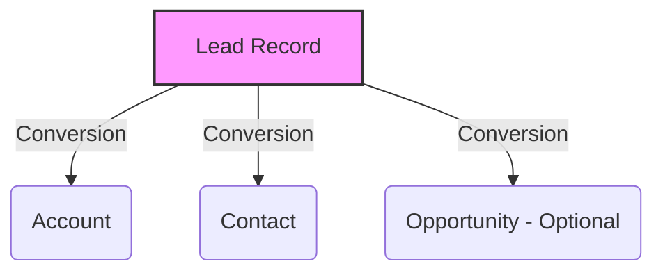
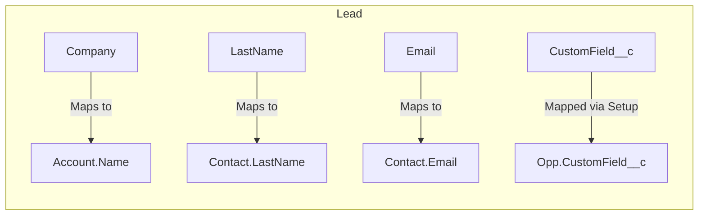
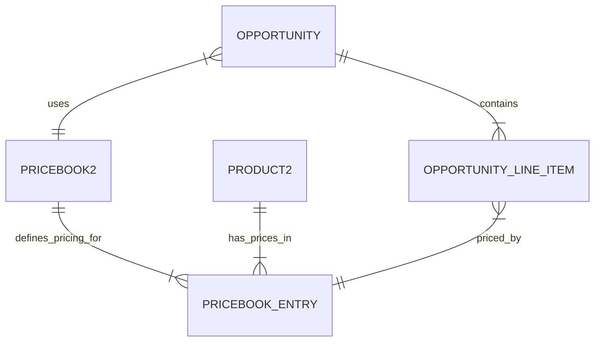

# Salesforce Standard Objects & CRM Data Model Architecture

## 1. Introduction

### What are Standard Objects?
In Salesforce, **Standard Objects** are pre-built, out-of-the-box database tables designed to handle common CRM (Customer Relationship Management) business requirements. They form the foundational data model of the Salesforce platform, representing standard business entities like accounts, contacts, leads, and opportunities.

### Why Salesforce Provides Standard Objects
Salesforce provides these objects to accelerate CRM implementation. Instead of building a customer data model from scratch, organizations can leverage Salesforce’s decades of CRM best practices. Standard objects come with pre-configured relationships, specialized UI components, native business logic, and standard report types that would require hundreds of hours to build custom.

### Benefits of Using Standard Objects
* **Faster Time-to-Value:** Ready to use immediately upon org provisioning.
* **Native Functionality:** Standard objects unlock native features (e.g., Lead Conversion, Opportunity Forecasting, Case Escalation Rules).
* **Integration Readiness:** Most third-party apps (AppExchange) and integrations (MuleSoft, ERPs) map natively to Standard Objects.
* **Salesforce Updates:** Salesforce continuously enhances standard objects (e.g., AI/Einstein features) with each release.

### Difference between Standard Objects and Custom Objects
| Feature | Standard Objects | Custom Objects |
| :--- | :--- | :--- |
| **Origin** | Provided out-of-the-box by Salesforce | Created by Admins/Developers |
| **Naming Convention** | Standard names (e.g., `Account`) | Appended with `__c` (e.g., `Project__c`) |
| **Deletion** | Cannot be deleted (only hidden via security) | Can be deleted |
| **Native Logic** | Pre-built processes (e.g., Lead Conversion) | Requires Flow/Apex for complex logic |
| **Use Case** | Standard CRM domains (Sales, Service, Marketing) | Domain-specific or company-specific entities |

---

## 2. Understanding CRM Data Model

### CRM Fundamentals
Customer Relationship Management is fundamentally about managing interactions across the entire customer journey. The Salesforce Standard Data Model is perfectly aligned with this journey, allowing data to flow seamlessly from a marketing prospect to a closed sale, and finally to a supported customer.

### Customer Lifecycle & Salesforce Support
* **Marketing Lifecycle:** Capturing awareness and engagement.
    * *Objects:* `Campaign`, `Lead`, `CampaignMember`.
    * *Process:* Campaigns generate Leads. Leads represent unqualified interest.
* **Sales Lifecycle:** Qualifying interest and closing deals.
    * *Objects:* `Account`, `Contact`, `Opportunity`, `Quote`, `Order`.
    * *Process:* Leads convert to Accounts, Contacts, and Opportunities. Opportunities move through pipeline stages to track revenue.
* **Service Lifecycle:** Retaining customers and resolving issues.
    * *Objects:* `Case`, `Entitlement`, `Knowledge`, `Asset`.
    * *Process:* Contacts raise Cases. Support agents use Knowledge and Entitlements to resolve Cases against specific Assets.

---

## 3. Core Salesforce Standard Objects Overview

| Object Name | API Name | Purpose | Common Use Cases | Key Relationships |
| :--- | :--- | :--- | :--- | :--- |
| **Account** | `Account` | Companies or individuals you do business with. | B2B Companies, B2C Consumers (Person Accounts), Partners. | Parent to Contact, Opportunity, Case. |
| **Contact** | `Contact` | Individuals associated with an Account. | Employees of a B2B customer, decision makers. | Child of Account. |
| **Lead** | `Lead` | Unqualified prospects. | Web-to-lead forms, trade show scans, purchased lists. | Converts to Account, Contact, Opp. |
| **Opportunity** | `Opportunity` | Potential revenue-generating deals. | Tracking sales pipeline, forecasting, managing sales cycles. | Child of Account. |
| **Case** | `Case` | Customer feedback, issues, or requests. | Helpdesk tickets, customer complaints, IT requests. | Child of Account/Contact. |
| **Campaign** | `Campaign` | Marketing initiatives. | Email blasts, webinars, trade shows. | Parent to CampaignMember. |
| **Product** | `Product2` | Items or services sold to customers. | Cataloging software licenses, physical goods, services. | Related to PricebookEntry. |
| **Price Book** | `Pricebook2` | A list of products and their prices. | Tiered pricing (e.g., Standard vs. Enterprise pricing). | Related to Product2. |
| **Price Book Entry** | `PricebookEntry` | A specific price for a product in a price book. | Multi-currency pricing, discount modeling. | Junction: Product2 & Pricebook2. |
| **Quote** | `Quote` | Proposed prices for products/services. | Sending formal pricing proposals to customers. | Child of Opportunity. |
| **Contract** | `Contract` | Written agreements defining terms. | SLAs, subscription agreements, legal terms. | Child of Account. |
| **Asset** | `Asset` | Specific products a customer has purchased. | Tracking serial numbers, managing warranties, install base. | Child of Account/Contact. |
| **Order** | `Order` | Confirmation of a purchase. | Fulfilling sold products, integrating with ERP systems. | Child of Account, related to Contract. |
| **User** | `User` | Internal employees logging into Salesforce. | Assigning record ownership, tracking logins. | Owner of most standard records. |
| **Task** | `Task` | A to-do item (no fixed time). | "Call John back", "Send quote". | Related to any object via `WhatId`/`WhoId`. |
| **Event** | `Event` | A scheduled calendar meeting. | Discovery meeting, QBR, demo. | Related to any object via `WhatId`/`WhoId`. |
| **Knowledge** | `Knowledge__kav` | Articles, FAQs, and procedures. | Self-service communities, agent scripts. | Related to Case via CaseArticle. |
| **Content Document** | `ContentDocument` | Uploaded files and documents. | Signed contracts, spec sheets, customer ID proofs. | Parent of ContentVersion. |

---

## 4. Account Object

### Business Purpose
The `Account` is the heart of the Salesforce data model. It represents the entities your organization does business with. Without an Account, the rest of the CRM process (Opportunities, Cases) lacks context.

### Person Account vs. Business Account
* **Business Account (B2B):** Represents a company. It acts as a container for related Contacts (the employees of that company).
* **Person Account (B2C):** Represents an individual consumer. It merges the fields of Account and Contact into a single record. Once enabled, Person Accounts cannot be disabled.

### Key Fields
* `Name`, `Industry`, `AnnualRevenue`, `BillingAddress`, `ShippingAddress`, `ParentId` (Account Hierarchy).

### Account Hierarchy & Global Organizations
Accounts support a self-referencing relationship (Parent Account). This is crucial for modeling global organizations.
* **Global Ultimate:** Acme Corp Global (HQ)
    * **Domestic HQ:** Acme Corp North America
        * **Branch:** Acme Corp New York
        * **Branch:** Acme Corp Chicago
* *Architecture Note:* Record-level security (sharing) does *not* automatically cascade down the Account Hierarchy unless explicitly configured via Sharing Rules.

---

## 5. Contact Object

### Purpose
The `Contact` object represents the human beings associated with an Account. In B2B scenarios, they are the decision-makers, champions, or end-users.

### Relationship with Account
By default, Contact has a Master-Detail-like relationship with Account, but it is technically a specialized Lookup (e.g., Contacts can be orphaned/private if they have no Account, though this is rare). 

### Business Scenarios
* Tracking communication preferences (Do Not Call, Email Opt Out).
* Identifying the primary billing contact vs. technical contact.
* Customer community login mapping (Community Users are tied to Contacts).

---

## 6. Lead Object

### Lead Management Process
A `Lead` is a raw, unqualified prospect. They act as a temporary holding area to keep dirty data (spam, unverified lists) out of your core Accounts and Contacts database.

### Lead Qualification
The business process of determining if a Lead has genuine buying intent, budget, and authority (BANT framework).

### Lead Conversion Process
When a Lead is qualified, the native Lead Conversion process is triggered.
* **Lead → Account:** Creates a new Account or links to an existing one.
* **Lead → Contact:** Creates a new Contact under the Account.
* **Lead → Opportunity:** (Optional) Creates a new sales pipeline record.

---

## 7. Opportunity Object

### Purpose
The `Opportunity` object tracks sales deals. It is the primary object for revenue generation, forecasting, and tracking the sales lifecycle.

### Sales Pipeline & Stages
Opportunities move through standard stages (e.g., Prospecting, Value Proposition, Negotiation, Closed Won, Closed Lost). Each Stage maps to a `Probability %` and a `Forecast Category`.

### Forecasting & Revenue Tracking
By logging the `Amount` and `CloseDate`, sales managers can utilize Collaborative Forecasting to predict quarterly revenue.

### Real-World Example
A software company uses Opportunities to track the sale of a $50,000 enterprise license. The Opp starts at "Discovery" (10% probability). As the AE completes a demo and sends a quote, it moves to "Negotiation" (80%), culminating in "Closed Won" (100%).

---

## 8. Account-Contact Relationship

### The Shift to Many-to-Many
Historically, a Contact belonged to one Account. Modern CRM requires flexibility. Salesforce introduced **Contacts to Multiple Accounts (AccountContactRelation)**.

### Contact Roles & ACR
* **Direct Relationship:** The primary company the person works for (Account Name on the Contact).
* **Indirect Relationship:** Other companies the person is affiliated with (e.g., A consultant who is the primary contact for Company A, but also advises Company B).

### Example
Dr. Smith (Contact) is directly related to "City Hospital" (Account). Dr. Smith also has an indirect relationship with "State Medical Board" (Account) as an "Advisory Board Member" (Role).

---

## 9. Lead Conversion Architecture

### What Happens During Conversion?
1.  **Data Mapping:** Custom Lead fields are mapped to Custom Account, Contact, and Opportunity fields via the "Map Lead Fields" setup UI. Standard fields map automatically.
2.  **Record Creation:** The system instantiates the new records and links them.
3.  **Lead Status:** The Lead record is flagged as `IsConverted = True`. It becomes read-only and is hidden from standard list views (but remains in the database for historical reporting).
4.  **Campaign History:** If the Lead was in a Campaign, the Campaign Member record is reparented to the new Contact.

### Data Mapping Diagram

---

## 10. Opportunity Data Model

### The Complete Sales Lifecycle Architecture
Revenue is rarely a single flat number. It is built from specific products.

1.  **Product2:** The catalog of what you sell (e.g., "CRM License", "Implementation Service").
2.  **Pricebook2:** The list of prices (e.g., "US Standard", "Government Pricing").
3.  **PricebookEntry:** The junction detailing that "CRM License" in the "US Standard" pricebook costs $100.
4.  **Opportunity:** The deal container.
5.  **OpportunityLineItem (Opportunity Product):** The specific products added to the deal. The sum of these items rolls up to the Opportunity `Amount`.

---

## 11. Service Cloud Standard Objects

* **Case:** The core object for support. Tracks customer issues. Features native escalation rules, assignment rules, and email-to-case.
* **Entitlement:** Defines the level of support a customer is guaranteed (e.g., "24/7 Phone Support").
* **Milestone:** Time-dependent steps on a Case (e.g., "First Response within 2 hours"). Enforces SLAs.
* **Asset:** Represents a specific physical or digital item the customer owns. Cases are often logged against specific Assets.
* **Knowledge (Knowledge__kav):** Articles used by agents to solve Cases faster, or exposed to customers via Communities.

---

## 12. Marketing Standard Objects

* **Campaign:** A marketing initiative. Can be hierarchical (Parent Campaign: "2024 Trade Shows" -> Child Campaign: "Dreamforce 2024").
* **Campaign Member:** A junction object linking a Campaign to a Lead or a Contact. Tracks their status in the campaign (e.g., "Sent", "Responded", "Attended").

---

## 13. Activity Management Objects

* **Task:** A discrete action to be completed. Shows in "Open Activities" and moves to "Activity History" when closed.
* **Event:** A scheduled meeting with a start and end date/time.
* **Polymorphic Relationships:** Activities use special polymorphic lookup fields:
    * `WhoId`: Relates to a human (Lead or Contact).
    * `WhatId`: Relates to a record (Account, Opportunity, Case, Custom Object).
* *Note:* The UI aggregates these into the **Activity Timeline**.

---

## 14. Content Management Objects (Salesforce Files)

Salesforce moved away from the old "Attachments" object to a robust, version-controlled architecture.
* **ContentDocument:** The master container for a file.
* **ContentVersion:** The specific version of the file. Updating a file creates a new ContentVersion under the same ContentDocument.
* **ContentDocumentLink:** The junction object that shares a ContentDocument with a Record (like an Account), a User, or a Group.

---

## 15. Standard Object Relationships

Understanding these relationships is vital for SOQL querying and reporting.

| From Object | To Object | Relationship Type | Key Impact |
| :--- | :--- | :--- | :--- |
| **Account** | **Contact** | Lookup (Special) | Contacts deleted if Account deleted (cascade). |
| **Account** | **Opportunity** | Lookup (Special) | OWD of Account can control Opportunity access. |
| **Opportunity** | **Product (OLI)** | Master-Detail | OLI cannot exist without an Opp. Roll-up summaries exist natively. |
| **Campaign** | **Lead/Contact** | Junction (CampaignMember) | Allows many-to-many relationship tracking. |
| **Account** | **Case** | Lookup | Single account has many support cases. |

---

## 16. Standard Objects vs Custom Objects

### When NOT to create Custom Objects
The golden rule of Salesforce architecture: **Use standard objects if the business process matches the object's intent.**

* *Mistake:* Creating `Support_Ticket__c` instead of using `Case`.
    * *Why:* You lose Email-to-Case, Support SLAs, Entitlements, and Case Routing.
* *Mistake:* Creating `Prospect__c` instead of `Lead`.
    * *Why:* You lose the native Lead Conversion engine.
* *Mistake:* Creating `Deal__c` instead of `Opportunity`.
    * *Why:* You lose Collaborative Forecasting, Opportunity Splits, and standard pipeline reporting.

### Custom Object Use Cases
Create custom objects for industry-specific data that doesn't fit standard CRM molds: `Property__c` (Real Estate), `Vehicle__c` (Auto), `Patient_Visit__c` (Healthcare).

---

## 17. Security Considerations

Standard objects have unique security behaviors:
* **Implicit Sharing:**
    * If a user has access to a child Opportunity, Case, or Contact, they implicitly get Read access to the parent Account.
    * If a user owns an Account, they implicitly get Read/Write access to child records based on role hierarchy.
* **Controlled by Parent:** Default security for Contacts, Opportunities, and Cases can be set to "Controlled by Parent" in OWD (Organization-Wide Defaults), meaning access to the Account dictates access to the child.
* **Lead Conversion Security:** Users must have "Create" and "Edit" on Account, Contact, and Opp, plus "Convert Leads" profile permission to convert a Lead.

---

## 18. Reporting Considerations

* **Standard Report Types:** Salesforce automatically provides report types for standard objects (e.g., "Accounts with Contacts", "Opportunities with Products").
* **With/Without Logic:** Cross-filter logic is natively supported (e.g., "Accounts *without* Opportunities").
* **Dashboard Implications:** Standard objects support dynamic dashboards running as the logged-in user, leveraging the standard role hierarchy.

---

## 19. Real Project Scenarios

### Manufacturing Company
* **Accounts:** Distributors and direct B2B buyers.
* **Contacts:** Purchasing managers at those distributors.
* **Opportunities:** Long-cycle sales for bulk machinery orders.
* **Assets:** Serialized machines installed at customer sites, used for warranty tracking.

### Banking Organization
* **Accounts:** Person Accounts (Retail Banking Customers) & Business Accounts (Commercial Banking).
* **Leads:** Prospects who started a mortgage application online.
* **Opportunities:** Loan origination tracking.
* **Cases:** Fraud reports, fee dispute resolutions.

### Insurance Organization
* **Accounts:** Policy Holders (Person Accounts).
* **Contacts:** Independent Brokers (B2B Contacts).
* **Assets:** Represents the actual Policies held by the customer.
* **Cases:** Claim processing and routing.

---

## 20. Common Mistakes

1.  **Reinventing the Wheel:** Rebuilding standard features via Apex/Custom Objects (e.g., building a custom quote generator instead of using `Quote` and `QuoteLineItem`).
2.  **Abusing the Account Object:** Using Accounts to store non-business entities.
3.  **Orphaned Contacts:** Allowing users to create Contacts without linking them to Accounts, leading to data visibility issues and dirty data.
4.  **Ignoring Lead Conversion:** Just creating Contacts manually and leaving Leads open, completely breaking marketing ROI tracking.
5.  **Not Using Pricebooks:** Relying on custom currency fields on the Opportunity instead of Opportunity Products, destroying product-level forecasting.

---

## 21. Best Practices

1.  **Data Governance:** Enforce validation rules on standard objects (e.g., require an Industry on Accounts).
2.  **Lead Cleanliness:** Implement duplicate rules (Matching Rules) to prevent duplicate Leads and Contacts.
3.  **Process Mapping:** Before writing a single line of code, map the business process to standard standard object lifecycles.
4.  **Field Utilization:** Repurpose standard fields before creating custom fields (e.g., use standard `Description` before creating `Notes__c`).

---

## 22. Enterprise Architecture Considerations

* **Large Data Volumes (LDV):** Standard objects like Account and Contact can easily reach tens of millions of records. Implement indexing, external IDs for integration, and archiving strategies. Account Data Skew (having >10k child records on one Account) will cause severe locking issues.
* **Multi-Org vs Single-Org:** Global deployments must decide if different business units share an Account model or operate in separate orgs. Record Types on Standard Objects allow multiple business units to coexist in one org safely.
* **Integration:** Standard objects are typically the targets for MDM (Master Data Management) systems. Use `External_ID__c` fields heavily on Account and Contact to map to ERP systems (SAP, Oracle).

---

## 23. Interview Questions & Answers

### Beginner
**Q: What is the difference between a Lead and a Contact?**
A: A Lead is an unqualified prospect. Once qualified, it is converted into a Contact, which represents a verified person associated with an Account.

### Intermediate
**Q: Explain what happens during Lead Conversion.**
A: The Lead record is flagged as converted and hidden from standard list views. The data maps to create or update an Account, a Contact, and optionally an Opportunity. Any related Activities or Campaign Members are re-parented to the new Contact.

### Advanced
**Q: How does the AccountContactRelation object change data modeling?**
A: Historically, a Contact had a 1-to-M relationship (one Account, many Contacts). ACR allows a Many-to-Many relationship, meaning a single Contact record can be related to multiple Accounts (one Direct, many Indirect), which is vital for modeling consultants, doctors, or franchise owners.

### Architect-Level
**Q: A client has 15 million Account records and wants to assign a single "Catch-All" Account to 50,000 orphaned Contacts. What architectural risks does this pose?**
A: This creates **Account Data Skew**. In Salesforce, when a parent Account has more than 10,000 child records, any update to the parent Account (or role hierarchy changes affecting the owner) can trigger massive asynchronous sharing recalculations, leading to CPU timeouts, record locking errors (UNABLE_TO_LOCK_ROW), and severe performance degradation. The solution is to leave them unlinked (if security model allows) or distribute them across dummy accounts (e.g., "Catch-All 1", "Catch-All 2").

---

## 24. Revision Summary

* **Core Concept:** Standard Objects are out-of-the-box tables tailored for standard CRM processes (Sales, Service, Marketing).
* **Key Objects:** Account (Companies), Contact (People), Lead (Prospects), Opportunity (Deals), Case (Support Tickets).
* **Sales Process:** Lead -> Account/Contact/Opportunity -> Quote -> Order.
* **Data Model Constraints:** Always prefer standard objects over custom objects if a standard business process applies (to retain native platform capabilities).
* **Enterprise Risks:** Be wary of Account Data Skew, understand implicit sharing behavior on standard objects, and ensure proper use of Pricebooks for accurate revenue reporting.