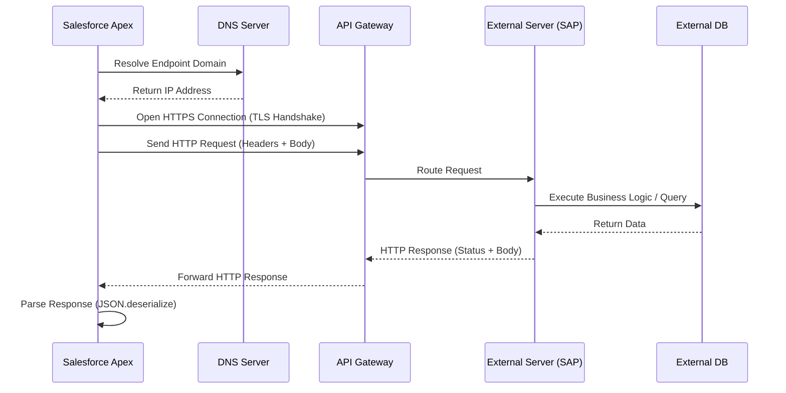

# Http Callouts External Api Communication

# 1. Introduction

Salesforce does not exist in isolation. Modern enterprise ecosystems require seamless data flow between platforms. **HTTP Callouts** are the primary mechanism Salesforce uses to communicate with external web services via REST or SOAP APIs over the HTTP protocol. 

* **Outbound Integrations:** Salesforce initiates the request to an external system (e.g., Salesforce sending a new Warranty Claim to SAP).
* **Inbound Integrations:** External systems initiate the request to Salesforce (e.g., SAP updating the Warranty Claim status in Salesforce).

**Why HTTP Callouts Matter:**
They enable real-time and asynchronous data synchronization, process automation, and microservices architectures. In an Automotive CRM, if a dealer submits a vehicle registration, Salesforce uses an HTTP Callout to instantly push that data to a government API and retrieve the registration number.

---

# 2. What is an HTTP Callout?

An HTTP Callout is an algorithmic request sent from Apex code to an external server. It adheres to a strict **Request-Response Architecture**.

* **Client-Server Communication:** Salesforce is the *Client*; the external system is the *Server*.
* **Stateless Communication:** Each request contains all the information needed by the server to process it. The server does not store session context between requests.
* **Synchronous vs. Asynchronous:** Callouts can block the current execution thread until a response is received (Synchronous) or run in the background (Asynchronous).
* **API Gateway:** Often, Salesforce doesn't talk directly to a legacy database but routes requests through an API Gateway (like MuleSoft or Apigee) which handles routing, throttling, and protocol translation.


---

# 3. Why HTTP Callouts are Needed

Enterprise architectures require integrating best-of-breed systems. Common scenarios include:

* **SAP/ERP Integration:** Syncing Work Orders, Inventory, and Invoices.
* **Government APIs:** Aadhaar Verification, GST Validation, PAN Verification (Strictly handling identity verification via secure tokens, never logging sensitive IDs).
* **Payment Gateways:** Processing dealer subscription fees via Stripe or PayPal.
* **Shipping APIs:** Tracking spare parts shipments via FedEx or UPS.
* **AI Services:** Sending customer complaints to OpenAI for sentiment analysis.
* **Automotive CRM Examples:** * Pushing a closed Warranty Claim to an external ERP for financial settlement.
    * Fetching live Spare Parts availability from a global supply chain database.

---

# 4. HTTP Protocol Fundamentals

* **HTTP (Hypertext Transfer Protocol):** The foundation of data communication on the web.
* **HTTPS (Secure):** HTTP encrypted with TLS/SSL. Salesforce mandates HTTPS for almost all external communication.
* **URI vs URL:** A URI (Uniform Resource Identifier) identifies a resource. A URL (Uniform Resource Locator) is a type of URI that provides the specific address (e.g., `https://api.erp.com/v1/vehicles`).
* **Endpoint:** The exact URL where the API service can be accessed.
* **Headers:** Metadata sent with the request/response (e.g., Content-Type, Authorization).
* **Body (Payload):** The actual data being transmitted (usually JSON or XML).

---

# 5. Complete HTTP Request Lifecycle

When an Apex HTTP Callout executes, a complex lifecycle occurs under the hood:



---

# 6. Apex HTTP Classes

Salesforce provides three primary classes in the `System` namespace for HTTP callouts:

1.  **`HttpRequest`**: Represents the outgoing request (Method, Endpoint, Body, Headers).
2.  **`Http`**: The execution engine that sends the `HttpRequest`.
3.  **`HttpResponse`**: Represents the incoming response from the server (Status, Code, Body).

---

# 7. HttpRequest Class

The `HttpRequest` class defines *what* you are sending and *where*.

| Method | Description |
| :--- | :--- |
| `setEndpoint(String)` | Sets the URL or Named Credential (e.g., `callout:SAP_API/v1/vehicles`). |
| `setMethod(String)` | Sets the HTTP method (`GET`, `POST`, `PUT`, etc.). |
| `setHeader(String, String)` | Adds a header (e.g., `setHeader('Content-Type', 'application/json')`). |
| `setBody(String)` | Sets the string payload (usually serialized JSON). |
| `setBodyAsBlob(Blob)` | Sets binary data (e.g., for file uploads). |
| `setTimeout(Integer)` | Sets timeout in milliseconds (Max 120,000). |

*Code Example:*
```apex
HttpRequest req = new HttpRequest();
req.setEndpoint('callout:Dealer_ERP/api/v1/inventory');
req.setMethod('POST');
req.setHeader('Content-Type', 'application/json');
req.setBody('{"dealerCode": "DL-001"}');
req.setTimeout(60000);
```

---

# 8. HttpResponse Class

The `HttpResponse` class processes the server's reply.

| Method | Description |
| :--- | :--- |
| `getStatusCode()` | Returns the numeric HTTP status (e.g., 200, 404, 500). |
| `getStatus()` | Returns the string representation of the status (e.g., 'OK', 'Not Found'). |
| `getBody()` | Returns the response body as a String (usually JSON). |
| `getHeader(String)` | Retrieves a specific response header. |

*Code Example:*
```apex
HttpResponse res = http.send(req);
if (res.getStatusCode() == 200) {
    String responseBody = res.getBody();
    System.debug('Success: ' + responseBody);
}
```

---

# 9. Http Class

The `Http` class is the conduit. It has only one primary method: `send()`.

```apex
Http http = new Http();
try {
    // Synchronously sends the request and blocks thread until response or timeout
    HttpResponse res = http.send(req); 
} catch (System.CalloutException ex) {
    System.debug('Callout failed: ' + ex.getMessage());
}
```

---

# 10. HTTP Methods

| Method | Purpose | Idempotent? | Safe? |
| :--- | :--- | :--- | :--- |
| **GET** | Retrieve data | Yes | Yes |
| **POST** | Create new records | No | No |
| **PUT** | Completely replace/update a record | Yes | No |
| **PATCH** | Partially update a record | No | No |
| **DELETE** | Remove a record | Yes | No |

---

# 11. HTTP GET

Used to fetch data. In an Automotive CRM, you might fetch Vehicle details by VIN.

```apex
HttpRequest req = new HttpRequest();
// Query parameters are appended to the URL
req.setEndpoint('callout:Vehicle_API/v1/vehicles?vin=1HGCM82633A');
req.setMethod('GET');
req.setHeader('Accept', 'application/json');

Http http = new Http();
HttpResponse res = http.send(req);
```

---

# 12. HTTP POST

Used to push new data. Requires a body.

```apex
HttpRequest req = new HttpRequest();
req.setEndpoint('callout:Warranty_API/v1/claims');
req.setMethod('POST');
req.setHeader('Content-Type', 'application/json');

String jsonBody = '{"claimNumber": "CLM-9981", "amount": 450.00, "dealer": "DL-123"}';
req.setBody(jsonBody);

HttpResponse res = new Http().send(req);
```

---

# 13. HTTP PUT vs PATCH

* **PUT:** Replaces the *entire* Warranty Claim. If you omit the "amount" field in the payload, the server sets it to null.
* **PATCH:** Updates *only* the fields provided. If you only send the "status" field, the "amount" remains unchanged on the server.

---

# 14. HTTP DELETE

Used for hard or soft deletes on the external system. Usually requires passing an ID in the path.

```apex
HttpRequest req = new HttpRequest();
req.setEndpoint('callout:Warranty_API/v1/claims/CLM-9981');
req.setMethod('DELETE');
HttpResponse res = new Http().send(req);
```

---

# 15. Request Headers

Headers control metadata.
* `Authorization`: Carries credentials (e.g., `Bearer eyJhbGci...`).
* `Content-Type`: Tells the server what format the body is in (`application/json`).
* `Accept`: Tells the server what format Salesforce wants back.
* `X-Correlation-ID`: Custom header used for distributed tracing across MuleSoft and SAP.

---

# 16. Request Body

The Body contains the payload. 
* **JSON** is the enterprise standard for REST APIs.
* **XML** is used for legacy SOAP APIs.
* **Multipart/Form-Data** is used to send files (like a photo of a broken car part).

---

# 17. Response Handling

Always check the `getStatusCode()` before parsing the `getBody()`. Not all 200-level codes mean success for your specific business logic, and error bodies often contain JSON detailing *why* it failed.

---

# 18. HTTP Status Codes

| Range | Category | Common Codes |
| :--- | :--- | :--- |
| **1xx** | Informational | 100 Continue |
| **2xx** | Success | 200 OK, 201 Created, 204 No Content |
| **3xx** | Redirection | 301 Moved Permanently, 302 Found |
| **4xx** | Client Error | 400 Bad Request, 401 Unauthorized, 403 Forbidden, 404 Not Found |
| **5xx** | Server Error | 500 Internal Server Error, 503 Service Unavailable |

---

# 19. JSON Processing

Salesforce provides the `JSON` class to convert Apex Objects to JSON strings and vice-versa.

* `JSON.serialize(object)`: Converts Apex object to JSON string.
* `JSON.serialize(object, true)`: Suppresses null values (highly recommended for smaller payloads).
* `JSON.deserialize(jsonString, ApexType.class)`: Converts JSON string directly into a typed Apex class.
* `JSON.deserializeUntyped(jsonString)`: Converts JSON to `Map<String, Object>`. Useful for highly dynamic JSON.

---

# 20. Wrapper Classes

Enterprise JSON responses are often deeply nested. Wrapper classes mirror this structure, making deserialization a one-line operation.

*Example JSON:*
```json
{
  "dealer": {
    "id": "DL-123",
    "parts": [ {"partId": "P-1", "stock": 50} ]
  }
}
```

*Apex Wrapper:*
```apex
public class DealerResponseWrapper {
    public DealerInfo dealer;
    
    public class DealerInfo {
        public String id;
        public List<Part> parts;
    }
    
    public class Part {
        public String partId;
        public Integer stock;
    }
}

// Deserialization
DealerResponseWrapper response = (DealerResponseWrapper) JSON.deserialize(res.getBody(), DealerResponseWrapper.class);
System.debug(response.dealer.parts[0].stock); // 50
```

---

# 21. Authentication

* **Basic Authentication:** Base64 encoded `Username:Password`. (Insecure, avoid unless using HTTPS and legacy systems).
* **API Keys:** A secret token passed in a header (e.g., `x-api-key: 12345`).
* **Bearer Tokens:** Usually generated via an identity provider. Passed as `Authorization: Bearer <token>`.
* **OAuth 2.0:** The enterprise standard. Salesforce authenticates with an auth server, gets a token, and uses that token for subsequent API calls.

---

# 22. Named Credentials

**NEVER hardcode endpoints or credentials in Apex.**
Named Credentials (NC) securely store the URL and handle authentication (including OAuth token refreshes) declaratively.

* **Advantages:** Zero code for auth, automatic OAuth token management, abstract endpoints from environments (sandbox vs prod).
* **External Credentials:** Introduced recently to separate the authentication parameters (principals) from the endpoint URL, allowing different permission sets to use different credentials for the same endpoint.

*Usage in Apex:*
```apex
// No headers or auth logic needed in code!
req.setEndpoint('callout:SAP_ERP_Credential/v1/inventory'); 
```

---

# 23. Remote Site Settings

| Feature | Remote Site Settings (RSS) | Named Credentials (NC) |
| :--- | :--- | :--- |
| **Purpose** | Whitelists an external domain. | Whitelists + Manages Authentication. |
| **Security** | Requires custom Apex to handle tokens/passwords. | Handles auth automatically and securely. |
| **Recommendation**| Use only for public, unauthenticated APIs. | **Best Practice** for all authenticated integrations. |

---

# 24. Error Handling

Always wrap callouts in a `try-catch` block. Catch `CalloutException` (for connection/timeout failures) and handle HTTP status errors (400s, 500s) gracefully.

```apex
try {
    HttpResponse res = new Http().send(req);
    if (res.getStatusCode() >= 200 && res.getStatusCode() < 300) {
        // Success Logic
    } else {
        // HTTP Error Logic (e.g., 401 Unauthorized, 500 Server Error)
        Integration_Log__c log = new Integration_Log__c(Error__c = res.getBody());
        insert log;
    }
} catch (System.CalloutException ex) {
    // Connection Error (e.g., Timeout, DNS failure)
    Integration_Log__c log = new Integration_Log__c(Error__c = ex.getMessage());
    insert log;
}
```

---

# 25. Timeout Handling

The default timeout is 10 seconds. For enterprise APIs, explicitly set it higher (up to 120 seconds).
```apex
req.setTimeout(120000); // 120 seconds
```
*Architect Note:* Prolonged synchronous callouts lock up the UI. Use Asynchronous patterns (Continuation or Queueable) for long-running integrations.

---

# 26. Retry Mechanisms

Network requests fail. Implement an **Exponential Backoff** retry strategy using Queueable Apex if a 500-level error occurs.
* **Idempotency:** Ensure the target API is idempotent (sending the same POST twice won't create duplicate records). Use an `Idempotency-Key` header if the server supports it.

---

# 27. Governor Limits

| Limit | Maximum Value |
| :--- | :--- |
| **Total Callouts per Transaction** | 100 |
| **Maximum Timeout per Transaction** | 120 seconds (cumulative) |
| **Request/Response Size** | 6 MB (Synchronous) / 12 MB (Async) |
| **Callouts in Batch Apex** | Permitted if `Database.AllowsCallouts` is used. |

---

# 28. Asynchronous HTTP Callouts

Synchronous callouts block the thread. If you hit a callout from an Apex Trigger, it will fail because Triggers cannot wait for callouts.

* **@future(callout=true):** Simple, but primitive. Returns void, cannot chain.
* **Queueable (Database.AllowsCallouts):** The modern standard. Supports complex objects, chaining, and better monitoring.
* **Batchable (Database.AllowsCallouts):** Used when processing millions of records and sending them to an external system in chunks.
* **Continuation:** Used in LWC/Aura to make long-running callouts (up to 120s) without tying up a Salesforce concurrent Apex limit.

---

# 29. Queueable HTTP Callouts

*Production Example: Pushing a Warranty Claim after an insert trigger.*

```apex
public class WarrantyPushQueueable implements Queueable, Database.AllowsCallouts {
    private List<Id> claimIds;
    
    public WarrantyPushQueueable(List<Id> ids) {
        this.claimIds = ids;
    }
    
    public void execute(QueueableContext context) {
        // Query claims
        // Form JSON
        // Make Callout
        // Update claim status in Salesforce based on response
    }
}
```

---

# 30. Batch HTTP Callouts

Used for nightly syncs. E.g., syncing all updated Dealer master records to SAP.
*Rule:* Keep batch scope size small (e.g., 10-50) if the API has strict payload limits or slow response times, to avoid hitting the 120-second cumulative timeout limit.

---

# 31. Testing HTTP Callouts

Salesforce prevents real callouts during test execution. You must mock the response.

**1. Create the Mock Class:**
```apex
@isTest
public class WarrantyCalloutMock implements HttpCalloutMock {
    public HttpResponse respond(HttpRequest req) {
        System.assertEquals('POST', req.getMethod());
        
        HttpResponse res = new HttpResponse();
        res.setHeader('Content-Type', 'application/json');
        res.setBody('{"status": "Success", "sapId": "SAP-001"}');
        res.setStatusCode(200);
        return res;
    }
}
```

**2. Use the Mock in the Test:**
```apex
@isTest
static void testWarrantyPush() {
    Test.setMock(HttpCalloutMock.class, new WarrantyCalloutMock());
    
    Test.startTest();
    // Execute logic that triggers the callout
    WarrantyService.pushToSAP(new List<Id>{'a01...'}); 
    Test.stopTest();
    
    // Assert results
}
```

---

# 32. Enterprise Integration Patterns

For scalable code, do not put HTTP logic in Triggers or Controllers.

* **Integration Service Layer:** A centralized class (e.g., `SAPIntegrationService`) handling all SAP communications.
* **API Client / Adapter Pattern:** Create a generic `ApiClient` class that handles HTTP construction, error logging, and retry logic. Domain-specific classes (like `WarrantyService`) call the `ApiClient`.

---

# 33. Security Best Practices

* **Never Hardcode:** No tokens in code. Use Named/External Credentials.
* **Least Privilege:** Restrict Named Credential access via Permission Sets.
* **Data Masking:** Do not print sensitive payloads (PII, tokens) in `System.debug()`.
* **Validate Certificates:** Ensure the endpoint uses a trusted CA certificate.

---

# 34. Performance Optimization

* **Filter Early:** Only send data the external system actually needs.
* **Bulkify APIs:** Instead of sending 100 individual POST requests, design the API to accept one POST request with a JSON array of 100 records.
* **Use `JSON.serialize(obj, true)`:** Removes null fields, drastically reducing payload size over the wire.

---

# 35. Real Project Scenarios (Automotive CRM)

**Scenario: E-Invoice Generation via Government API**
1.  **Requirement:** When a Vehicle Invoice is marked "Paid", an E-Invoice must be generated in the country's tax system.
2.  **Implementation:**
    * Trigger on Invoice calls a Queueable class.
    * Queueable queries Invoice Lines, uses a Wrapper class to build the exact JSON structure required by the tax authority.
    * Callout is made via Named Credential (using OAuth 2.0).
    * Response contains an IRN (Invoice Reference Number).
    * Queueable deserializes the response and updates the Invoice record with the IRN.
    * If the API is down (503), Queueable logs the error and schedules a retry using Scheduled Apex.

---

# 36. Common Mistakes

| Mistake | Solution |
| :--- | :--- |
| **Callout in a `for` loop** | Bulkify! Collect data in a List/Map and send one combined payload (if API supports it), or chain Queueables. |
| **No DML before Callout** | "Uncommitted work pending" error. Do callouts *before* DML in sync transactions, or use Async Apex. |
| **Hardcoding URLs** | Use Named Credentials or Custom Metadata. |
| **Ignoring Timeout limits** | Explicitly use `setTimeout()` and monitor performance. |

---

# 37. Best Practices Checklist

* ✅ **Use Named Credentials:** Eliminates custom auth code.
* ✅ **Use External Credentials:** For modern, secure principal mapping.
* ✅ **Bulkify Integrations:** Send lists of data, not singles.
* ✅ **Use Queueable for long-running APIs:** Keeps the UI fast and avoids DML/Callout conflicts.
* ✅ **Implement Retry Logic:** Network drops happen. Be prepared.
* ✅ **Log Failures:** Create a custom `Integration_Log__c` object to track 400/500 errors.
* ✅ **Write Comprehensive Mocks:** Test 200, 400, and 500 response scenarios.

---

# 38. Debugging HTTP Callouts

* **Developer Console:** Set Trace Flags. Callout payloads will appear in the `CALLOUT_REQUEST` and `CALLOUT_RESPONSE` events.
* **Postman:** ALWAYS test the API in Postman before writing Apex. If it doesn't work in Postman, it won't work in Salesforce.
* **Integration Logs:** Rely on your custom logging object to see what happens in production without turning on debug logs.

---

# 39. Interview Questions & Answers

### Beginner Questions
**Q: Can we make a callout directly from a Trigger?**
A: No. Synchronous callouts are not allowed in triggers. You must use an asynchronous method like `@future(callout=true)` or a Queueable class.

### Intermediate Questions
**Q: What is the "You have uncommitted work pending" error?**
A: This occurs if you perform a DML operation (insert/update) and then try to make a synchronous HTTP callout in the same transaction. The database cannot hold a lock while waiting for a web service. Solution: Do the callout first, then DML, or move the callout to Async Apex.

### Advanced Questions
**Q: How do you handle deep, complex JSON responses without writing massive Apex strings?**
A: Use a strongly typed Wrapper Class and `JSON.deserialize()`, or use JSON2Apex generators. For highly variable schemas, `JSON.deserializeUntyped()` is preferred, returning a `Map<String, Object>`.

### Architect-Level Questions
**Q: How do you design an integration if the external API takes 3 minutes to process a request?**
A: Salesforce has a hard 120-second timeout limit. You cannot wait 3 minutes synchronously or asynchronously. You must implement a **Polling** or **Webhook (Callback)** pattern. Send the request, get a 202 Accepted with a Job ID, and either have the external system call a Salesforce REST endpoint (Webhook) when done, or use Scheduled Apex to poll the external system's status endpoint every 5 minutes.

---

# 40. Revision Summary

* **Classes:** `HttpRequest` (build), `Http` (send), `HttpResponse` (receive).
* **Methods:** GET, POST, PUT, PATCH, DELETE.
* **JSON:** Use `JSON.serialize(obj, true)` and `JSON.deserialize(string, Type.class)`.
* **Security:** Always use Named/External Credentials over hardcoded tokens.
* **Limits:** Max 100 callouts, 120s cumulative timeout, 6MB sync size.
* **Async:** Use Queueable with `Database.AllowsCallouts` for robust enterprise integrations.
* **Testing:** Implement `HttpCalloutMock` and use `Test.setMock()`. Test both success and error states.
* **Architecture:** Decouple callout logic using an API Client/Service layer pattern.