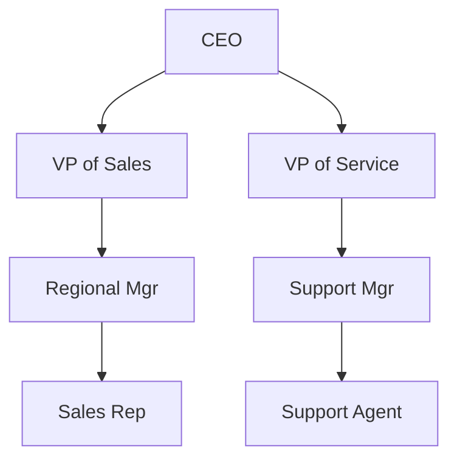

# Salesforce Org Security: Roles & Role Hierarchy

## 1. Introduction

### What Roles Are
In Salesforce, a **Role** is a record-level security feature used to define the data visibility and record access for users. While profiles control *what a user can do* (create, read, edit, delete on objects), roles control *whose records a user can see*. 

### Why Salesforce Introduced Roles
Salesforce introduced Roles to facilitate the natural, hierarchical data access requirements of organizations. In a typical company, managers need to see the data and performance metrics of their subordinates. The Role Hierarchy automates this visibility without requiring complex, individual sharing rules for every manager-employee relationship.

### Difference Between Roles and Profiles
* **Profile:** Determines *Object-level* and *Field-level* security. Every user **must** have one profile.
* **Role:** Determines *Record-level* security. Roles are **optional** but highly recommended for data access management.

### Real-World Example
A Sales Representative can create Opportunities. The VP of Sales can also create Opportunities. Because the VP of Sales is above the Sales Representative in the **Role Hierarchy**, the VP can automatically view and edit the Sales Representative's Opportunity records, even if the Organization-Wide Default (OWD) is set to Private.

---

## 2. Salesforce Security Model Overview

Salesforce security is often visualized as a pyramid or funnel, starting from the broadest access down to the most granular.

1.  **Organization-Level Security:** IP restrictions, Login Hours, Multi-Factor Authentication (MFA).
2.  **Object-Level Security:** Profiles and Permission Sets (CRUD - Create, Read, Update, Delete).
3.  **Field-Level Security (FLS):** Profiles and Permission Sets (Visibility and Editability of specific fields).
4.  **Record-Level Security:** OWD, Role Hierarchy, Sharing Rules, Manual Sharing, Team Access.

### How Roles Interact with Other Layers

    Object Access (Profile/Perm Set) 
           + 
    Record Access (OWD -> Role Hierarchy -> Sharing Rules) 
           = 
    Total User Access

* **Profiles & Permission Sets:** A user must have at least "Read" access on an object via their Profile/Permission Set for the Role Hierarchy to grant them access to a record. Role hierarchy *cannot* bypass Object-Level restrictions.
* **OWD (Organization-Wide Defaults):** Roles only expand access. If OWD is Public Read/Write, Roles are essentially bypassed for visibility. Roles matter most when OWD is **Private** or **Public Read Only**.
* **Sharing Rules:** Sharing rules can share records owned by a specific *Role* to another *Role* or Public Group.

---

## 3. What is a Role?

### Definition
A Role is a metadata entity in Salesforce that represents a node in the org's data visibility tree. 

### Purpose
Its primary purpose is to open up access to records vertically. It acts as a grouping mechanism for users who share the same data access requirements based on their position.

### Metadata Structure
In the Metadata API, a Role is represented by the `Role` metadata type. It contains properties such as:
* `name`: The label of the role.
* `parentRole`: The API name of the role immediately above it.
* `opportunityAccessLevel`, `caseAccessLevel`, `contactAccessLevel`: Controls how standard child records are accessed.

### User Assignment
Users are assigned to a Role via the `UserRoleId` field on the User record. A user can only belong to **one** Role at a time.

---

## 4. What is Role Hierarchy?

### Definition
The Role Hierarchy is a tree-like structure that works in conjunction with Organization-Wide Defaults (OWD) to determine the levels of access users have to your Salesforce data. 

### Parent roles & Child roles
* **Parent Roles:** Nodes higher up in the tree (e.g., CEO, VP).
* **Child Roles:** Nodes subordinate to parent roles.

### Access Inheritance (Upward Visibility)
Users in higher roles inherit the record access granted to users in lower roles. If a user in a child role owns or is shared a record, the parent role automatically gains the same level of access.

### Why Managers Access Subordinate Records
This is built on the business principle that management is responsible for the output of their teams. To run reports, generate forecasts, and assist in deal closures, managers inherently need full visibility into their subordinates' pipelines.

---

## 5. Role Hierarchy Architecture

A well-designed Role Hierarchy reflects data access needs.

**Record Access Flow:**
1. *Sales Rep* creates an Account.
2. *Regional Mgr* automatically sees/edits the Account.
3. *VP of Sales* automatically sees/edits the Account.
4. *CEO* automatically sees/edits the Account.

---

## 6. How Role Hierarchy Works

Access calculation in Salesforce follows a strict evaluation path:

1.  **Record Ownership:** Is the user the owner of the record? (Yes -> Full Access).
2.  **OWD Evaluation:** Is the OWD for the object Public Read/Write? (Yes -> Access Granted).
3.  **Role Hierarchy Evaluation:** Is the user above the record owner in the Role Hierarchy? AND is "Grant Access Using Hierarchies" enabled for this object? (Yes -> Access Granted).
4.  **Sharing Rule Evaluation:** Does an Ownership-based or Criteria-based sharing rule grant the user's Role or Public Group access? (Yes -> Access Granted).
5.  **Manual/Team Sharing:** Has the record been manually shared? (Yes -> Access Granted).

---

## 7. Role Hierarchy and Record Access

The impact of the Role Hierarchy depends heavily on OWD:

* **Private OWD:** Hierarchy grants managers access to their team's private records.
* **Public Read Only:** Hierarchy grants managers **Edit** access to their subordinates' records.
* **Public Read/Write:** Role Hierarchy has no effect on visibility or editability.
* **Controlled by Parent:** Role Hierarchy applies to the Parent record.

---

## 8. Roles vs Profiles

| Feature | Roles | Profiles |
| :--- | :--- | :--- |
| **Purpose** | Controls **Record-Level** visibility (Row-level). | Controls **Object/Field-Level** security (Column-level). |
| **Security Layer** | Data Access / Visibility | Base Security / Permissions |
| **Record Access** | Determines *whose* records you can see. | Does not determine record ownership visibility. |
| **Object Access** | Cannot grant CRUD access. | Grants CRUD access to objects. |
| **Field Access** | No impact on Field-Level Security. | Controls Field-Level Security (FLS). |

---

## 9. Roles vs Permission Sets

| Feature | Roles | Permission Sets |
| :--- | :--- | :--- |
| **Primary Use** | Hierarchical record data access. | Extending object, field, and app permissions. |
| **Multiplicity** | A user can have only **one** Role. | A user can have **multiple** Permission Sets. |

**When to use:** Use Roles when a manager needs to see team data. Use Permission Sets to grant a specific user the ability to delete Opportunities.

---

## 10. Role Hierarchy and OWD

* **Private Access:** Data is locked down to the owner. Managers are granted access strictly via the hierarchy tree.
* **Public Access:** Role hierarchy is primarily used for Management Dashboards, Role-based Reports, and Collaborative Forecasting.
* **Grant Access Using Hierarchies:** This option bridges OWD and Roles.

---

## 11. Grant Access Using Hierarchies

* **Standard Objects:** Permanently enabled and **cannot be unchecked**. 
* **Custom Objects:** You can check or uncheck this box. 
* **When to Disable It:** If you have a custom object containing highly sensitive data where even the CEO should not automatically see the record.

---

## 12. Internal Roles vs External Roles

* **Internal Users:** Standard Salesforce licenses in the internal Role Hierarchy.
* **Partner Users & Customer Users:** These users utilize External Roles which branch off from the Account Owner's internal role.
* **Experience Cloud Users:** High-Volume portal users (Customer Community) do NOT have roles. They use Sharing Sets. Customer Community Plus / Partner Community DO have roles.

---

## 13. Roles in Experience Cloud

Partner and Customer Accounts can have up to 3 roles:
1.  **Executive** (Top)
2.  **Manager** (Middle)
3.  **User** (Bottom)

**External Sharing:** This allows an external Manager to see the leads created by their Users within their specific organization.

---

## 14. Role Hierarchy and Sharing Rules

* **Ownership-Based Sharing Rules:** "Share records owned by *Eastern Sales Role* with *Eastern Service Role*."
* **Criteria-Based Sharing Rules:** "If Opportunity Type is 'Existing', share with the *Customer Success Role*."

**Complementary Nature:** Role hierarchy opens data up vertically. Sharing rules open data horizontally.

---

## 15. Role Hierarchy and Teams

Salesforce offers Account Teams, Opportunity Teams, and Case Teams.
* **Use Case:** Teams are ad-hoc. If a Sales Rep needs help from a specialist, the Role Hierarchy won't help. Adding the specialist to the **Opportunity Team** grants access.

---

## 16. Real Project Scenarios

### Automotive CRM
* **Roles:** Service Advisor -> Workshop Manager -> Dealer Manager -> Regional Manager.
* **Access Inheritance:** Workshop Manager can view/approve a Service Advisor's Work Order.

### Banking Organization
* **Roles:** Loan Officer -> Branch Manager -> Regional Manager.
* **Access Model:** Custom Objects with OWD Private and "Grant Access Using Hierarchies" **enabled**.

### Insurance Company
* **Roles:** Claim Processor -> Claim Supervisor -> Regional Head.
* **Access Model:** Medical Claims are Private with "Grant Access Using Hierarchies" **disabled**. Supervisors are granted access via Criteria-Based Sharing Rules.

---

## 17. Enterprise Role Design

1.  **Functional Hierarchy:** Based on what people do (Sales vs Service).
2.  **Geographic Hierarchy:** Based on territory (North America vs EMEA).
3.  **Matrix Organization:** Role hierarchy is strictly a tree. For matrixed access, use a flattened role hierarchy supplemented by Sharing Rules.
4.  **Multi-Business Unit Structure:** Keep structures separate to prevent cross-pollution of data visibility.

---

## 18. Role Hierarchy Limits

| Limit Type | Standard Org Limit | Notes |
| :--- | :--- | :--- |
| **Max Roles** | 50,000 | Contact Salesforce support to increase if necessary. |
| **External Roles per Account** | 1 to 3 | Configurable in Digital Experiences settings. Default is 1. |
| **Max Portal Roles** | 50,000 | Can be increased to 100,000 with approval. |

---

## 19. Performance Considerations

* **Sharing Calculations:** Every time a user moves to a new Role, Salesforce recalculates `ObjectShare` tables.
* **Large role hierarchies / Millions of records:** Cascading sharing recalculation can lock the system.
* **Role optimization:** Enable **Deferred Sharing Maintenance** when making bulk changes.

---

## 20. Common Mistakes

1.  **Confusing roles with profiles:** Giving users a new Profile for record access.
2.  **Excessive role creation:** Creating a unique role for every individual user.
3.  **Poor hierarchy design:** Creating a 15-level deep hierarchy.
4.  **Ignoring sharing implications:** Forgetting that Account access grants implicit access to child Contacts/Opportunities.

---

## 21. Best Practices

* **Naming conventions:** `<Region> - <Department> - <Level>` (e.g., `NA - Enterprise Sales - Manager`).
* **Hierarchy design:** Flatten the tree. Do NOT mirror HR org charts.
* **Access reviews & Security governance:** Require architect approval before creating new Roles.

---

## 22. Auditing and Compliance

* **Access Reviews:** Use "Login As" to verify access.
* **Security Audits:** Query `UserRole` to identify and remove unused roles.
* **Compliance Considerations:** Document why hierarchy grants access to PII.

---

## 23. Troubleshooting Record Access Issues

1.  **User cannot see record:** Check Profile, OWD, Ownership, Role Hierarchy.
2.  **User sees too many records:** Are they high in the hierarchy? Is OWD Public?
3.  **Sharing calculation issues:** Recalculate sharing rules.
4.  **Role assignment problems:** Ensure user is actually in the assigned role.
*Use the "Sharing Hierarchy" action in Lightning to see exactly why a user has access.*

---

## 24. Modern Salesforce Security Strategy

* **Profiles:** Minimum viable access.
* **Permission Set Groups:** Used to grant all CRUD/FLS access.
* **Roles:** Strictly for vertical data visibility and forecasting.
* **Sharing Rules:** For horizontal data sharing.
* **Restriction Rules:** To hide specific records.

---

## 25. Interview Questions & Answers

### Beginner Questions
**Q: What is the difference between a Role and a Profile?**
**A:** Profiles control what you can do (CRUD). Roles control whose data you can see.

### Intermediate Questions
**Q: Can you restrict access to records using the Role Hierarchy?**
**A:** No. Role hierarchy only expands access. Restrict access using OWD.

### Advanced Questions
**Q: How do you prevent the CEO from seeing a highly confidential HR record?**
**A:** Set OWD to Private and **uncheck** "Grant Access Using Hierarchies".

### Architect-Level Questions
**Q: How do you design sharing for 150,000 partner users without hitting Portal Role limits?**
**A:** Utilize Customer Community licenses (no roles) and implement Sharing Sets.

---

## 26. Revision Summary

* **Roles:** Optional, row-level access control.
* **Role Hierarchy:** Upward inheritance of record access.
* **OWD:** The baseline security level; Roles expand it.
* **Sharing Rules:** Horizontal expansion.
* **Grant Access Using Hierarchies:** Always ON for Standard objects; configurable for Custom objects.
* **Best Practices:** Flatten hierarchies, design for data access, mindful of limits.