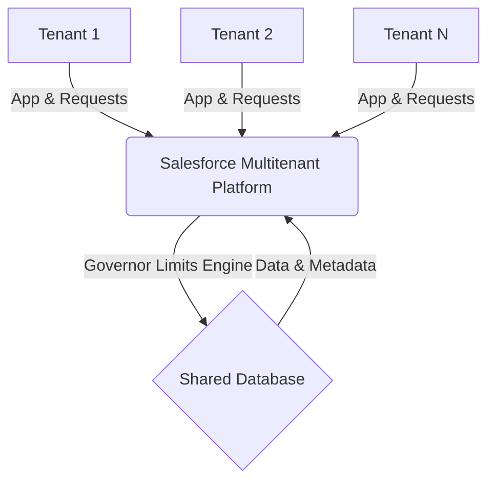

# Governor Limits – Query Limitations

## 1. Introduction

### What Governor Limits Are
Salesforce Governor Limits are runtime constraints enforced by the Apex runtime engine. They ensure that code running on the Salesforce platform does not monopolize shared resources. Governor limits dictate how much processing power, memory, database access, and time a single transaction can consume.

### Why Query Limits Exist
Database queries are among the most expensive operations in any application. In Salesforce, query limits exist to:
1.  **Prevent Resource Monopolization:** Ensure a single poorly written query or transaction does not degrade performance for other customers.
2.  **Enforce Efficient Code:** Force developers to write scalable, bulk-safe code.
3.  **Protect the Database:** Prevent full-table scans on massive datasets (Large Data Volumes), which lock database resources and consume high CPU.

### Relationship Between Multitenancy and Query Limits
Salesforce operates on a multitenant architecture, meaning multiple customers (tenants) share the same underlying infrastructure and database. If one tenant runs an infinite loop of SOQL queries or queries millions of records unselectively, it causes CPU spikes and database locks that directly impact the performance of other tenants (the "Noisy Neighbor" problem). Query limits act as the platform's defense mechanism to guarantee equitable resource distribution.

### Real-World Example
Imagine an Automotive CRM. A developer writes a trigger on the `Warranty_Claim__c` object to query the related `Vehicle__c` record inside a `for` loop. If a bulk upload of 200 Warranty Claims occurs, the loop runs 200 queries. This hits the `Too many SOQL queries: 101` limit, failing the transaction. The limit protects the shared database from 200 separate, sequential query connections that should have been bulkified into a single query.

---

## 2. Multitenancy Recap

### Shared Resources & Database
In multitenancy, resources (CPU, Memory, Network, Database connections, Disk I/O) are pooled. The Salesforce multitenant architecture relies on a metadata-driven kernel that maps tenant-specific data structures to a unified, shared database schema. 

### Fair Resource Allocation
Because all tenants share the same physical database engine, resource starvation is a major risk. The platform enforces strict boundaries (Governor Limits) to ensure that whether you are an org with 10 users or a massive enterprise with 100,000 users, your processing receives a guaranteed, fair slice of execution time.

### Architecture Diagram


---

## 3. Query Execution in Salesforce

Understanding how a query executes internally clarifies *why* certain limits exist and how to optimize around them.

### Lifecycle of a Query
1.  **SOQL/SOSL Parsing:** The platform parses the query syntax.
2.  **Metadata Resolution:** Maps the abstract object/field names (e.g., `Vehicle__c`) to the underlying shared physical database tables and metadata definitions.
3.  **Security Checks:** Applies Field-Level Security (FLS), Object-Level Security (CRUD), and Sharing Rules (Record-Level Security).
4.  **Query Optimizer:** Evaluates the query against database statistics (Cost, Cardinality) to determine the best execution plan (e.g., whether to use an index or perform a full table scan).
5.  **Index Selection:** If selective enough, the optimizer utilizes standard or custom database indexes.
6.  **Database Execution:** The underlying relational database engine executes the plan.
7.  **Record Retrieval:** Data is fetched from the database layer.
8.  **Heap Allocation:** The raw database rows are deserialized into Apex Objects (`sObjects`) and loaded into the transaction's Heap memory.
9.  **Governor Limit Validation:** The system counts the queried rows against the 50,000 limit and the query against the 100 query limit.
10. **Result Return:** The collection of records is returned to the Apex context.

### Execution Diagram
```mermaid
sequenceDiagram
    participant Apex as Apex Runtime
    participant Parsing as Parsing & Metadata
    participant Sec as Security Engine
    participant Opt as Query Optimizer
    participant DB as Shared Database
    
    Apex->>Parsing: Database.query('SELECT...')
    Parsing->>Sec: Validate Object/Field Access
    Sec->>Opt: Apply Sharing Rules & WHERE clause
    Opt->>Opt: Calculate Cost & Cardinality
    Opt->>DB: Execute Query Plan (Index/Scan)
    DB-->>Apex: Return Records
    Apex->>Apex: Verify Limits (Rows/Count/Heap)
    Apex->>Apex: Hydrate sObjects
```

---

## 4. Complete Query-Related Governor Limits

| Limit Type | Limit Value | Applies To | Exception Thrown | Real-World Example | Best Practice |
| :--- | :--- | :--- | :--- | :--- | :--- |
| **SOQL Queries (Sync)** | 100 | Synchronous Apex | `LimitException: Too many SOQL queries: 101` | Querying `Dealer__c` inside a loop iterating over `Warranty_Claim__c`. | Query outside loops. Use Maps. |
| **SOQL Queries (Async)** | 200 | Batch, Future, Queueable | `LimitException: Too many SOQL queries: 201` | High-volume batch processing making a query per chunk item. | Bulkify batch `execute` context just like sync code. |
| **SOSL Queries** | 20 | Sync & Async Apex | `LimitException: Too many SOSL queries: 21` | Iterative global search for multiple `VIN__c` strings. | Combine search terms into a single SOSL `OR` clause. |
| **Records Returned (SOQL)** | 50,000 | Total rows per transaction | `LimitException: Too many query rows: 50001` | `[SELECT Id FROM Invoice__c]` on a massive org. | Use selective WHERE clauses; Use Batch Apex for LDV processing. |
| **Records via Database.getQueryLocator** | 10,000 | UI / Standard Apex | `LimitException: Too many query rows` | Standard list controller viewing >10k records. | Use Pagination or filter criteria. |
| **Batch Apex QueryLocator** | 50,000,000 | Batch Apex Context | N/A (Limits execution chunking) | Batch to update `Status` on 10M `Work_Order__c` records. | Filter using indexed criteria; use Bulk API for >50M. |
| **Aggregate Query Limits** | Counts toward 50k rows | Sync & Async | `LimitException: Too many query rows: 50001` | `SELECT Count(Id) FROM Claim_Line__c` with 60,000 lines. | Aggregate queries count *evaluated* rows, not returned rows. Filter tightly. |
| **Child-to-Parent Queries** | 5 Levels deep | SOQL | `MALFORMED_QUERY` | `SELECT Contact.Account.Owner.Profile.Name FROM Case` | Flatten data model or use formula fields to bridge levels. |
| **Parent-to-Child Queries** | 1 Level deep (Standard) | SOQL | `MALFORMED_QUERY` | `SELECT Id, (SELECT Id FROM Contacts), (SELECT Id FROM Opportunities) FROM Account` | Limit the number of subqueries to 20 per main query. |
| **Heap Size** | 6 MB (Sync) / 12 MB (Async) | Total memory per transaction | `LimitException: Apex heap size too large` | Querying 40k `Vehicle__c` records with 50 fields into a List. | Use SOQL for-loops; query only necessary fields. |
| **CPU Time** | 10,000ms (Sync) / 60,000ms (Async) | Execution duration | `LimitException: Apex CPU time limit exceeded` | Complex sorting/filtering of 40k queried records in Apex. | Push logic to database using `WHERE` / `GROUP BY`. |
| **Query Cursor Timeout** | 15 Minutes | Batch Apex / Cursors | `QueryException: Aggregate query has too many rows...` | Long-running batch chunk preventing cursor retention. | Optimize batch size, ensure fast execute methods. |
| **SOQL Offset Limit** | 2,000 | Pagination Queries | `QUERY_TOO_COMPLICATED` | `SELECT Id FROM Vehicle__c OFFSET 2001` | Use cursor-based pagination (WHERE Id > lastId). |

---

## 5. SOQL Governor Limits

### Maximum SOQL Queries
Salesforce allows **100 SOQL queries** in synchronous transactions and **200** in asynchronous ones. This counts every `[SELECT ...]` or `Database.query()` call executed.
- **Dynamic SOQL** (`Database.query()`) and **Static SOQL** (`[SELECT ...]`) consume this limit equally.
- **Relationship Queries:** A parent-to-child subquery (e.g., `[SELECT Id, (SELECT Name FROM Contacts) FROM Account]`) counts as **1** query toward the 100 limit, but it counts heavily against CPU and heap.

### Aggregate Queries
Aggregate functions (`COUNT()`, `SUM()`, `MAX()`, `MIN()`, `AVG()`) perform calculations at the database level. 
*Important:* The number of rows evaluated by an aggregate function counts toward the **50,000 returned records limit**. If you run `SELECT COUNT() FROM Vehicle__c` and there are 50,001 vehicles, it will throw an exception.

---

## 6. SOSL Governor Limits

Salesforce Object Search Language (SOSL) is designed for full-text search across multiple objects. 
- **Maximum Queries:** 20 per transaction.
- **Returned Records:** A single SOSL query can return up to 2,000 records.
- **Search Optimization:** SOSL utilizes a separate search index (not the standard database index). It is highly optimized for text/token-based searches (e.g., searching an Engine Serial Number across `Vehicle__c`, `Work_Order__c`, and `Warranty_Claim__c` simultaneously).

---

## 7. Returned Record Limits

### The 50,000-Row Limit
A transaction can retrieve a maximum of 50,000 rows across *all* queries combined. If Query A returns 30,000 rows and Query B returns 20,001 rows, the limit is exceeded.

### QueryLocator and Large Data Volumes
For standard processing, `Database.getQueryLocator()` has a 10,000 row limit (often used in Visualforce/LWC standard pagination). However, when passed to the `start` method of **Batch Apex**, it bypasses the 50k limit and can return up to **50 million records**, dividing them into chunks (usually 200 records per chunk) for the `execute` method.

---

## 8. Aggregate Query Limits

Aggregate queries summarize data.
- **AggregateResult Object:** Data returned is housed in an `AggregateResult` array, not a standard sObject array.
- **HAVING Limitations:** The `HAVING` clause can filter aggregated data, but you must ensure the baseline `WHERE` clause is selective.
- **Example:**
```apex
// Finds Service Centers with more than 50 rejected Warranty Claims
List<AggregateResult> results = [
    SELECT Service_Center__c, COUNT(Id) rejectedCount
    FROM Warranty_Claim__c
    WHERE Status__c = 'Rejected'
    GROUP BY Service_Center__c
    HAVING COUNT(Id) > 50
];
```

---

## 9. Relationship Query Limits

### Child-to-Parent (Upward Traversal)
- Maximum 5 levels deep in SOQL. 
- E.g., `Contact.Account.Owner.UserRole.Name`.
- Highly efficient; fetched via SQL JOINs internally.

### Parent-to-Child (Downward Traversal / Subqueries)
- Limited to 1 level deep in a standard SOQL statement.
- Maximum 20 subqueries per main query.
- **Performance Implication:** Subqueries are notoriously slow and consume significant CPU/Heap during sObject deserialization. Avoid deep subqueries in triggers.

---

## 10. Heap Size and Query Results

**Heap Allocation** is the memory used by your variables at runtime. 
- A query returning 10,000 `Vehicle__c` records with 50 fields will consume massive heap space (easily hitting the 6MB limit).
- **Optimization Strategy (SOQL For-Loop):**
Instead of loading everything into a `List<sObject>`, process records in batches of 200 using a SOQL `for` loop. The runtime will garbage-collect the list on each iteration, keeping heap usage low.

```apex
// BAD: Consumes massive Heap
List<Warranty_Claim__c> claims = [
    SELECT Id, Notes__c, Description__c 
    FROM Warranty_Claim__c 
    WHERE Status__c = 'Pending'
];
for (Warranty_Claim__c claim : claims) { /* process */ }

// GOOD: SOQL For-Loop (Chunks of 200), heap safe
for (List<Warranty_Claim__c> claimsChunk : [SELECT Id, Notes__c, Description__c FROM Warranty_Claim__c WHERE Status__c = 'Pending']) {
    for(Warranty_Claim__c claim : claimsChunk) { /* process */ }
}
```

---

## 11. CPU Time and Query Execution

While database query execution time *does not* count toward Apex CPU time, **deserializing the results from the database into Apex objects DOES**.
- Querying unneeded fields (e.g., Long Text Areas, rich text, or formula fields that evaluate complex logic) spikes CPU time.
- **Formula Fields:** If you query a formula field, Salesforce evaluates that formula at query execution. Complex formulas slow down the query and increase CPU consumption.

---

## 12. Query Optimizer and Limits

The **Salesforce Query Optimizer** dynamically analyzes queries to determine the most cost-effective execution plan.

### Selective vs. Non-Selective Queries
A query is **Selective** if its `WHERE` clause is tight enough to utilize an index. A query must hit specific thresholds to use an index:
- **Standard Index (Id, Name, OwnerId, CreatedDate, SystemModstamp, RecordType):** Filter must target < 30% of first 1M records, 15% after.
- **Custom Index (External ID, Unique, Custom Indexed):** Filter must target < 10% of first 1M records, 5% after (max 333,333 records).

If a query exceeds these thresholds (or queries >100,000 records without an index), it is **Non-Selective** and triggers a full table scan. If the object has more than ~200k records, a non-selective query will fail with `System.QueryException: Non-selective query against large object`.

---

## 13. Large Data Volumes (LDV)

LDV environments involve millions of records (e.g., an Automotive CRM tracking 15 million `Vehicle__c` records globally).
- **Skinny Tables:** Salesforce support can create Skinny Tables that combine standard and custom fields, bypassing normal multitenant joins, significantly speeding up queries on millions of rows.
- **Partitioning:** Standard objects like `Account` and `Case` partition data by `OwnerId` and `CreatedDate`. Leveraging these fields in LDV queries massively improves performance.
- **Custom Indexes:** Request Salesforce to place two-column custom indexes or index formula fields (if deterministic) to make reporting and SOQL on massive `Work_Order__c` tables selective.

---

## 14. Bulkification

Bulkification is the practice of designing Apex code to process multiple records simultaneously, minimizing query counts.

### Before Bulkification (BAD)
```apex
trigger WarrantyClaimTrigger on Warranty_Claim__c (before insert) {
    for (Warranty_Claim__c claim : Trigger.new) {
        // Governor Limit Risk: Query inside loop! 
        // 101 claims = System.LimitException: Too many SOQL queries: 101
        Vehicle__c v = [SELECT Warranty_Expiry__c FROM Vehicle__c WHERE Id = :claim.Vehicle__c];
        if (v.Warranty_Expiry__c < Date.today()) {
            claim.addError('Vehicle is out of warranty.');
        }
    }
}
```

### After Bulkification (GOOD)
```apex
trigger WarrantyClaimTrigger on Warranty_Claim__c (before insert) {
    // 1. Gather all unique Vehicle IDs (Set optimization)
    Set<Id> vehicleIds = new Set<Id>();
    for (Warranty_Claim__c claim : Trigger.new) {
        if(claim.Vehicle__c != null) vehicleIds.add(claim.Vehicle__c);
    }
    
    // 2. Perform a single query outside the loop (Collection-based query)
    // Map optimization for O(1) retrieval
    Map<Id, Vehicle__c> vehiclesMap = new Map<Id, Vehicle__c>([
        SELECT Id, Warranty_Expiry__c FROM Vehicle__c WHERE Id IN :vehicleIds
    ]);
    
    // 3. Process claims
    for (Warranty_Claim__c claim : Trigger.new) {
        Vehicle__c v = vehiclesMap.get(claim.Vehicle__c);
        if (v != null && v.Warranty_Expiry__c < Date.today()) {
            claim.addError('Vehicle is out of warranty.');
        }
    }
}
```

---

## 15. Common Query Limit Exceptions

| Exception Name | Cause | Example / Resolution |
| :--- | :--- | :--- |
| `System.LimitException: Too many SOQL queries: 101` | More than 100 queries ran in a synchronous transaction. | *Cause:* SOQL in `for` loop. *Resolution:* Bulkify code using Maps and Sets. |
| `System.LimitException: Too many query rows: 50001` | Transaction retrieved > 50,000 records. | *Cause:* Missing `WHERE` clause on `Claim_Line__c`. *Resolution:* Filter selectively, limit rows, or use Batch Apex. |
| `System.QueryException: Non-selective query against large object...` | Object has > 200k records, query filter exceeds index thresholds. | *Cause:* Querying `Vehicle__c` with `WHERE Color__c = 'Red'`. *Resolution:* Make `Color__c` an External ID, or combine with standard indexed fields like `CreatedDate`. |
| `System.LimitException: Apex heap size too large` | Over 6MB memory consumed. | *Cause:* Loading 45,000 records with huge text fields. *Resolution:* Use SOQL for-loop, query only required fields. |

---

## 16. Monitoring Governor Limits

You must proactively monitor limits in your code to prevent catastrophic runtime failures.

### The System.Limits Class
```apex
// Returns the number of SOQL queries already issued
Integer queriesUsed = Limits.getQueries();

// Returns the max number of SOQL queries allowed (e.g., 100)
Integer queriesAllowed = Limits.getLimitQueries();

// Returns the total number of records retrieved so far
Integer rowsUsed = Limits.getQueryRows();

// Returns the max rows allowed (50,000)
Integer rowsAllowed = Limits.getLimitQueryRows();

// Dynamic Safe Processing Pattern
if ((Limits.getLimitQueries() - Limits.getQueries()) < 10) {
    // Danger: Approaching limit. Enqueue asynchronous Queueable job instead.
    System.enqueueJob(new AsyncWarrantyProcessor(claimList));
}
```
**Tools:** Developer Console (Execution Overview), Debug Logs (`LIMIT_USAGE_FOR_NS`), VS Code Replay Debugger.

---

## 17. Performance Optimization

1.  **Query Only Required Fields:** Never simulate `SELECT *`. Querying fields you don't need consumes Heap and CPU during hydration.
2.  **Avoid Negative Operators:** `!=`, `NOT IN`, and `EXCLUDES` bypass the query optimizer and result in full table scans. Use positive operators (`=`, `IN`, `INCLUDES`).
3.  **Avoid Leading Wildcards:** `LIKE '%Ford'` cannot use an index. `LIKE 'Ford%'` can use an index.
4.  **Query Caching:** Utilize the Platform Cache (Session/Org Cache) for static configurations (e.g., Custom Metadata, static Dealer mapping) instead of querying them every transaction.

---

## 18. Real Project Scenarios: Automotive CRM

### Scenario 1: Invoice Processing (Heap Limit Risk)
**Issue:** A nightly Batch process updates status on `Invoice__c`. The query fetches `Invoice__c`, `Line_Items__r`, and large text `Terms__c`. The batch chunk size of 200 hits the 12MB Heap limit.
**Optimization:** Exclude `Terms__c` from the batch query. Query it on-the-fly inside the `execute` method only for records that explicitly require modification, or use `SOQL for loops`.

### Scenario 2: Vehicle Lookup (Non-Selective Query)
**Issue:** The UI allows users to search `Vehicle__c` (15 million records) by `License_Plate__c`. The query fails with `Non-selective query against large object`.
**Optimization:** Mark `License_Plate__c` as an **External ID** (which implicitly creates a custom index). Update the query to require at least one other standard indexed field (e.g., `Account__c`).

### Scenario 3: SAP Integration (SOQL limits on Sync)
**Issue:** An inbound REST API from SAP creates 50 `Spare_Order__c` records. Triggers on insertion cause cascading updates, eating up 110 queries and throwing the 101 Limit.
**Optimization:** Move the heavy processing from the trigger into a Queueable Apex class. Since it becomes an asynchronous transaction, the query limit doubles to 200, and isolates the SAP synchronous handshake from the heavy database operations.

---

## 19. Best Practices (Architect Level)

- **Lazy Loading:** Do not query related data until it is explicitly needed by the user interface or specific logic paths.
- **Trigger Frameworks:** Use a robust Trigger handler framework (like Kevin O'Hara or fflib) to ensure triggers only execute once per context, preventing recursive queries.
- **Asynchronous Processing:** Shift heavy read/write operations to `@future`, Queueable, or Batch.
- **Delegated Querying:** For enormous volumes of purely historical data (e.g., archived 10-year-old Claims), utilize **Salesforce Connect / External Objects**. The data stays in AWS/Heroku Postgres, avoiding SOQL limits entirely (OData handles the translation).

---

## 20. Common Mistakes

1.  **SOQL Inside Loops:** The cardinal sin of Salesforce development.
2.  **Returning Unnecessary Fields:** Slows down CPU heavily.
3.  **Ignoring the Query Plan Tool:** Writing complex queries and assuming they are optimized without using Developer Console -> Query Plan to verify Cost (< 1.0 is indexed).
4.  **Hardcoded IDs:** Querying `WHERE RecordTypeId = '012...'`. When deployed between environments, IDs change, breaking the query. Use `Schema.SObjectType.Account.getRecordTypeInfosByDeveloperName()`.
5.  **Unbounded Queries in UI:** Writing a query without `LIMIT 1000` or pagination in a Lightning Web Component, assuming the data set will always be small.

---

## 21. Debugging Query Performance

**Performance Troubleshooting Workflow:**
1.  **Extract Query:** Find the failing query in the Debug Logs.
2.  **Developer Console Query Editor:** Paste the query.
3.  **Query Plan Tool:** Click "Query Plan". Ensure the Cost is below `1.0`. If it's above `1.0`, it's doing a full table scan.
4.  **Analyze Cardinality:** Look at the number of records evaluated vs returned. 
5.  **Workbench:** Use Workbench for REST explorer SOQL analysis if dealing with massive strings that crash the Dev Console.
6.  **VS Code:** Use SOQL Builder to visually map out relationships and identify unneeded subqueries.

---

## 22. Interview Questions & Answers

### Beginner
**Q: How many SOQL queries can you run in a single synchronous transaction?**
**A:** 100 queries. If you run 101, a `LimitException` is thrown and the transaction is rolled back.

### Intermediate
**Q: What is the difference between Limits.getQueries() and Limits.getLimitQueries()?**
**A:** `Limits.getQueries()` returns the number of queries *already executed* in the current transaction. `Limits.getLimitQueries()` returns the maximum *allowable* queries for the context (100 for sync, 200 for async).

### Advanced
**Q: You have a query evaluating `SELECT COUNT() FROM Warranty_Claim__c`. There are 60,000 records. What happens?**
**A:** It will throw a `Too many query rows: 50001` exception. Even though `COUNT()` returns a single integer, the governor limits count all the raw rows evaluated by the aggregate function against the 50,000 returned records limit.

### Architect-Level
**Q: A customer has 5 million `Work_Order__c` records. A query filtering by a custom picklist field `Status__c = 'Closed'` is failing. How do you optimize this?**
**A:** This is an LDV Non-Selective Query issue. Because `Status__c = 'Closed'` likely represents a large percentage of records (low selectivity), a custom index might not even be used by the optimizer. Solutions:
1. Contact Salesforce to add a custom index to `Status__c` (if it evaluates to <5% of 1M records).
2. Create a Skinny Table.
3. Add an additional filter on a natively indexed field (like `CreatedDate = THIS_YEAR`) to force index utilization.
4. If this is for batch processing, use `Database.getQueryLocator()` in a Batch class.

---

## 23. Revision Summary

- **Why Limits Exist:** To protect shared database resources in a multitenant environment.
- **SOQL Limits:** 100 (Sync) / 200 (Async).
- **SOSL Limits:** 20 queries, 2000 records max.
- **Query Row Limits:** 50,000 total across all queries. Aggregate functions count all evaluated rows.
- **Relationship Queries:** Max 5 levels up (Child-to-Parent), 1 level down (Parent-to-Child).
- **Heap Size:** 6MB Sync / 12MB Async. Manage by querying fewer fields and using SOQL for-loops.
- **CPU Time:** DB time doesn't count, but Apex serialization of query results does. Max 10s Sync / 60s Async.
- **Query Optimization:** Target < 10% of records to utilize custom indexes. Avoid negative operators.
- **Bulkification:** ALWAYS use Maps/Sets and query outside of loops.
- **Common Exceptions:** 101 (Queries), 50001 (Rows), Non-selective query against large object.
- **Best Practices:** Lazy loading, Batch processing for LDV, Query Plan Tool for debugging.