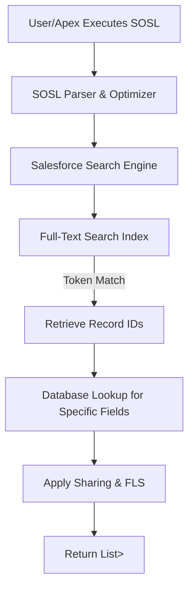

# SOSL – Text Search Across Objects

## 1. Introduction

### What is SOSL?
**Salesforce Object Search Language (SOSL)** is a programmatic search language designed to perform full-text searches across multiple SObjects (Salesforce Objects) simultaneously. Unlike structured database querying, SOSL relies on a dedicated, high-performance search engine to find textual matches across indexed fields.

### Why Salesforce Introduced SOSL
Salesforce introduced SOSL to solve the limitations of standard database queries (SOQL) when dealing with unstructured data, unknown data locations, or broad textual searches. Querying massive database tables for a string using `LIKE '%text%'` forces a full table scan, severely degrading performance. SOSL routes these requests to a specialized search index, enabling sub-second full-text retrieval.

### Searching vs. Querying
* **Querying (SOQL):** You know exactly *which* object and *which* field holds the data. You are querying the database directly. (e.g., "Give me the Account where AccountNumber is '12345'").
* **Searching (SOSL):** You know the *data* you want, but you don't necessarily know which object or field contains it. You are querying the search index. (e.g., "Find the text 'Mustang' anywhere in Accounts, Contacts, or Vehicles").

### Business Importance of Enterprise Search
In an enterprise context like an **Automotive CRM**, a call center agent might receive a call from a customer. The agent hears the word "Transmission" or a partial SAP Reference Number like "SAP-9021". They do not know if this data is inside a `Case`, a `Warranty_Claim__c`, an `Invoice__c`, or a `Work_Order__c`. SOSL empowers the application to search all these records instantly.

---

## 2. Salesforce Search Architecture

### Metadata-Driven Platform
Salesforce’s architecture separates the physical database layer from the metadata and search layers. When a record is created or updated in the Oracle/PostgreSQL backend, a background process asynchronously pushes the text data to the Search Engine.

### Search Engine & Full-Text Search
Salesforce utilizes a highly optimized, Lucene-based search engine mechanism. Instead of scanning database rows, it scans a **Search Index**—a highly structured dictionary of tokens (words) mapped back to Salesforce Record IDs. 

### Search Result Ranking
When a search is executed, the engine evaluates matches using algorithms like TF-IDF (Term Frequency-Inverse Document Frequency) and Salesforce-specific heuristics (e.g., recent record activity, ownership) to return the most relevant results first.



---

## 3. What is SOSL? Deep Dive

### Definition and Purpose
SOSL is the native tool for token-based, multi-object text searching. Its primary purpose is to deliver Google-like search capabilities natively within the Salesforce platform, optimized for multi-tenant governor limits.

### Search Lifecycle
1.  **Request Generation:** An Apex class or API call submits a `FIND` statement.
2.  **Tokenization:** The engine breaks the search string into standardized tokens.
3.  **Index Lookup:** The engine scans the search index for these tokens.
4.  **Database Hydration:** Once Record IDs are found in the index, Salesforce queries the actual database to retrieve the fields requested in the `RETURNING` clause.
5.  **Security Trimming:** The platform strips out any records or fields the running user does not have permission to view.
6.  **Ranking & Return:** Results are ordered by relevance and returned.

---

## 4. SOQL vs SOSL

| Feature | SOQL (Salesforce Object Query Language) | SOSL (Salesforce Object Search Language) |
| :--- | :--- | :--- |
| **Purpose** | Precise database queries. | Broad full-text searches. |
| **Syntax** | `SELECT ... FROM ... WHERE ...` | `FIND ... RETURNING ...` |
| **Objects Searched** | Single object (and its related parents/children). | Multiple unrelated objects simultaneously. |
| **Target Engine** | Relational Database (Synchronous). | Search Index (Asynchronous indexing). |
| **Matching** | Exact match or explicit `LIKE` wildcards. | Tokenized, fuzzy, stemming, and phrase matching. |
| **Return Type (Apex)** | `List<SObject>` | `List<List<SObject>>` |
| **Use Case** | Extracting a specific Vehicle by VIN. | Finding any mention of "Brake Failure" across Cases, Emails, and Claims. |
| **Limits** | 50,000 records returned per transaction. | 2,000 records returned per transaction. |

---

## 5. SOSL Query Structure

The anatomy of a SOSL query is distinct from SQL/SOQL.

### Syntax Breakdown
```sql
FIND 'SearchQuery' 
[IN SearchGroup] 
[RETURNING FieldSpec [[WITH networkId]...]] 
[LIMIT n] 
[WITH ... ]
```

* **`FIND`**: The root keyword, followed by the text to search for (enclosed in single quotes).
* **`IN`**: Narrows the scope of the search index (e.g., only search Name fields).
* **`RETURNING`**: Specifies which SObjects to retrieve and which fields to map back from the database.
* **`LIMIT`**: Restricts the maximum number of records returned globally.
* **`WITH`**: Applies specific filters, such as Data Categories for Knowledge or Snippets.

---

## 6. FIND Clause

### Purpose
The `FIND` clause contains the literal string the search engine will tokenize and look up.

### Search Strings & Wildcards
* **Exact Match:** `FIND 'Mustang'`
* **Phrase Match:** `FIND '"Transmission Failure"'` (uses double quotes inside single quotes to enforce exact phrase).
* **Wildcards:**
    * `*` (Asterisk): Matches zero or more characters. `FIND 'Auto*'` matches *Auto, Automatic, Automotive*.
    * `?` (Question Mark): Matches exactly one character. `FIND 'Jo?n'` matches *John, Joan*.

### Logical Operators
* `FIND 'Ford AND Mustang'` (Both terms must exist)
* `FIND 'Ford OR Chevrolet'` (Either term)
* `FIND 'Ford AND NOT Focus'` (Excludes matching term)

---

## 7. Search Groups (IN Clause)

Search groups tell the engine which subset of the index to scan, dramatically improving performance and relevance.

| Search Group | Behavior | Use Case (Automotive) |
| :--- | :--- | :--- |
| **`ALL FIELDS`** | Scans all indexed text fields. (Default) | Searching for a defect description anywhere. |
| **`NAME FIELDS`** | Scans only Name, Auto-Number, or custom name fields. | Searching specifically for a Customer Name or Dealership Name. |
| **`EMAIL FIELDS`** | Scans only standard/custom Email fields. | Finding a user or contact by domain `@ford.com`. |
| **`PHONE FIELDS`** | Scans only standard/custom Phone fields. | Reverse phone lookup from a CTI integration. |
| **`SIDEBAR FIELDS`** | Scans fields defined in the sidebar search settings. | Legacy UI integration searches. |

---

## 8. RETURNING Clause

The `RETURNING` clause translates the IDs found in the search index back into SObject records and fields.

### Syntax
```sql
FIND 'John' RETURNING Account(Id, Name, Type), Contact(FirstName, LastName)
```

* **Specific Objects:** You must explicitly declare which objects you want returned.
* **Specific Fields:** Enclosed in parentheses. If omitted, only the `Id` is returned.
* **Per-Object Limits & Ordering:**
    ```sql
    RETURNING Vehicle__c (Id, VIN__c ORDER BY CreatedDate DESC LIMIT 50)
    ```

---

## 9. LIMIT Clause

The `LIMIT` clause restricts the total number of records returned across *all* objects.

```sql
FIND 'Engine' RETURNING Case(Id), Warranty_Claim__c(Id) LIMIT 100
```
* **Purpose:** Ensures your Apex heap size doesn't explode and keeps the UI responsive.
* **Performance:** A lower limit speeds up the database hydration phase.
* **Note:** If the global `LIMIT` is 100, and you search 5 objects, the distribution of those 100 records among the 5 objects is determined by the Search Engine's relevance ranking.

---

## 10. WITH Clause

Used for specialized search contexts.

* **`WITH DATA CATEGORY`**: Crucial for Salesforce Knowledge. E.g., `WITH DATA CATEGORY Geography__c AT (NorthAmerica__c)`
* **`WITH NETWORK`**: Searches within a specific Experience Cloud site.
* **`WITH SNIPPET`**: Returns a preview snippet of the matched text, highlighting the search term (highly useful for custom LWC search components).

---

## 11. Search Operators

SOSL supports complex logic to fine-tune recall.

* **Logical:** `AND`, `OR`, `AND NOT`.
* **Grouping:** Parentheses dictate execution order.
    ```sql
    FIND '(Transmission OR Engine) AND NOT "Oil Leak"' RETURNING Work_Order__c(Id)
    ```
* **Proximity:** While full proximity (NEAR) isn't standard in SOSL, phrase matching (`" "`) ensures words appear adjacent and in order.

---

## 12. Search Tokenization

To understand SOSL, you must understand how Salesforce reads text.

* **Tokenization:** The engine splits sentences into words (tokens) using whitespace and punctuation as delimiters.
* **Stop Words:** Common words (`the`, `a`, `and`, `in`) are ignored and not indexed to save space and improve speed.
* **Stemming:** Words are reduced to their root form. A search for `FIND 'Running'` will also match records containing *Run* or *Runs*. (Note: Stemming support varies by language).
* **Index Generation:** When a `Warranty_Claim__c` is saved with the description "Leaking radiator", the engine indexes tokens: `leak`, `radiator`, mapped to that record ID.

---

## 13. Full-Text Search Indexes

* **Asynchronous Processing:** When a user saves a record, it goes to the database immediately. The search index updates asynchronously (usually within milliseconds, but under heavy load can take up to 15 minutes).
* **Indexed Fields:** Not all fields are indexed. Picklists, Numbers, and Checkboxes are NOT full-text indexed. Text, Text Area, Text Area (Long/Rich), Name, Email, and Phone fields are.
* **Impact on Devs:** If you create a test record in an Apex test, it is *not* automatically added to the search index. You must use `Test.setFixedSearchResults(fixedSearchResults)` to mock SOSL.

---

## 14. Search Ranking

Salesforce returns the most "relevant" records first based on:

1.  **Exact Match vs. Partial Match:** Exact matches on `NAME` fields score highest.
2.  **Frequency (TF):** How many times the term appears in the document.
3.  **Rarity (IDF):** If a term is rare across the entire org, matches score higher.
4.  **Activity:** Recently viewed or edited records by the searching user get a significant ranking boost.

---

## 15. Searching Multiple Objects

```sql
FIND 'Smith' 
RETURNING 
    Account(Id, Name, BillingState),
    Contact(Id, Name, Email),
    Lead(Id, Name, Status)
```
**Explanation:**
1.  `FIND 'Smith'`: Tokenizes "Smith".
2.  `RETURNING Account(...)`: If "Smith" is found in an Account, return its Id, Name, and State.
3.  `Contact(...)`: Also check Contacts and return Id, Name, Email.
4.  `Lead(...)`: Also check Leads.
*Apex Return Type:* `List<List<SObject>>` where Index 0 is Accounts, Index 1 is Contacts, Index 2 is Leads.

---

## 16. Searching Standard Objects (Automotive Context)

**Scenario:** Searching for a fleet customer's reference "AcmeCorp".
```sql
FIND 'AcmeCorp' IN ALL FIELDS 
RETURNING 
    Account(Id, Name, Fleet_Identifier__c), 
    Opportunity(Id, Name, StageName), 
    Case(Id, CaseNumber, Subject)
```
* **Business Use:** An account manager types "AcmeCorp" into a custom LWC. This single query fetches the Account details, pending deals (Opportunities), and active support tickets (Cases).

---

## 17. Searching Custom Objects

**Scenario:** Searching for an engine part number or description.
```sql
FIND 'Pist*' IN ALL FIELDS
RETURNING
    Product2(Id, Name, ProductCode),
    Spare_Part__c(Id, Name, Stock_Location__c),
    Work_Order__c(Id, Name, Mechanic_Notes__c)
```
* **Business Use:** A mechanic searches "Pist*" (Piston). The system queries standard Products, custom Spare Parts inventory, and historical Work Orders where a mechanic might have written notes about pistons.

---

## 18. SOSL in Apex

When writing SOSL in Apex, the return type is always a List of Lists.

```apex
public class GlobalSearchService {
    public static void performAutomotiveSearch(String searchTerm) {
        // Line 1: Execute static SOSL. Enclose in [ ].
        List<List<SObject>> searchResults = [
            FIND :searchTerm IN ALL FIELDS 
            RETURNING 
                Account(Name, Type), 
                Vehicle__c(Name, VIN__c, Engine_Type__c), 
                Warranty_Claim__c(Name, Claim_Status__c)
        ];
        
        // Line 2-4: Extract lists by their index in the RETURNING clause
        List<Account> accounts = (List<Account>)searchResults[0];
        List<Vehicle__c> vehicles = (List<Vehicle__c>)searchResults[1];
        List<Warranty_Claim__c> claims = (List<Warranty_Claim__c>)searchResults[2];
        
        // Line 5: Process results
        for(Vehicle__c veh : vehicles) {
            System.debug('Found Vehicle: ' + veh.VIN__c);
        }
    }
}
```

---

## 19. Dynamic SOSL

Dynamic SOSL is used when the objects or fields to return are not known at compile time.

```apex
public class DynamicSearchService {
    public static List<List<SObject>> executeSafeSearch(String userInput, String objectScope) {
        // Step 1: ALWAYS escape user input to prevent SOSL Injection
        String sanitizedInput = String.escapeSingleQuotes(userInput);
        
        // Step 2: Build the query string dynamically
        String soslQuery = 'FIND \'' + sanitizedInput + '*\' IN NAME FIELDS RETURNING ' + objectScope;
        
        // Step 3: Execute via Search.query()
        return Search.query(soslQuery);
    }
}
```
**SOSL Injection Risk:** If a user inputs `' OR Name = 'Admin`, an unescaped dynamic query could break the syntax or expose unintended records. Always use `String.escapeSingleQuotes()`.

---

## 20. SOSL Security

SOSL respects Salesforce's declarative security model:
* **Object-Level & Field-Level Security:** If the user lacks Read access to `Warranty_Claim__c`, the object will quietly return zero results for that user, even if matches exist.
* **Record-Level Security (Sharing):** Users only see search results for records they have visibility to via OWD, Role Hierarchy, or Sharing Rules.
* **Apex Enforcement:** While static SOSL runs in system context regarding data access, the standard search APIs naturally respect sharing. To explicitly enforce FLS/CRUD in Apex, modern development uses `System.Search.query('...', AccessLevel.USER_MODE)` or strips inaccessible fields post-query using `Security.stripInaccessible()`.

---

## 21. Governor Limits

| Limit Description | Synchronous Limit | Asynchronous Limit |
| :--- | :--- | :--- |
| Max SOSL Queries per Transaction | 20 | 20 |
| Max Records Returned per Query | 2,000 | 2,000 |
| Heap Size (Impacted by large returns) | 6 MB | 12 MB |
| CPU Time (Impacted by iteration) | 10,000 ms | 60,000 ms |

*Architect Note:* Exceeding the 2,000 record limit does not throw an exception; Salesforce simply truncates the results to the most relevant 2,000.

---

## 22. Search Performance

* **Avoid Short Terms:** `FIND 'A*'` is expensive. Require at least 2-3 characters from users before executing SOSL.
* **Use Search Groups:** `IN NAME FIELDS` is infinitely faster than `IN ALL FIELDS` because the index scan area is massively reduced.
* **Narrow the `RETURNING` Clause:** Only request the specific objects and fields you need. Returning `Account(Id)` is faster than `Account(Id, Description, Long_Text__c)`.
* **LDV (Large Data Volumes):** In orgs with millions of records, SOSL is strictly better than SOQL for text matching, but poorly constructed SOSL with wide scopes can still time out.

---

## 23. SOSL vs Global Search

| Feature | Global Search (UI) | SOSL (Code) |
| :--- | :--- | :--- |
| **Interface** | Salesforce Top Search Bar | Apex, API, SOQL/SOSL REST Endpoints |
| **Result Scope** | Configured by User Profile & Search Layouts | Explicitly defined in the `RETURNING` clause |
| **Features** | Spell correction, synonyms, lemmatization | Explicit token matching (synonyms require custom logic) |
| **Use Case** | End-user ad-hoc navigation | Custom UI logic, automated integrations |

---

## 24. Real Project Scenarios (Automotive CRM)

### Scenario 1: Search Vehicle Chassis Number (VIN)
VINs are complex alphanumeric strings.
* *Why SOSL?* A customer might provide a partial VIN (last 6 digits). `FIND '*89A321' IN ALL FIELDS RETURNING Vehicle__c(Name, VIN__c)` allows quick retrieval without forcing a SOQL `LIKE` full table scan on millions of vehicles.

### Scenario 2: Search SAP Reference
* *Why SOSL?* An SAP invoice number might be stored in the `Invoice_Reference__c` field on `Invoice__c` or deep in a `Log_Message__c` payload field. SOSL finds it regardless of where the data resides.

---

## 25. Common Mistakes

1.  **Using SOSL for Exact DB Lookups:** Do not use `FIND '0015g00000XyZ1a'` to find an Account. Use SOQL. SOSL is for text search, not primary key lookup.
2.  **Missing `Test.setFixedSearchResults`:** Writing an Apex test with SOSL without setting fixed search results. The test will fail because the index isn't updated during the test context.
3.  **Ignoring the 2,000 Limit:** Building a custom search UI without pagination or limit warnings. If a user searches "Car" in an automotive org, they will hit the 2,000 limit instantly.

---

## 26. Best Practices

* **Architect Guidance:** Always prefer SOQL when the entity and field are known and indexed. Reserve SOSL for multi-object, unstructured text exploration.
* **Bulk-Safe Apex:** Even though a SOSL query can return up to 2,000 records, place it outside of loops!
    ```apex
    // GOOD
    List<List<SObject>> results = [FIND :term RETURNING Lead(Id), Contact(Id)];
    // BAD
    for(String term : searchTerms) { 
        List<List<SObject>> results = [FIND :term ...]; // WILL HIT LIMITS 
    }
    ```
* **Optimize Scope:** If searching for a phone number, strictly use `IN PHONE FIELDS`.

---

## 27. Debugging & Troubleshooting SOSL

* **No Search Results in UI/Dev Console?**
    * *Cause A:* Index delay. Wait 5-15 minutes if the record was just created.
    * *Cause B:* The field type is not full-text indexed (e.g., Picklists).
    * *Cause C:* Security. Check OWD and FLS.
* **Debugging Tool:** Use the **Query Editor** tab in the Developer Console. There is a specific "Use Tooling API" / "Search" toggle mechanism, but writing standard SOSL directly in the Dev Console Query Editor works perfectly.
* **Apex Debugging:** Check `System.debug(LoggingLevel.INFO, searchResults);` to inspect multi-list arrays.

---

## 28. Interview Questions & Answers

**Beginner:**
* *Q: What is the return type of a SOSL query in Apex?*
    * *A:* `List<List<SObject>>`. A list containing a list of records for each object specified in the `RETURNING` clause.

**Intermediate:**
* *Q: How do you write test coverage for a class using SOSL?*
    * *A:* Because test data is not asynchronously indexed during a test, use `Id[] fixedSearchResults = new Id[]{account.Id}; Test.setFixedSearchResults(fixedSearchResults);` before executing the class logic.

**Advanced:**
* *Q: Can you perform a subquery inside a SOSL RETURNING clause?*
    * *A:* No. You cannot do `RETURNING Account(Id, (SELECT Name FROM Contacts))` like in SOQL. You must request `Contact` as a separate object in the `RETURNING` clause.

**Architect-Level:**
* *Q: When dealing with Large Data Volumes (10M+ records), how do you decide between SOQL and SOSL for searching a custom alphanumeric `Tracking_Number__c`?*
    * *A:* If the query is an exact match (`Tracking_Number__c = 'XYZ123'`), I will mark the field as an External ID / Unique to index it at the database level and use SOQL. If users need to search partial strings (`LIKE '%XYZ%'`), SOQL will time out due to a full table scan. I must use SOSL `FIND '*XYZ*'` because it queries the Lucene text index.

---

## 29. Revision Summary

* **SOSL:** Multi-object, full-text search language.
* **Engine:** Utilizes an asynchronous, tokenized search index (Lucene-based), not direct DB scans.
* **Syntax:** `FIND {Query} IN {Scope} RETURNING {Objects(Fields)} LIMIT {Number}`
* **Apex Context:** Always returns `List<List<SObject>>`. Must use `Test.setFixedSearchResults()` in test classes.
* **SOQL vs SOSL:** SOQL = Exact/Structured, Single Object. SOSL = Fuzzy/Unstructured, Multi-Object.
* **Limits:** 20 queries per transaction, 2,000 maximum combined records returned.
* **Security:** Naturally respects sharing; use `AccessLevel.USER_MODE` or `.stripInaccessible()` for strict FLS in Apex.
* **Best Practice:** Narrow scope using `IN NAME FIELDS` or `IN PHONE FIELDS` whenever possible. Escaping dynamic SOSL is mandatory to prevent injection.