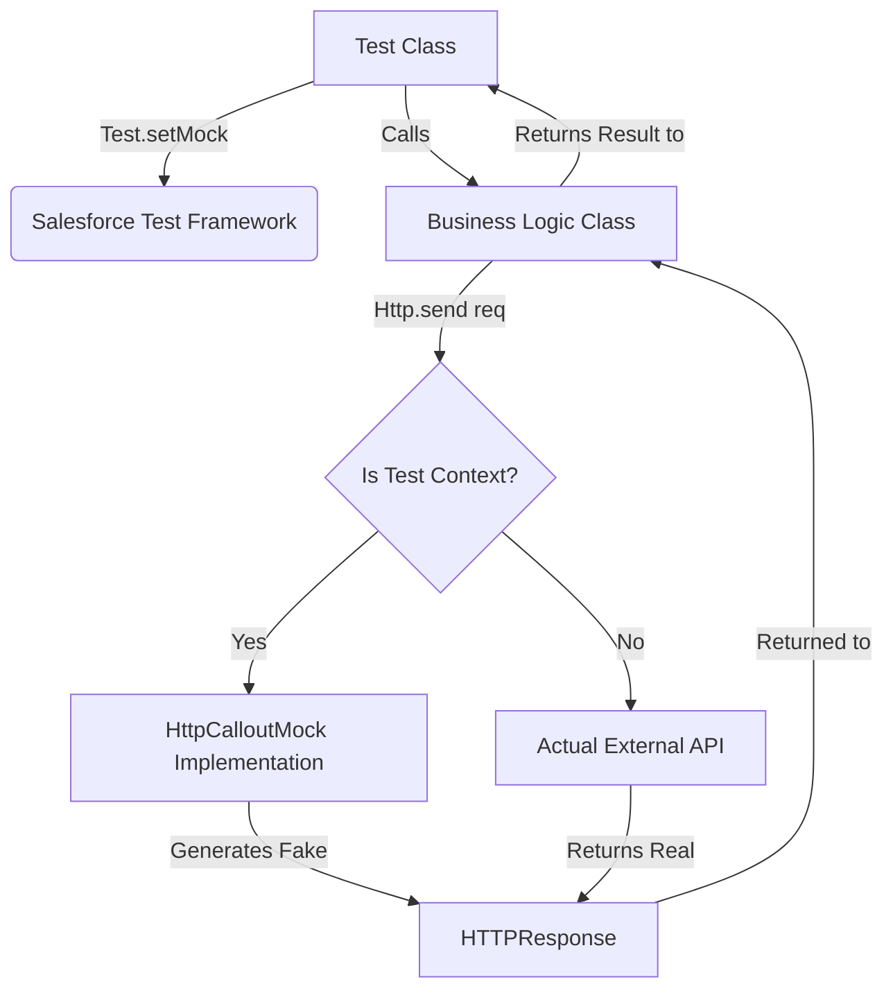
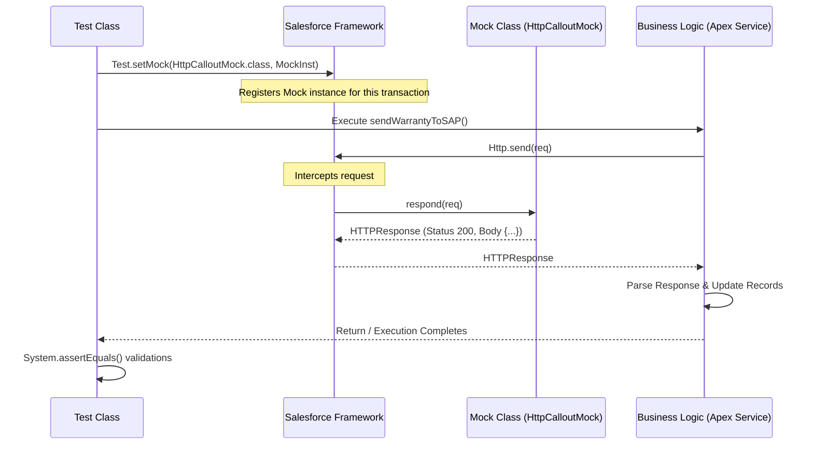

# Mocking Callouts – HttpCalloutMock

---

## 1. Introduction

### What is Mocking?
In software engineering, **mocking** is the process of creating a simulated, controlled version of an external system or component to test the behavior of the code that depends on it. In the context of Salesforce, mocking specifically refers to simulating the responses of external web services (REST or SOAP APIs) during the execution of Apex test classes.

### Why Mocking is Important
When writing unit tests, the goal is to validate your business logic, not the uptime or correctness of external third-party systems. Mocking decouples your Salesforce codebase from external dependencies, ensuring that your tests are deterministic, fast, and purely focused on your internal logic. 

### Why Salesforce Requires Mocking for Callouts
Salesforce enforces strict test isolation. **By design, the Salesforce platform blocks actual HTTP callouts from executing during test runs.** If your Apex code attempts an unmocked callout inside an `@isTest` context, Salesforce immediately throws a `CalloutException: Methods defined as TestMethod do not support Web service callouts`. Mocking is a mandatory platform requirement to bypass this restriction and achieve code coverage.

### Benefits of Mocking
*   **Deterministic Testing:** Tests do not fail due to external API downtime or network latency.
*   **Data Integrity:** Prevents tests from accidentally creating or deleting records in live external systems (e.g., SAP, ERPs).
*   **Comprehensive Scenario Coverage:** Allows developers to easily simulate edge cases (e.g., 500 Internal Server Errors, timeouts, malformed payloads) that are difficult to trigger on demand in real systems.
*   **Speed:** Simulated responses return instantly, keeping the test execution time low.

### Enterprise Testing Scenarios
In an enterprise **Automotive CRM** project, you might integrate with SAP for Warranty Claims, an external Dealer Management System (DMS), and a third-party SMS gateway. Mocking allows you to:
1.  Verify that a rejected SAP Warranty Claim updates the Salesforce `Warranty_Claim__c` status correctly.
2.  Ensure that a 401 Unauthorized response from the SMS gateway triggers a retry mechanism or logs an Error Record.
3.  Validate that bulk Dealer synchronizations parse complex, nested JSON payloads perfectly without hitting real endpoints.

---

## 2. What is HttpCalloutMock?

### Definition
`HttpCalloutMock` is an Apex interface provided by Salesforce in the `System` namespace. It allows developers to specify a fake response for HTTP callouts made within test methods.

### Purpose
Its primary purpose is to intercept outbound `HTTPRequest` objects generated by your Apex code during testing and return a predefined, simulated `HTTPResponse` object instead of reaching out to the actual internet.

### Interface Structure
The interface contains exactly one method that must be implemented:
```apex
HTTPResponse respond(HTTPRequest req);
```

### Test Execution
When `Test.setMock(HttpCalloutMock.class, new MyMockClass())` is declared in a test, the Salesforce execution engine registers the mock. Any subsequent `Http.send(req)` executed within that transaction will automatically route to the `respond()` method of your mock class.

### Mock Architecture



---

## 3. Why HTTP Callouts Cannot Execute During Tests

### Test Isolation
Salesforce test execution is heavily sandboxed. Tests must not have side effects. Allowing tests to make real web callouts violates this principle, as it could alter state in external databases.

### External Dependencies
If tests relied on external APIs, a Salesforce deployment could fail simply because a third-party server was undergoing maintenance. This breaks Continuous Integration (CI) pipelines.

### Predictable Test Results
Real callouts return dynamic data. If an external API returns different data every day, your assertions will constantly fail. Mocking ensures the input to your business logic is exactly the same every time the test runs.

### Security
Executing real callouts from a test context could expose sensitive integration credentials, tokens, or live customer data during automated builds.

### Platform Restrictions
Salesforce strictly enforces a "No uncommitted work pending" rule. If you perform a DML operation and then attempt a callout, the transaction fails. While tests have bypasses for some rules, allowing callouts would vastly complicate the database rollback mechanisms Salesforce uses at the end of every test method. 

---

## 4. How Mocking Works

The mocking lifecycle involves a clear handshake between the Test Class, the Salesforce Framework, the Mock implementation, and the Business Logic.

### Lifecycle Sequence



### Stage Explanations
1. **Test Class Setup:** The test method initializes test data and registers the mock using `Test.setMock()`.
2. **Execution:** The test calls the method in the business logic class that makes the callout.
3. **Interception:** The Salesforce framework detects the `Http.send()` call. Because it's a test context with a registered mock, it intercepts the callout.
4. **Mock Handling:** The framework passes the `HTTPRequest` to the `respond()` method of the registered mock class.
5. **Response Generation:** The mock class inspects the request and constructs an `HTTPResponse`.
6. **Return & Process:** The business logic receives the fake response, completely unaware it didn't come from the internet, and executes the rest of its logic (parsing, DML).
7. **Assertions:** The test class verifies the outcome.

---

## 5. HttpCalloutMock Interface

### Example

```apex
@isTest
global class MyMockCallout implements HttpCalloutMock {
    global HTTPResponse respond(HTTPRequest req) {
        // Create a fake response
        HttpResponse res = new HttpResponse();
        res.setHeader('Content-Type', 'application/json');
        res.setBody('{"status":"success"}');
        res.setStatusCode(200);
        return res;
    }
}
```

### Line-by-Line Explanation

*   `@isTest`: An annotation indicating that this class is only used for testing. It excludes the class from the org's Apex character limit and code coverage requirements.
*   `global class MyMockCallout`: Declares the class. `global` is used here (though `public` is standard unless building a managed package) to ensure it can be accessed across namespaces if necessary.
*   `implements HttpCalloutMock`: Tells the compiler that this class adheres to the `HttpCalloutMock` interface contract.
*   `global HTTPResponse respond(HTTPRequest req) {`: The mandatory method signature. It receives the outbound `HTTPRequest` and must return an `HTTPResponse`.
*   `HttpResponse res = new HttpResponse();`: Instantiates an empty response object.
*   `res.setHeader(...)`: Sets the HTTP headers (e.g., Content-Type) so the business logic parses it correctly.
*   `res.setBody(...)`: Simulates the payload returned from the external server.
*   `res.setStatusCode(200);`: Simulates the HTTP status code (200 = OK).
*   `return res;`: Hands the mocked response back to the Salesforce execution engine.

---

## 6. The respond() Method

### Purpose
The `respond()` method is the engine of the mock class. It acts as a simulated web server, receiving a request and deciding what response to return.

### Parameters
*   `HTTPRequest req`: The exact request generated by your business logic. You can inspect `req.getEndpoint()`, `req.getMethod()`, `req.getBody()`, and `req.getHeader()` to implement conditional routing.

### Return Value
*   `HTTPResponse`: The simulated response. You must fully construct this object (headers, body, status, status code) to prevent `NullPointerExceptions` in your business logic.

### Execution Flow
It executes synchronously in the exact moment your business logic calls `Http.send(req)`. 

---

## 7. Creating Mock Responses

Creating a robust mock response means simulating exactly what the third-party API would send.

*   **Status Code:** `res.setStatusCode(201);` (Created)
*   **Status:** `res.setStatus('Created');`
*   **Headers:** `res.setHeader('Content-Type', 'application/json');`
*   **Body (JSON):** `res.setBody('{"claimId": "SAP-99912"}');`
*   **Body (XML):** `res.setBody('<Response><Status>OK</Status></Response>');`
*   **Body (Binary/Blob):** `res.setBodyAsBlob(Blob.valueOf('Fake PDF Data'));`

---

## 8. Mocking JSON APIs

JSON is the most common integration format. 

### Production-Quality Example

```apex
@isTest
public class SAPWarrantyMock implements HttpCalloutMock {
    public HTTPResponse respond(HTTPRequest req) {
        HttpResponse res = new HttpResponse();
        res.setHeader('Content-Type', 'application/json');
        
        // Dynamic JSON construction using wrapper class and JSON.serialize
        Map<String, Object> responseMap = new Map<String, Object>{
            'sapClaimNumber' => 'WR-88371',
            'status' => 'APPROVED',
            'approvedAmount' => 1250.50
        };
        
        res.setBody(JSON.serialize(responseMap));
        res.setStatusCode(200);
        return res;
    }
}
```

### Explanation
*   `JSON.serialize()`: Instead of typing error-prone static JSON strings (`'{"key":"value"}'`), we use an Apex `Map` or a Wrapper Class and serialize it. This ensures perfectly formatted JSON and makes it easy to mock dynamic data.
*   **Wrapper Classes:** If your integration uses complex nested JSON, construct an instance of your Apex wrapper class, populate it, and use `JSON.serialize(myWrapperInstance)`.

---

## 9. Mocking XML APIs

Many legacy enterprise systems (and SOAP services) still use XML.

### Example

```apex
@isTest
public class SAPVehicleXMLMock implements HttpCalloutMock {
    public HTTPResponse respond(HTTPRequest req) {
        HttpResponse res = new HttpResponse();
        res.setHeader('Content-Type', 'text/xml;charset=UTF-8');
        
        String xmlBody = '<?xml version="1.0" encoding="UTF-8"?>' +
                         '<VehicleResponse xmlns="[http://sap.com/automotive](http://sap.com/automotive)">' +
                         '  <VIN>1HGCM82633A</VIN>' +
                         '  <EngineStatus>Active</EngineStatus>' +
                         '</VehicleResponse>';
                         
        res.setBody(xmlBody);
        res.setStatusCode(200);
        return res;
    }
}
```

### Considerations
*   **Headers:** Ensure `Content-Type` is set to `text/xml` or `application/xml`.
*   **Namespaces:** If the real API returns namespaces (`xmlns`), your mock XML must include them, otherwise the `DOM.Document` or `XmlStreamReader` in your business logic will fail to parse it.

---

## 10. Test.setMock()

### Syntax and Example

```apex
@isTest
static void testSAPIntegration() {
    // Register the mock
    Test.setMock(HttpCalloutMock.class, new SAPWarrantyMock());
    
    // Execute business logic...
}
```

### Deep Explanation
*   `Test.setMock()` is a static method used to instruct the system to use a mock response.
*   **Parameter 1 (`HttpCalloutMock.class`):** Specifies the *type* of mock we are setting. For REST, it is always `HttpCalloutMock.class`. (For SOAP, it is `WebServiceMock.class`).
*   **Parameter 2 (`new SAPWarrantyMock()`):** The actual instance of the class that implements the interface.
*   **Execution Lifecycle:** Once called, this mock remains active for the duration of the test method context. Any callout made after this line will be intercepted.

---

## 11. Testing HTTP Callouts

Here is a complete, production-quality test method bringing it all together.

### Example: Business Logic Validation

```apex
@isTest
private class WarrantyServiceTest {
    
    @isTest
    static void testSubmitWarrantyClaimSuccess() {
        // 1. Setup Test Data
        Warranty_Claim__c claim = new Warranty_Claim__c(Name = 'Claim-001', Amount__c = 1500);
        insert claim;
        
        // 2. Set Mock
        Test.setMock(HttpCalloutMock.class, new SAPWarrantyMock());
        
        // 3. Execute - Wrapping in startTest/stopTest resets governor limits
        Test.startTest();
        WarrantyService.submitToSAP(claim.Id); // This method makes the callout
        Test.stopTest(); // Forces asynchronous @future or Queueable callouts to execute
        
        // 4. Assertions - Response Validation & Business Logic Validation
        Warranty_Claim__c updatedClaim = [SELECT Status__c, SAP_Reference__c FROM Warranty_Claim__c WHERE Id = :claim.Id];
        
        System.assertEquals('Approved', updatedClaim.Status__c, 'The claim status should be Approved based on the mock response.');
        System.assertEquals('WR-88371', updatedClaim.SAP_Reference__c, 'The SAP reference should match the mocked JSON.');
    }
}
```

### Explanation
*   **Data Setup:** Create the context records.
*   **`Test.startTest()` / `Test.stopTest()`:** Vital for testing asynchronous callouts (like `@future(callout=true)`) because `stopTest()` forces them to execute synchronously.
*   **Assertions:** We do not assert the HTTPResponse directly because the test method doesn't receive it—the `WarrantyService` does. We query the database to assert that the `WarrantyService` parsed the mocked response and updated the Salesforce record correctly.

---

## 12. StaticResourceCalloutMock

For APIs that return massive, complex JSON/XML payloads, hardcoding strings in Apex is difficult to maintain. Salesforce provides a built-in class called `StaticResourceCalloutMock` to handle this.

### Purpose
Allows you to store the mock API response body as a file in Salesforce **Static Resources** and tell the mock framework to return the contents of that file.

### Example

1. Create a text file named `sap_warranty_success.json` with your large JSON payload.
2. Upload it to Salesforce Static Resources as `SAP_Warranty_Success`.

```apex
@isTest
static void testWithStaticResource() {
    StaticResourceCalloutMock mock = new StaticResourceCalloutMock();
    mock.setStaticResource('SAP_Warranty_Success');
    mock.setStatusCode(200);
    mock.setHeader('Content-Type', 'application/json');
    
    Test.setMock(HttpCalloutMock.class, mock);
    
    // Call business logic...
}
```

### Advantages
*   Zero custom mock classes required.
*   Easy to maintain complex payloads (just upload a new file).

---

## 13. MultiStaticResourceCalloutMock

What if your business logic makes callouts to **two different endpoints** in the same transaction?

### Purpose
`MultiStaticResourceCalloutMock` maps specific endpoints to specific Static Resources.

### Example

```apex
@isTest
static void testMultipleStaticCallouts() {
    MultiStaticResourceCalloutMock multimock = new MultiStaticResourceCalloutMock();
    
    // Map Endpoint A to Resource A
    multimock.setStaticResource('[https://api.sap.com/warranty](https://api.sap.com/warranty)', 'SAP_Warranty_Resource');
    multimock.setStatusCode(200);
    multimock.setHeader('Content-Type', 'application/json');
    
    // Map Endpoint B to Resource B
    multimock.setStaticResource('[https://api.sms-gateway.com/send](https://api.sms-gateway.com/send)', 'SMS_Success_Resource');
    multimock.setStatusCode(200);
    multimock.setHeader('Content-Type', 'application/json');
    
    Test.setMock(HttpCalloutMock.class, multimock);
    
    // Call business logic that hits both endpoints...
}
```

---

## 14. HttpCalloutMock vs StaticResourceCalloutMock

| Feature | `HttpCalloutMock` (Custom Class) | `StaticResourceCalloutMock` |
| :--- | :--- | :--- |
| **Response Body Source** | Hardcoded in Apex or built via `JSON.serialize()` | File in Static Resources |
| **Dynamic Responses** | **High:** Can read `req.getBody()` and return dynamic data based on input. | **None:** Always returns the exact static file contents. |
| **Ease of Use** | Moderate (Requires writing a class) | High (Built-in class) |
| **Maintainability (Large payloads)** | Poor (Ugly string concatenation) | Excellent (Clean file separation) |
| **Request Validation** | Yes (Can assert `req` parameters) | No |
| **Best Use Case** | Logic requires varying responses based on dynamic request parameters. | API returns massive static catalog data, or simple identical success checks. |

**Architect Recommendation:** Use `HttpCalloutMock` with a Mock Factory pattern for enterprise apps, as it allows strict validation of the *outbound request payload*, which StaticResource mocks cannot do.

---

## 15. WebServiceMock (Overview)

While `HttpCalloutMock` is for REST APIs, `WebServiceMock` is for legacy **SOAP APIs** generated via WSDL2Apex.

*   **Purpose:** Mocks responses for generated SOAP stub classes.
*   **Difference:** Instead of dealing with `HTTPRequest` and `HTTPResponse`, `WebServiceMock` deals directly with the strongly-typed SOAP request and response objects generated by Salesforce.
*   **Usage:** `Test.setMock(WebServiceMock.class, new MySoapMock());`

---

## 16. Mocking Multiple Callouts

If a transaction makes multiple callouts and you need dynamic validation, build a router inside your `HttpCalloutMock`.

### Production-Quality Example

```apex
@isTest
public class AutomotiveEnterpriseMock implements HttpCalloutMock {
    public HTTPResponse respond(HTTPRequest req) {
        HttpResponse res = new HttpResponse();
        res.setHeader('Content-Type', 'application/json');
        
        // Routing based on Endpoint
        if (req.getEndpoint().contains('/sap/warranty')) {
            res.setBody('{"status": "SAP_OK"}');
            res.setStatusCode(200);
        } 
        else if (req.getEndpoint().contains('/dms/dealer')) {
            // Routing based on HTTP Method for the same endpoint
            if (req.getMethod() == 'POST') {
                res.setBody('{"dealerId": "DLR-100", "status": "Created"}');
                res.setStatusCode(201);
            } else if (req.getMethod() == 'GET') {
                res.setBody('{"dealerId": "DLR-100", "name": "Global Motors"}');
                res.setStatusCode(200);
            }
        } 
        else {
            // Unhandled endpoint
            res.setStatusCode(404);
            res.setBody('{"error": "Endpoint not mocked"}');
        }
        
        return res;
    }
}
```

---

## 17. Dynamic Mock Responses

Instead of just checking the endpoint, you can inspect the **body** of the outbound request to dynamically alter the mock response.

### Example: Inspecting the Payload

```apex
public HTTPResponse respond(HTTPRequest req) {
    HttpResponse res = new HttpResponse();
    res.setHeader('Content-Type', 'application/json');
    
    // Parse the outbound request body
    Map<String, Object> requestBody = (Map<String, Object>) JSON.deserializeUntyped(req.getBody());
    
    // Dynamic logic based on request data
    String vin = (String) requestBody.get('VIN');
    if (vin == 'INVALID_VIN') {
        res.setStatusCode(400);
        res.setBody('{"error": "Vehicle Identification Number not recognized"}');
    } else {
        res.setStatusCode(200);
        res.setBody('{"status": "Warranty Valid", "vin": "' + vin + '"}');
    }
    return res;
}
```

---

## 18. Request Validation

A critical, often overlooked aspect of mocking is asserting that your Apex code constructed the *outbound request* perfectly. You should assert the URL parameters, headers (like Authorization), and the JSON body.

You can perform assertions directly inside the `respond()` method.

```apex
public HTTPResponse respond(HTTPRequest req) {
    // Request Validation Assertions
    System.assertEquals('POST', req.getMethod(), 'Should use POST method');
    System.assertEquals('Bearer test_token', req.getHeader('Authorization'), 'Auth header missing');
    System.assert(req.getEndpoint().endsWith('/v1/claims'), 'Endpoint suffix is incorrect');
    
    // Return mock response...
    HttpResponse res = new HttpResponse();
    res.setStatusCode(200);
    return res;
}
```

---

## 19. Response Validation

This refers to validating how your Apex code handles the mock response. It occurs in the test method *after* the business logic runs. 

### Best Practices
*   **Do not** just assert that the mock returned a 200.
*   **Do** assert the ultimate state change in Salesforce. Did the field update? Was an Error Log record inserted?

```apex
// Inside Test Method
Test.startTest();
WarrantyService.syncDealer('DLR-99');
Test.stopTest();

// Response Validation
Dealer__c d = [SELECT Sync_Status__c, Last_Sync_Date__c FROM Dealer__c WHERE Dealer_Id__c = 'DLR-99'];
System.assertEquals('Synced', d.Sync_Status__c, 'Dealer should be marked as synced');
System.assertNotEquals(null, d.Last_Sync_Date__c, 'Sync date should be populated');
```

---

## 20. Testing Error Scenarios

Enterprise applications must handle failure gracefully. You must write test methods that simulate external API failures.

### Examples of Error Mocking

| Scenario | HTTP Code | Mock Body Simulation | Business Logic Expected Behavior |
| :--- | :--- | :--- | :--- |
| **Validation Error** | 400 Bad Request | `{"error": "Missing field"}` | Update record status to 'Integration Error'. |
| **Auth Expiry** | 401 Unauthorized | `{"error": "Token Expired"}` | Attempt token refresh, or log error. |
| **Server Crash** | 500 Internal Error | `{"error": "Server Down"}` | Schedule a retry via Queueable / Batch. |
| **Timeout** | N/A (Exception) | *See below* | Catch `CalloutException`, retry or fail gracefully. |

### Simulating a Timeout or CalloutException

You cannot set a status code for a timeout; the platform throws a `CalloutException` before a response is received. To mock this:

```apex
public class TimeoutMock implements HttpCalloutMock {
    public HTTPResponse respond(HTTPRequest req) {
        CalloutException e = (CalloutException)CalloutException.class.newInstance();
        e.setMessage('Read timed out');
        throw e;
    }
}
```

---

## 21. Governor Limits

Understanding how mocking interacts with Salesforce Governor Limits is vital for Performance Engineers.

| Limit | Real Transaction | Mocked (Test) Transaction | Notes |
| :--- | :--- | :--- | :--- |
| **Total HTTP Callouts** | 100 per transaction | **Does NOT count** | The mock intercepts before the limit is incremented. |
| **Max Timeout** | 120 seconds per callout | N/A | Mock responses return instantly. |
| **CPU Time** | 10,000 ms (Async 60k) | **Counts** | The parsing and string manipulation inside `respond()` consumes CPU time. |
| **Heap Size** | 6 MB (Async 12 MB) | **Counts** | Large static resource strings or dynamic JSON generation consumes Heap. |

**Architect Tip:** Do not load massive 5MB static resources in a loop during tests; you will hit the Heap Size limit even though it's a test.

---

## 22. Enterprise Testing Patterns

In large orgs, creating hundreds of distinct mock classes becomes unmaintainable. 

### The Mock Factory Pattern
Create a single, reusable Factory class that can dynamically generate responses based on parameters passed from the test.

```apex
@isTest
public class UniversalMockFactory implements HttpCalloutMock {
    private Integer code;
    private String status;
    private String body;

    public UniversalMockFactory(Integer code, String status, String body) {
        this.code = code;
        this.status = status;
        this.body = body;
    }

    public HTTPResponse respond(HTTPRequest req) {
        HttpResponse res = new HttpResponse();
        res.setStatusCode(this.code);
        res.setStatus(this.status);
        res.setBody(this.body);
        return res;
    }
}
```
**Usage in Test:**
```apex
Test.setMock(HttpCalloutMock.class, new UniversalMockFactory(404, 'Not Found', '{"error":"No Data"}'));
```

### Dependency Injection (DI)
Instead of mocking the HTTP layer, DI involves mocking the *Service Layer* itself using frameworks like `fflib_ApexMocks`. This allows you to skip HTTP mocking entirely and just test if `WarrantyService.send()` was invoked.

---

## 23. Real Project Scenarios (Automotive CRM)

### Scenario 1: SAP Warranty API (Success)
*   **Requirement:** When a Warranty Claim is approved in Salesforce, push to SAP.
*   **Implementation:** Use `UniversalMockFactory(201, 'Created', '{"sapId":"123"}')`. Validate the Salesforce `Warranty_Claim__c` record receives the `sapId`.

### Scenario 2: Dealer Synchronization (Massive Payload)
*   **Requirement:** Nightly batch pulls down 5,000 dealers from an external DMS.
*   **Implementation:** Use `StaticResourceCalloutMock` with a JSON file containing a 50-dealer array to validate the Batch class parsing and chunking logic without blowing up test heap limits.

### Scenario 3: Customer WhatsApp Notifications (Auth Error)
*   **Requirement:** Send notification when vehicle service is complete.
*   **Implementation:** Mock a `401 Unauthorized`. Assert that the business logic catches it, queries a new OAuth token, and retries the callout successfully.

---

## 24. Common Mistakes

| Mistake | Consequence | Solution |
| :--- | :--- | :--- |
| **Forgetting `Test.setMock()`** | `CalloutException` during test run. | Always set the mock before `Test.startTest()`. |
| **Not Testing Errors** | Code coverage drops; production bugs occur when APIs fail. | Create specific test methods for 400, 401, 500, and timeouts. |
| **Hardcoding massive JSON strings** | Apex classes become unreadable; easy to introduce syntax errors. | Use `StaticResourceCalloutMock` or `JSON.serialize()`. |
| **No Request Validation** | You might deploy code that sends empty payloads to production APIs. | Add `System.assertEquals()` inside the `respond()` method. |

---

## 25. Best Practices Checklist

*   [x] **Use HttpCalloutMock for dynamic APIs:** When request validation or dynamic routing is needed.
*   [x] **Use StaticResourceCalloutMock for static responses:** When dealing with massive, unchanging JSON payloads.
*   [x] **Validate request data:** Ensure your Apex is sending the correct headers, endpoint, and payload structure.
*   [x] **Test success and failure scenarios:** 200 OK is not enough. Mock 400s and 500s.
*   [x] **Test different HTTP status codes:** Ensure your business logic branches correctly.
*   [x] **Keep mock classes reusable:** Implement the Mock Factory pattern to avoid duplicate mock classes.
*   [x] **Separate mock classes from test classes:** Do not pollute test classes with inner mock classes; keep them in a `TestUtilities` or `Mocks` folder.
*   [x] **Use meaningful assertions:** Assert data changes, not just `res.getStatusCode() == 200`.

---

## 26. Debugging Mock Callouts

When your mock isn't behaving as expected:

1.  **Developer Console / Debug Logs:** Place `System.debug('MOCK HIT: ' + req.getEndpoint());` inside your `respond()` method. If this doesn't print, your business logic isn't making the callout, or `Test.setMock()` wasn't called properly.
2.  **Trace Flags:** Set debug levels for `Callout` to `INFO` or `FINEST`. Even though it's mocked, the platform will log the outbound request attempt.
3.  **Uncommitted Work Errors:** If you see `System.CalloutException: You have uncommitted work pending`, it means your test method did a DML insert (e.g., creating test data), and your code attempted a synchronous callout *without* `Test.startTest()` separating the contexts.

---

## 27. Interview Questions & Answers

### Beginner Questions
**Q: Why do we get an error when making a callout in a test class without a mock?**
A: Salesforce strictly isolates tests to prevent unwanted side effects on external systems and to ensure deterministic testing without relying on external network uptime. It blocks real callouts by design.

### Intermediate Questions
**Q: How can you test both a successful callout and a failed callout in the same test class?**
A: By writing two separate test methods. In `testCalloutSuccess()`, register a mock returning 200. In `testCalloutFailure()`, register a mock (or pass parameters to a Mock Factory) returning 500.

**Q: What is the difference between HttpCalloutMock and StaticResourceCalloutMock?**
A: `HttpCalloutMock` is an interface you implement in Apex to dynamically generate responses and validate requests. `StaticResourceCalloutMock` is a built-in class that returns a static file from Salesforce Static Resources, ideal for large unchanging payloads.

### Advanced Questions
**Q: Can a mock callout consume API governor limits?**
A: Mock callouts do *not* count toward the 100 callouts-per-transaction limit. However, the data processing, JSON serialization, and variable instantiations *do* count toward CPU Time and Heap Size limits.

### Architect-Level Questions
**Q: You have an enterprise codebase making 50 different API callouts. How do you structure your mocks to maintain scalability?**
A: I would not create 50 different mock classes. I would implement a **Mock Factory Pattern** where a single generic class implements `HttpCalloutMock`. The test methods inject the desired HTTP Status, Body, and Headers into the Factory's constructor. For massive enterprise scale, I would utilize a Dependency Injection framework like `fflib_ApexMocks` to mock the service layer entirely, bypassing the need for HTTP mocking for most unit tests, reserving HTTP mocks only for integration layer tests.

---

## 28. Revision Summary

*   **HttpCalloutMock:** Interface to simulate REST callouts in test classes.
*   **Test.setMock():** The method used to register the mock implementation with the test framework.
*   **respond():** The mandatory interface method that receives `HTTPRequest` and returns `HTTPResponse`.
*   **StaticResourceCalloutMock:** Built-in class for serving static files as mock responses.
*   **MultiStaticResourceCalloutMock:** Maps different endpoints to different static resources.
*   **WebServiceMock:** Used exclusively for mocking SOAP APIs.
*   **Dynamic Responses:** inspecting `req.getBody()` or `req.getEndpoint()` to route logic within `respond()`.
*   **Error Testing:** Always test 4xx, 5xx status codes and simulate `CalloutException` for timeouts.
*   **Governor Limits:** Mocks bypass the 100 callout limit but consume CPU and Heap.
*   **Best Practices:** Use Mock Factories, validate outbound requests, and separate mock architecture from test logic.