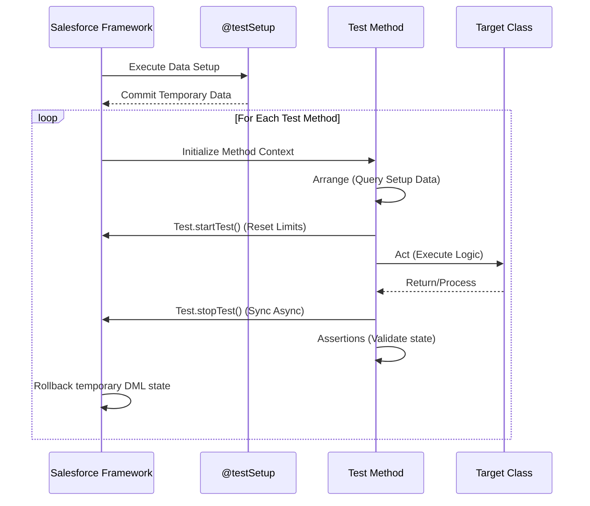

# Test Classes & 75% Code Coverage

---

## 1. Introduction

### What are Apex Test Classes?
Apex Test Classes are specialized classes written in Salesforce's proprietary programming language (Apex) explicitly designed to execute and validate the business logic contained in standard Apex classes, triggers, and controllers. They act as automated quality gates, ensuring that the code performs exactly as expected under various conditions.

### Why Salesforce Enforces Testing
Unlike traditional on-premise platforms, Salesforce operates in a multi-tenant cloud environment where resources are shared among thousands of organizations. To protect the integrity, stability, and performance of the platform, Salesforce enforces a mandatory minimum code coverage of 75% for all Apex code being deployed to a production environment. This ensures that faulty or infinitely looping code does not consume shared server resources or corrupt customer data.

### Benefits of Unit Testing
- **Verification of Logic:** Ensures business requirements are correctly implemented.
- **Governor Limit Assurance:** Proves that code is bulkified and adheres to strict Salesforce execution limits.
- **Safe Refactoring:** Allows developers to optimize or refactor code with confidence.
- **Documentation:** Well-written tests serve as living documentation of how the code is supposed to behave.

### Importance of Automated Testing
Manual testing is error-prone and unscalable in massive enterprise environments. Automated testing within CI/CD pipelines ensures that every incremental change is verified against the entire existing codebase, catching regressions instantly before they reach Production.

### Real-World Enterprise Scenario
In an **Automotive CRM**, when a `Warranty_Claim__c` is approved, a complex trigger automates parts inventory deductions, calculates labor costs, and sends an outbound message to an SAP ERP system. Manual testing of every permutation (approved, rejected, partial approval, high volume bulk inserts) is impossible. Automated test classes run thousands of these permutations in seconds during every deployment, guaranteeing the ERP sync and inventory counts never break.

---

## 2. What is a Test Class?

### Definition
A test class is an Apex class defined with the `@isTest` annotation. It contains static methods, also annotated with `@isTest`, that instantiate standard classes, provide inputs, and verify outputs.

### Purpose
The sole purpose is to prove code correctness without permanently altering the org's actual database.

### `@isTest` Annotation
This annotation flags the class and its methods to the Apex compiler as testing code. Code within `@isTest` classes does not count against your organization's overall Apex character limit (6 MB).

### Test Execution Lifecycle
When a test class runs, Salesforce creates an isolated transaction. It allocates temporary database context, executes the code, and tracks which lines of production code were executed. Once finished, it issues an immediate, unpreventable database rollback.

### Test Isolation
By default, tests run in total isolation from the organization's real data. If you query `Account` records in a test, the system returns zero records, regardless of whether you have 10 million Accounts in Production. You must construct your own mock data in memory. This ensures tests are reliable and not brittle against changing production data.

---

## 3. Why Test Classes are Required

### Deployment Requirement
Salesforce simply will not allow you to push Apex code to a Production org via Changeset, Metadata API, or Salesforce CLI unless the target org's overall code coverage is at least 75%, and all test methods pass without exceptions.

### Code Quality
Tests force developers to write modular, decoupled code. Monolithic, tightly-coupled code is notoriously difficult to test, so testing natively enforces better architectural patterns.

### Bug Prevention
Testing uncovers edge cases. For instance, testing what happens when a `Dealer__c` record is inserted without a primary contact, or when 200 records are inserted simultaneously.

### Regression Testing
As the Automotive CRM evolves, developers will add new validation rules and flows. Test classes written two years ago will automatically run alongside new deployments, catching regressions (unintended side effects) introduced by the new changes.

### Maintainability
Enterprise orgs have hundreds of thousands of lines of code. Tests ensure that new developers can confidently understand and modify existing code without breaking undocumented dependencies.

---

## 4. Salesforce Code Coverage

### What is Code Coverage?
Code coverage is a metric (expressed as a percentage) that represents the number of executable lines of Apex code that were invoked during the execution of all test classes, compared to the total number of executable lines in the org.

### How Salesforce Calculates Code Coverage
`Code Coverage % = (Executed Lines / (Executed Lines + Unexecuted Lines)) * 100`
*Note: Comments, blank lines, system debugs, and brackets do not count as executable lines.*

### Organization-Wide vs. Individual Class Coverage
| Feature | Organization-Wide Coverage | Individual Class Coverage |
| :--- | :--- | :--- |
| **Definition** | Average coverage across all non-test classes and triggers in the entire org. | Coverage of a single specific Apex class or trigger. |
| **Requirement** | **MUST be >= 75%** to deploy to Production. | Recommended to be >= 75%, but not strictly mandatory *if* Org average covers it (unless using specific deployment types). |
| **Impact** | If < 75%, entire deployment fails. | Triggers must specifically have > 0% coverage. |

### Managed Package Coverage
Apex code inside installed Managed Packages does not count towards your organization's code coverage requirement. When compiling or deploying, managed package tests are bypassed by default to save time.

### Deployment Validation Rules
During a deployment, Salesforce validates the payload in memory. It runs the designated tests, calculates the hypothetical coverage *if* the payload were deployed, and either commits or rolls back the transaction.

---

## 5. The 75% Code Coverage Requirement

### Why Salesforce Requires 75%
The 75% threshold is a balance between ensuring platform stability and developer productivity. Requiring 100% would force developers to write brittle tests for impossible edge cases, while 50% would leave too much logic unverified.

### Is Every Class Required to Have 75%?
Strictly speaking, **No**. If your Org has an overall coverage of 85%, you could technically deploy a class with 60% coverage (as long as the overall org average stays above 75%). However, **every Trigger must have at least 1% coverage**. (Best practice is 75%+ per class).
*Exception:* If you are deploying via Salesforce CLI / CI/CD and select `RunSpecifiedTests`, every class *included in the deployment payload* must meet 75% individually.

### What Happens if Coverage is Below 75%?
Deployment to Production fails outright with the error: `Average test coverage across all Apex Classes and Triggers is < 75%`.

### Best Practices to Achieve Meaningful Coverage
- Do not just call methods with null parameters to hit lines of code.
- Write assertions. Covering a line without verifying its output is called "Fake Coverage."

### Why 100% Coverage Doesn't Guarantee Bug-Free Code
A test might cover 100% of the lines in a `WarrantyClaimCalculator` by passing perfectly formatted data. But if the test fails to test what happens when `Labor_Hours__c` is a negative number (which might bypass an IF block but corrupt SAP downstream), the code is covered but logically flawed.

---

## 6. Anatomy of a Test Class

### Components
- `@isTest`: Defines the class/method as test context.
- `static methods`: Test methods must be static and return `void`.
- `Test data`: Initialization of SObjects.
- `Assertions`: `System.assert()` to prove expected behavior.
- `Test execution`: Utilizing `Test.startTest()` and `Test.stopTest()`.

### Production-Quality Example

```apex
@isTest
private class WarrantyClaimServiceTest {
    
    // 1. Test Setup - Creates reusable data for all methods in this class
    @testSetup
    static void setupTestData() {
        Dealer__c testDealer = new Dealer__c(Name = 'AutoMotive HQ', Dealer_Code__c = 'DLR-001');
        insert testDealer;
    }
    
    // 2. Test Method
    @isTest
    static void testAutoApproveSmallClaims() {
        // 3. Arrange: Retrieve test setup data
        Dealer__c dealer = [SELECT Id FROM Dealer__c WHERE Dealer_Code__c = 'DLR-001' LIMIT 1];
        
        Warranty_Claim__c claim = new Warranty_Claim__c(
            Dealer__c = dealer.Id,
            Claim_Amount__c = 450.00, // Below $500 threshold
            Status__c = 'Draft'
        );
        insert claim;
        
        // 4. Act: Reset limits and call the business logic
        Test.startTest();
        WarrantyClaimService.processClaims(new List<Id>{claim.Id});
        Test.stopTest();
        
        // 5. Assert: Verify the results
        Warranty_Claim__c processedClaim = [SELECT Status__c FROM Warranty_Claim__c WHERE Id = :claim.Id];
        System.assertEquals('Approved', processedClaim.Status__c, 'Claims under $500 should be auto-approved.');
    }
}
```

### Line-by-Line Explanation
1. `@isTest private class WarrantyClaimServiceTest`: Declares a private test class.
2. `@testSetup static void setupTestData()`: Pre-creates a `Dealer__c` record. This runs once before any tests start.
3. `Dealer__c dealer = ...`: Queries the dealer created in testSetup. (Test classes can see testSetup data).
4. `insert claim;`: Creates the scenario.
5. `Test.startTest();`: Resets governor limits. Signals the start of the heavy processing.
6. `WarrantyClaimService.processClaims(...)`: The actual class being tested.
7. `Test.stopTest();`: Forces synchronous completion of any async calls made in the method and ends the fresh governor limit context.
8. `System.assertEquals(...)`: The most critical line. Proves the logic actually updated the status to 'Approved'.

---

## 7. Creating Test Data

### Manual Test Data
Constructing SObjects directly in memory within a test method. This is tedious if the data model has many required fields.

### Independent Test Data
Salesforce data models are highly relational. A `Work_Order__c` requires a `Vehicle__c`, which requires a `Customer__c`. Test data must recreate this exact hierarchy in memory before testing the `Work_Order__c`.

### Avoiding Existing Org Data
Never rely on `SELECT Id FROM User WHERE Name = 'John Doe'`. John Doe might leave the company, his record deactivated, and your test will inexplicably fail. Create test Users dynamically.

### Reusable Test Data (`@testSetup`)
Methods annotated with `@testSetup` run once before the entire class executes. All test methods in the class get a fresh copy of this data. If `testMethod1` deletes a record, `testMethod2` will still see it.

### Data Relationships (Automotive Example)
```apex
// Utility Class for Data Generation
@isTest
public class TestDataFactory {
    public static Vehicle__c createVehicle(Id customerId) {
        Vehicle__c v = new Vehicle__c(
            VIN__c = '1HGCM82633AXXXXXX',
            Customer__c = customerId
        );
        insert v;
        return v;
    }
}
```

---

## 8. Test Execution Lifecycle



---

## 9. Assertions

Assertions are the heartbeat of testing. Without them, you are only checking if the code compiles and runs without crashing, not if it actually works.

### `System.assert(condition, message)`
Checks if a boolean condition is true.
*Example:* `System.assert(claim.Amount > 0, 'Amount must be greater than zero');`

### `System.assertEquals(expected, actual, message)`
Compares two values. If they differ, the test fails and prints the message.
*Example:* `System.assertEquals('Closed', order.Status, 'Order status should be Closed.');`
*When to use:* This is the preferred assertion because the error logs will tell you *what* the mismatch was (e.g., "Expected: Closed, Actual: Open").

### `System.assertNotEquals(unexpected, actual, message)`
Ensures a value has changed or does not match an invalid state.
*Example:* `System.assertNotEquals(null, dealer.Id, 'Dealer Id should have been populated after insert.');`

---

## 10. Types of Test Cases

### Positive Testing
Testing the "Happy Path." Providing perfect, expected inputs and verifying the expected successful output.
*Example:* A valid warranty claim with a valid VIN is successfully processed and approved.

### Negative Testing
Providing invalid data to ensure the code gracefully handles errors (via exceptions, `addError()`, or specific return types).
*Example:* Submitting a Warranty Claim for a vehicle whose warranty expired 5 years ago. Assert that the trigger correctly blocks the insert with an error.

### Boundary Testing
Testing the extreme edges of logical constraints.
*Example:* If auto-approval is `< $500`, test with `$499.99` (Positive), `$500.00` (Negative/Manual Review), and `$500.01` (Negative/Manual Review).

### Bulk Testing
Testing the code against 200 records simultaneously to ensure SOQL/DML governor limits are not breached (Bulkification).
*Example:* Inserting 200 `Dealer_Invoice__c` records in a single List.

### Exception Testing
Validating `try/catch` blocks.
*Example:* `System.assert(e.getMessage().contains('Invalid SAP ID'));`

### Security Testing
Using `System.runAs(testUser)` to verify that users with limited profiles can or cannot access specific logic or records.

---

## 11. Test.startTest() and Test.stopTest()

### Purpose
To clearly demarcate the actual logic being tested from the setup and teardown phases. 

### Governor Limit Reset
Salesforce gives tests a fresh set of governor limits.
- If you use 90 SOQL queries to set up test data (creating users, roles, dealers, products), you only have 10 left for your actual test!
- `Test.startTest()` resets the SOQL counter back to 0. You now have a fresh 100 queries to test your business logic.
- `Test.stopTest()` reverts back to the original limit context.

### Asynchronous Execution
`Test.stopTest()` acts as a synchronizing checkpoint. Any `@future`, `Queueable`, or `Batch` jobs invoked after `startTest()` will be held in a queue. When `stopTest()` is called, Salesforce executes them immediately and synchronously.

### Best Practices
- Only ever call `startTest()` once per test method.
- Wrap only the target business logic between the two methods.

```apex
Test.startTest();
// ONLY business logic goes here
SAPIntegrationCallout.syncInvoices();
Test.stopTest();
```

---

## 12. Governor Limits During Testing

| Limit | Normal Transaction | Test Context (Setup) | Inside Test.startTest() |
| :--- | :--- | :--- | :--- |
| **SOQL Queries** | 100 | 100 | Reset to 0 (New 100 available) |
| **DML Statements** | 150 | 150 | Reset to 0 (New 150 available) |
| **CPU Time** | 10,000 ms | 10,000 ms | Reset to 0 |
| **Heap Size** | 6 MB | 6 MB | Reset to 0 |
| **Callouts** | 100 | NOT ALLOWED | Mocks Allowed (Reset limits) |

*Important:* Limits used between `startTest` and `stopTest` do not count against the limits used for test data creation.

---

## 13. Testing Different Apex Components

### Triggers
Triggers are tested by performing DML operations (`insert`, `update`, `delete`, `undelete`) on the target object.
*Example:* `insert new Work_Order__c();` automatically executes the Before and After Insert trigger logic.

### Controllers (Visualforce / Aura / LWC)
For standard/custom controllers, you must instantiate the controller in the test and call its methods directly.
*Example:* 
```apex
ApexPages.StandardController sc = new ApexPages.StandardController(dealerRecord);
DealerExtension ext = new DealerExtension(sc);
ext.saveAction();
```

### Utility Classes
Tested by directly invoking static methods and passing variables.

---

## 14. Testing Asynchronous Apex (Overview)

Salesforce prevents async chains in testing. You can only execute one level of async code.

### Future Methods / Queueable Apex
Call the method between `startTest/stopTest`. The system pauses execution. Upon reaching `stopTest`, the future/queueable logic runs immediately on the current thread.

### Batch Apex
You must instantiate the batch class and call `Database.executeBatch()`. The batch `start`, `execute`, and `finish` methods will run synchronously upon `stopTest()`.
*Caveat:* The scope of records passed into a batch during testing is artificially limited to **200 records**.

### Scheduled Apex
You can test the scheduling logic using `System.schedule()` between start/stop test. However, the scheduled *job* (the actual execution) does not run in the test. To test the logic itself, instantiate the Schedulable class and call its `execute()` method directly.

---

## 15. Test Isolation

### Why tests should not depend on existing org data
If a test queries `SELECT Id FROM RecordType`, it relies on the org state. If deployed to an org without that RecordType, it fails. 

### Independent execution
Test methods within the same class do not run sequentially. They can execute in parallel. Therefore, `testMethodA` cannot pass data to `testMethodB` via static variables.

### Repeatability
Tests must yield the exact same result whether they are run at 2 AM on a Sunday or during a heavy deployment on a Tuesday. Isolation guarantees this.

---

## 16. SeeAllData Annotation

### Purpose
Grants test classes read access to the organization's real database.

### Syntax
`@isTest(SeeAllData=true)`

### Default Behavior
Since API Version 24.0, all test classes run with `SeeAllData=false` by default. 

### Comparison

| Feature | SeeAllData=false (Default) | SeeAllData=true |
| :--- | :--- | :--- |
| **Data Visibility** | Only sees data created within the test. | Sees all Org data (Accounts, Cases, etc.) |
| **Reliability** | Extremely High. | Very Low (fails if data is modified by users). |
| **Deployment Speed** | Fast (Isolated memory block). | Slower (Querying massive DB indexes). |
| **When to use** | 99.9% of the time. | Only for specific objects that cannot be mocked (e.g., Pricebooks, UserRoles, specific metadata). |

---

## 17. Deployment Requirements

### Validation
Before deploying, it is standard practice to run a "Validate Only" deployment. This runs the required test classes against the target org without permanently committing the code.

### Test Execution Levels
When deploying (via API, Ant, or CLI), you must specify a test level:
- **NoTestRun:** Only for sandbox deployments. Not allowed for Prod.
- **RunSpecifiedTests:** You manually define which test classes to run. *Rule:* Every deployed class must achieve 75% individually.
- **RunLocalTests:** (Default for Prod) Runs all tests except those from Managed Packages.
- **RunAllTests:** Runs absolutely every test in the Org, including managed packages. Used for deep regression analysis.

---

## 18. Code Coverage Reports

### Analyzing Coverage
- **Developer Console:** Shows a "Tests" tab with overall % and highlights unexecuted lines in red and executed lines in blue.
- **Salesforce CLI:** `sfdx force:apex:test:run -c -r human` outputs a terminal report of coverage per class.
- **VS Code:** Salesforce Extensions allow "Highlight Apex Code Coverage" directly in the editor.

### Fixing Low Coverage
Identify the red lines (unexecuted code). Ask yourself: "What data configuration is required to make the execution path enter this IF block or Catch block?" Adjust the test data accordingly.

---

## 19. Enterprise Testing Strategy

### Unit Testing
Testing a single method (e.g., `calculateTax()`) in absolute isolation.

### Integration Testing
Testing multiple components together (e.g., creating a Dealer, inserting a Claim, which fires a Trigger, which calls an HTTP Mock, which updates the Dealer).

### CI/CD Pipeline
Enterprise teams use Bitbucket/GitHub Actions + Salesforce CLI to automatically run `RunLocalTests` upon every Pull Request creation. If coverage drops below 85% (an arbitrary enterprise standard higher than Salesforce's 75%), the Pull Request is automatically blocked.

---

## 20. Real Project Scenarios (Automotive CRM)

| Scenario | Component Tested | What Should Be Tested? |
| :--- | :--- | :--- |
| **Warranty Claim Creation** | `WarrantyTriggerHandler` | Does saving a valid claim automatically look up the correct `Vehicle__c` warranty policy? What if the VIN doesn't exist? |
| **Dealer Registration** | `DealerRegistrationService` | If `Region__c = 'APAC'`, is the Dealer correctly assigned to the APAC queue? |
| **Invoice Generation** | `InvoiceBatch` | Create 200 Work Orders. Run batch. Verify 200 Invoices are created with correct line item rollups. |
| **SAP Integration** | `SAPSyncQueueable` | Implement `HttpCalloutMock` returning HTTP 200. Assert the Salesforce record status updates to `SAP_Synced`. |

---

## 21. Common Mistakes

- **Testing only for coverage:** Writing `Test.startTest(); MyClass.myMethod(null); Test.stopTest();` gets lines covered but proves nothing.
- **No Assertions:** Failing to use `System.assertEquals`.
- **Hardcoded IDs:** `String accId = '0015000000abcde';` will fail immediately in another org.
- **Using SeeAllData=true unnecessarily:** Laziness in creating test data leads to brittle tests.
- **Ignoring Bulk Scenarios:** Testing with 1 record passes, but the code has SOQL in a for-loop. It will fail in production when users update lists.

---

## 22. Best Practices Checklist

- ✅ **Test business logic, not just coverage:** Write tests based on acceptance criteria.
- ✅ **Keep tests independent:** Never assume another test ran first.
- ✅ **Create reusable test data:** Utilize `@testSetup` and `TestDataFactory` patterns to reduce code duplication and CPU timeouts.
- ✅ **Test positive and negative scenarios:** Prove the code fails gracefully.
- ✅ **Test bulk operations:** Always write a method that inserts/updates 200 records at once.
- ✅ **Use meaningful assertions:** Every test method should end with at least one `System.assert`.
- ✅ **Avoid SeeAllData=true:** Protect tests from org data changes.
- ✅ **Write small, focused test methods:** Name methods clearly, e.g., `testWarrantyRejectionForExpiredVehicle()`.

---

## 23. Interview Questions & Answers

### Beginner Questions
**Q: What is the minimum code coverage required for deployment to Production?**
**A:** 75% overall org coverage, and every trigger must have at least 1% coverage.

**Q: How do you bypass governor limits in a test class?**
**A:** You cannot bypass limits entirely, but wrapping code in `Test.startTest()` and `Test.stopTest()` resets the limits to 0 for that specific block.

### Intermediate Questions
**Q: Can a test method call a future method? If so, how is it verified?**
**A:** Yes. The future method is invoked inside `startTest/stopTest`. When `stopTest()` is reached, the async code is forced to run synchronously, allowing you to `System.assert` the results on the next line.

**Q: What is the difference between `@isTest` and `@testSetup`?**
**A:** `@isTest` defines the class/method as test context. `@testSetup` is used specifically on a method to construct generic data once for the entire class, significantly improving execution speed.

### Advanced Questions
**Q: Why might you get a "Mixed DML Exception" in a test, and how do you resolve it?**
**A:** Mixed DML occurs when you try to perform DML on Setup objects (User, Profile, Role) and non-Setup objects (Account, CustomObject) in the same transaction. Resolve this by wrapping the non-Setup DML in a `System.runAs(user)` block, which creates a separate execution context.

### Architect-Level Questions
**Q: In a CI/CD pipeline, how do you handle deployments of massive payloads where `RunLocalTests` takes 3 hours to complete?**
**A:** An architect should utilize `RunSpecifiedTests` during delta deployments to only run tests associated with the changed code. Furthermore, implement test performance profiling to identify heavy `@testSetup` methods or inefficient mock data generation, aiming to modularize `TestDataFactories` to reduce unnecessary SObject inserts.

---

## 24. Revision Summary

- **Test Classes:** Essential automated validations using `@isTest`.
- **75% Requirement:** Mandatory overall org threshold for Prod deployments.
- **Organization Coverage:** Average across the org; dictates total deployability.
- **Assertions:** `System.assertEquals()` is mandatory for validating output.
- **Test Data:** Use `@testSetup` and Factory patterns; avoid real org data.
- **Test.startTest/stopTest:** Resets governor limits and synchronizes asynchronous apex.
- **SeeAllData:** Keep it `false`. Never rely on hardcoded org records.
- **Deployments:** Validate payload via `RunLocalTests` or `RunSpecifiedTests`.
- **Governor Limits:** Tests must prove the code handles 200 records without hitting SOQL/DML limits.
- **Best Practice:** Aim for meaningful tests of logic, not just chasing lines of code coverage.
