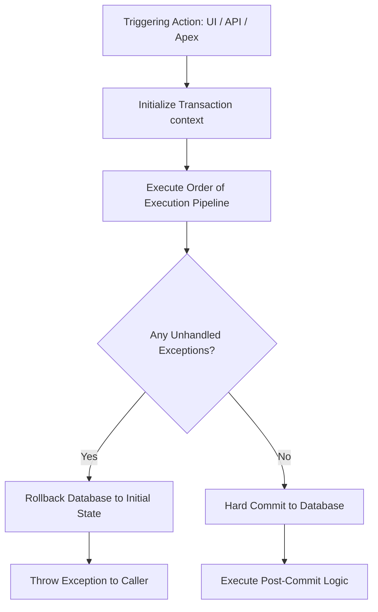
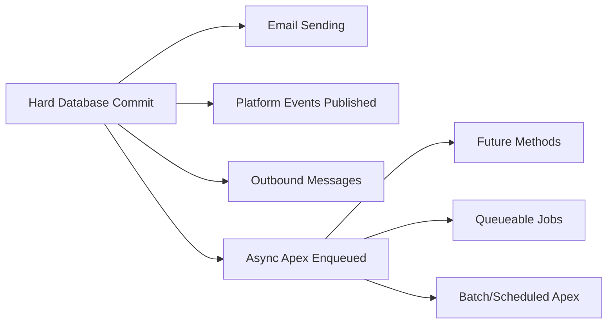

# Salesforce Order of Execution

# 1. Introduction

### What is the Salesforce Order of Execution?
The Salesforce Order of Execution (OoE) is the precise, non-negotiable sequence of events that the Salesforce platform executes when a record is saved to the database. Whether a record is created, updated, or upserted via the UI, API, Apex, or automated processes, Salesforce processes the transaction through a rigid, multi-step pipeline.

### Why Understanding Transaction Flow is Critical
For Salesforce Developers, Architects, and Consultants, mastering the Order of Execution is not optional—it is a fundamental requirement. Failing to understand this sequence leads to architectural flaws, infinite loops, data corruption, and catastrophic governor limit exceptions.

### Business Importance & Common Real-World Problems
In enterprise environments, multiple teams often deploy various automations (Flows, Apex, integrations) on the same object. 
* **The "Ghost Update" Problem:** A developer writes an After Trigger to update a child record. Meanwhile, an admin creates a Workflow Rule that updates a field on the parent. The Workflow Rule fires, updating the parent, which *re-triggers* the update transaction, causing the After Trigger to fire twice.
* **The Validation Bypass:** A validation rule is written to prevent changing a `Warranty_Claim__c` status. However, a Before-Save Flow updates the status *before* custom validation rules evaluate, causing unexpected behavior or validation failures at the wrong time.

Understanding the OoE ensures predictability, scalability, and maintainability in your Salesforce architecture.

---

# 2. What is a Salesforce Transaction?

### Definition
A Salesforce transaction is a set of database operations that are executed as a single, indivisible unit of work. A transaction begins when the first piece of code or automation executes and ends when all operations successfully commit to the database or when the transaction is entirely rolled back.

### Atomicity and Rollback Behavior
Salesforce transactions follow the principle of **Atomicity** (the "A" in ACID database properties). This means an operation is "all-or-nothing." If an error occurs at step 19 of a 20-step transaction, the entire transaction is rolled back. No partial data is saved.

### Transaction Lifecycle


---

# 3. Complete Salesforce Order of Execution

Below is the definitive, step-by-step Salesforce Order of Execution sequence.

1. **Load Original Record:** The original record is loaded from the database (or initialized for an insert).
2. **System Validation Rules:** Checks required fields, field formats, and maximum lengths.
3. **Before Record-Triggered Flows:** Fast field updates run to evaluate and set values before saving.
4. **Before Triggers:** Executes `before insert` or `before update` Apex triggers.
5. **System Validation (Again):** System validations run again to verify any changes made by Before Triggers.
6. **Custom Validation Rules:** Evaluates user-defined formula validation rules.
7. **Duplicate Rules:** Executes duplication detection rules.
8. **Save Record (Not Committed):** The record is saved to the database but *not yet committed*. (The record gets its Id at this stage for inserts).
9. **After Triggers:** Executes `after insert` or `after update` Apex triggers.
10. **Assignment Rules:** Executes Assignment Rules (Leads/Cases).
11. **Auto-Response Rules:** Executes Auto-Response Rules.
12. **Workflow Rules:** Executes legacy Workflow Rules.
13. **Workflow Field Updates:** If Workflow Rules update fields, Salesforce updates the record again.
14. **Trigger Re-execution (Due to Workflow):** If a workflow field update occurred, Before Triggers, System Validations, and After Triggers fire *one more time* (Custom validations and duplicate rules do NOT re-fire).
15. **Escalation Rules:** Executes Escalation Rules.
16. **Processes & Record-Triggered Flows (After Save):** Executes Process Builder processes and After-Save Record-Triggered Flows.
17. **Entitlement Rules:** Executes Entitlement rules.
18. **Roll-Up Summary Calculations:** Calculates Roll-up Summary fields on the parent record.
19. **Grandparent Roll-Up Processing:** The parent record goes through the save process, potentially triggering grandparent roll-ups.
20. **Criteria-Based Sharing Evaluation:** Evaluates sharing rules.
21. **Database Commit:** Hard commits all DML operations to the database.
22. **Post-Commit Logic:** Executes email sending, outbound messages, Platform Events, and async Apex.

---

# 4. System Validation Rules

System validations are the very first checks Salesforce performs. They evaluate the fundamental schema integrity of the incoming data.

* **Required Fields:** Checks if fields marked "Required" at the field/database level (not page layout) are populated.
* **Data Types:** Ensures you aren't putting text into a Date field.
* **Maximum Lengths:** Validates that a string does not exceed the field limit (e.g., a VIN number cannot exceed 17 characters in a `Text(17)` field).
* **Field Formats:** Validates standard formats like standard Email or URL fields.

**Example:** If a SAP Integration attempts to insert a `Vehicle__c` record with a `VIN__c` of 20 characters, the transaction fails immediately at Step 2, before any custom code runs.

---

# 5. Before-Save Flows

Before-Save Flows (Fast Field Updates) execute immediately after initial system validations and *before* Apex Before Triggers.

* **Execution Timing:** Step 3 of the OoE.
* **Performance Advantages:** They are 10x faster than legacy Process Builders because they do not require a separate DML statement to update the triggering record. They update the record values in memory before the initial database save.
* **Limitation:** They can *only* update fields on the record that triggered the flow.

### Before-Save Flows vs Before Triggers
| Feature | Before-Save Flow | Before Trigger |
| :--- | :--- | :--- |
| **Execution Order** | Executes First | Executes Second |
| **Speed** | Extremely Fast | Extremely Fast |
| **Complexity** | Simple to Moderate | Complex (Maps, Sets, bulkified cross-object logic) |
| **Best For** | Same-record field updates | Complex validation, external callout prep, complex cross-object queries |

---

# 6. Before Triggers

Before Triggers execute before the record is saved to the database. Their primary purpose is to perform complex validations or update fields on the record being processed.

* **Validation Logic:** Use `.addError()` to prevent records from saving based on complex Apex logic.
* **Field Updates:** Updates to `Trigger.new` records do *not* require a DML statement.

**Production Quality Apex Example:**
```apex
public class WarrantyClaimTriggerHandler {
    public static void validateMileage(List<Warranty_Claim__c> newClaims) {
        for (Warranty_Claim__c claim : newClaims) {
            // Complex logic validating against standard warranty thresholds
            if (claim.Vehicle_Mileage__c > 100000 && claim.Claim_Type__c == 'Powertrain') {
                // Generates an error at Step 4 of the OoE
                claim.addError('Powertrain warranty is void for vehicles over 100,000 miles.');
            }
            
            // Setting a value before save (No DML needed)
            if (claim.Status__c == 'New') {
                claim.Requires_Manager_Approval__c = true;
            }
        }
    }
}
```

---

# 7. Custom Validation Rules

Custom Validation Rules (configured via Setup) run *after* Before Triggers. 

* **Formula Evaluations:** They evaluate boolean formulas. If the formula returns `TRUE`, the error fires.
* **Best Practice:** Keep validation rules for simple data-integrity checks (e.g., `Start_Date__c > End_Date__c`). Leave complex, multi-object validations to Before Triggers.

*Note:* Because they run after Before Triggers, any field updates made by Before-Save Flows or Before Triggers *will* be evaluated by Custom Validation Rules.

---

# 8. Duplicate Rules

Duplicate rules execute to maintain data hygiene.
* **Matching Rules:** Define *how* duplicates are identified (e.g., Exact Match on VIN).
* **Duplicate Rules:** Define *what happens* when a match is found.
* **Action Types:** You can choose to **Block** the transaction entirely or **Allow** it but generate an alert/report. If blocked, the transaction throws a `DmlException` and rolls back.

---

# 9. After Triggers

After Triggers execute *after* the record has been saved to the database (but before the commit). 

* **State of the Record:** The record now has a system ID (if insert), and formula fields/system fields (like `CreatedDate`) are available.
* **Read-Only Context:** The records in `Trigger.new` are read-only. You cannot directly modify them.
* **Cross-Object Updates:** The primary use case is using the ID of the saved record to perform DML on *related* records.

**Example:**
```apex
public static void createInvoiceOnWorkOrderClosure(Map<Id, Work_Order__c> newMap, Map<Id, Work_Order__c> oldMap) {
    List<Invoice__c> invoicesToInsert = new List<Invoice__c>();
    
    for (Work_Order__c wo : newMap.values()) {
        if (wo.Status__c == 'Closed' && oldMap.get(wo.Id).Status__c != 'Closed') {
            invoicesToInsert.add(new Invoice__c(
                Work_Order__c = wo.Id,
                Amount__c = wo.Total_Labor_Cost__c + wo.Total_Parts_Cost__c,
                Dealer__c = wo.Dealer__c
            ));
        }
    }
    
    // Explicit DML is required in After Triggers for related records
    if (!invoicesToInsert.isEmpty()) {
        insert invoicesToInsert; 
    }
}
```

---

# 10. Assignment Rules

Used primarily for Lead and Case routing.
* **Dealer Assignment:** In an Automotive CRM, if a new Web-to-Lead comes in for a test drive, Lead Assignment Rules evaluate the customer's Zip Code and reassign the Lead owner to the closest local Dealership user or queue.

---

# 11. Auto-Response Rules

Executes immediately after Assignment Rules to send automated, targeted emails.
* **Warranty Acknowledgment:** When a customer submits a Case via an Experience Cloud site for a defective part, an Auto-Response rule sends a branded email confirming receipt with the Case Number.

---

# 12. Workflow Rules

Legacy automation tool. While Salesforce is retiring Workflow Rules, they are critical to understand because of their impact on the Order of Execution.
* **Execution:** They can send Outbound Messages, Email Alerts, create Tasks, or update fields.
* **Workflow Trigger Re-execution (The Danger Zone):** If a Workflow Rule updates a field, Salesforce re-executes Before Triggers, System Validations, and After Triggers. *This is a primary cause of recursive trigger execution and governor limit breaches.*

---

# 13. Process Builder

Legacy automation tool (Processes).
* **Execution Timing:** Runs late in the transaction (Step 16). 
* **Performance:** Very slow compared to Flows. Evaluates multiple criteria nodes sequentially.
* **Relationship with Flows:** Salesforce heavily recommends migrating all Process Builders to Record-Triggered Flows.

---

# 14. Record-Triggered Flows

Modern declarative automation tool. Salesforce splits Flow execution based on when it fires.

| Flow Type | Execution Step | Equivalent Apex | Primary Use Case |
| :--- | :--- | :--- | :--- |
| **Before-Save** | Step 3 | Before Trigger | Fast, same-record field updates. Defaulting values. |
| **After-Save** | Step 16 | After Trigger | Updating related parent/child records, creating records. |
| **Asynchronous** | Post-Commit | Future Method | Callouts to external systems (e.g., SAP integration) after the record is fully committed. |

---

# 15. Roll-Up Summary Calculations

Roll-Up Summary Fields (RSF) on Master-Detail relationships are calculated at Step 18.
* **Transaction Ripple Effect:** When a child record is inserted/updated/deleted, the RSF on the Parent recalculates.
* **Parent Update:** This recalculation fundamentally updates the Parent record. Therefore, the Parent record is saved, which *triggers the entire Order of Execution on the Parent object*.

**Example:** Adding a `Claim_Line_Item__c` rolls up a `Total_Claim_Amount__c` onto the `Warranty_Claim__c`. This saves the `Warranty_Claim__c`, firing the `Warranty_Claim__c` triggers in the same execution context.

---

# 16. Sharing Rule Evaluation

Salesforce evaluates record sharing visibility late in the transaction.
* **Criteria-Based & Ownership-Based:** Recalculated here.
* **Execution Timing:** If the transaction updates thousands of records and complex sharing rules are triggered, Salesforce may defer the sharing recalculation to an asynchronous background job to prevent the transaction from timing out.

---

# 17. Database Commit

Step 21: The Point of No Return.
* All pending DML operations are finalized. 
* Up until this exact microsecond, if any governor limit is breached or a validation rule fails, the entire transaction rolls back to Step 1.
* Once committed, the data is permanently available to queries.

---

# 18. Post-Commit Logic

After the database commit is successful, Salesforce executes "Deferred" operations. 



* **Platform Events:** If an event is published with "Publish After Commit" behavior, it waits until this phase to fire.
* **Asynchronous Apex:** Queueable and Future methods are handed off to the Flex Queue.

---

# 19. Transaction Rollback

If a failure occurs anywhere from Step 1 to Step 20, the database rolls back.

* **Savepoints:** Developers can manually define rollback points using Apex.
* **Exceptions:** Unhandled exceptions (e.g., `NullPointerException`, `DmlException`) trigger automatic rollbacks.

**Example:**
```apex
Savepoint sp = Database.setSavepoint();
try {
    insert newVehicle;
    insert newWarranty;
} catch (Exception e) {
    // Reverts the database state to right before the newVehicle insert
    Database.rollback(sp);
    System.debug('Transaction failed and rolled back: ' + e.getMessage());
}
```

---

# 20. Governor Limits During Transactions

Governor limits track consumption *per transaction*. A complex OoE uses up limits rapidly.

| Limit Type | Sync Transaction Limit | Async Transaction Limit | Impact on Execution Flow |
| :--- | :--- | :--- | :--- |
| **SOQL Queries** | 100 | 200 | A Workflow updating a field re-fires triggers, potentially doubling SOQL consumption instantly. |
| **DML Statements** | 150 | 150 | Creating related records across multiple After-Save flows depletes this quickly. |
| **CPU Time** | 10,000 ms | 60,000 ms | Deep nested logic, process builders, and recursive triggers easily blow past the CPU limit. |
| **Heap Size** | 6 MB | 12 MB | Large lists of records held in memory. |
| **Maximum Trigger Depth** | 16 | 16 | Trigger A updates B, B updates C, C updates A. Limit reached. |

---

# 21. Recursive Automation Problems

Recursion occurs when automation triggers itself, creating a loop.
* **Workflow Recursion:** A Workflow updates a field, causing the trigger to fire, which sets a value, which causes the workflow to evaluate again.
* **Prevention:** Always use a `static` variable in a utility class to track execution state.

**Example Prevention:**
```apex
public class RecursionBlocker {
    public static Set<Id> processedClaimIds = new Set<Id>();
}

// In your Trigger Handler:
public static void processClaims(List<Warranty_Claim__c> claims) {
    List<Warranty_Claim__c> claimsToProcess = new List<Warranty_Claim__c>();
    for(Warranty_Claim__c claim : claims) {
        if(!RecursionBlocker.processedClaimIds.contains(claim.Id)) {
            claimsToProcess.add(claim);
            RecursionBlocker.processedClaimIds.add(claim.Id); // Mark as processed
        }
    }
    // Process unique records only
}
```

---

# 22. Trigger Re-Execution Scenarios

When do triggers fire more than once in a single transaction?
1. **Workflow Field Updates:** Step 13 forces Step 4 (Before) and Step 9 (After) to run again.
2. **Roll-Up Summary Updates:** Updating a child updates the parent, executing all automations on the parent.
3. **Cross-Object Field Updates in PB/Flow:** Updating a parent from a child's flow triggers the parent's execution context.

*Note:* During a Workflow-induced trigger re-execution, Custom Validation Rules, Duplicate Rules, and Escalation Rules are **skipped** to save processing time.

---

# 23. Order of Execution with Flow and Apex

| Automation Tool | Execution Timing | Should I Use This? |
| :--- | :--- | :--- |
| **Before-Save Flow** | First (Step 3) | **Yes.** Best for same-record updates. |
| **Before Apex Trigger** | Second (Step 4) | **Yes.** Best for complex validation. |
| **After Apex Trigger** | Middle (Step 9) | **Yes.** Best for complex cross-object DML. |
| **Workflow Rules** | Middle (Step 12) | **No.** Deprecated. Causes dangerous re-executions. |
| **Process Builder** | Late (Step 16) | **No.** Deprecated. Slow CPU performance. |
| **After-Save Flow** | Late (Step 16) | **Yes.** Good for simple cross-object updates. |

*Architectural Interaction:* Because After-Save Flows run *after* After Triggers, any DML you write in an After Trigger might be overwritten by an After-Save Flow later in the transaction if you aren't careful.

---

# 24. Enterprise Design Best Practices

1. **One Trigger Per Object:** Never create multiple triggers (e.g., `VehicleBeforeInsert`, `VehicleAfterUpdate`) for the same object. You cannot control the execution order of multiple triggers on the same object. Use a single trigger that delegates to a Handler class.
2. **Implement a Trigger Framework:** Use frameworks like fflib or a custom lightweight framework to control execution routing, bypasses, and recursion.
3. **Service Layer Architecture:** Remove business logic from trigger handlers. Handlers should only route data to Service classes (e.g., `WarrantyService.cls`).
4. **Leverage Before-Save Flows:** Move all simple "If X, then set Y" logic to Before-Save Flows to save CPU time.
5. **Centralize Bypasses:** Build a Custom Permission or Custom Setting (e.g., `Automation_Bypass__c`) that allows integration users to bypass automations during data loads, drastically saving limits and time.

---

# 25. Real Project Scenarios (Automotive CRM)

### Scenario: Vehicle Registration Process
1. **Integration:** SAP sends an API call to insert a `Vehicle__c`. (Step 1)
2. **System Validation:** Checks that `VIN__c` is exactly 17 chars. (Step 2)
3. **Before-Save Flow:** Looks at the `Manufacture_Date__c`. If it's this year, sets `Model_Year_Status__c = 'Current'`. (Step 3)
4. **Before Trigger:** Queries external system metadata to ensure the color code matches global standards. (Step 4)
5. **Save:** Vehicle gets a Salesforce ID. (Step 8)
6. **After Trigger:** Creates an associated `Asset` record for the customer. (Step 9)
7. **Commit:** Vehicle and Asset are saved. (Step 21)
8. **Post-Commit:** An Outbound Message fires to the Dealership Portal indicating inventory arrival. (Step 22)

---

# 26. Common Mistakes

* **Mistake:** Assuming After Triggers run after Process Builders.
  * *Reality:* After Triggers (Step 9) run *before* Process Builders and After-Save Flows (Step 16).
* **Mistake:** SOQL inside a `FOR` loop.
  * *Reality:* Order of Execution processes records in batches of 200. A query in a loop will hit the 100 SOQL limit instantly.
* **Mistake:** Doing a Callout in a Trigger without `@future` or Queueable.
  * *Reality:* You cannot hold a synchronous database transaction open while waiting for an external server. It must be asynchronous.
* **Mistake:** Not handling trigger re-execution.
  * *Reality:* Leads to CPU Timeouts and "Maximum Trigger Depth Exceeded" errors.

---

# 27. Debugging Transaction Flow

When Order of Execution issues occur, Architects rely on specific tools:
* **Developer Console / Debug Logs:** Set profiling levels. Filter by `EXECUTION_STARTED` and `EXECUTION_FINISHED` to trace the steps. Look for `CODE_UNIT_STARTED` to see triggers firing multiple times.
* **Flow Debugger:** Run Flows in Rollback Mode to see step-by-step variable assignment without committing data.
* **Governor Limit Monitoring:** In Apex debug logs, track the `LIMIT_USAGE_FOR_NS` blocks to see exactly which step consumed your SOQL or CPU time.

---

# 28. Interview Questions & Answers

### Beginner Questions
**Q: Can you update `Trigger.new` in an After Trigger?**
*A: No. `Trigger.new` is read-only in After context. Trying to modify it will throw a runtime exception. You must query the record or perform a separate DML operation.*

### Intermediate Questions
**Q: A Workflow rule updates a field on a record. Does a Custom Validation Rule fire again to check the new value?**
*A: No. When a Workflow updates a field, Before Triggers and After Triggers re-fire, but Custom Validation Rules and Duplicate Rules are skipped in the re-execution.*

### Advanced Questions
**Q: Your Before-Save Flow runs incredibly fast, but your After-Save Flow causes a CPU limit exception. Why?**
*A: Before-Save flows update the record in memory before the initial database save, taking milliseconds. After-Save flows execute later, require their own implicit DML operations, and can trigger further downstream automation on related records, heavily consuming CPU time.*

### Architect-Level Questions
**Q: Explain how a Master-Detail Roll-Up Summary can cause a `System.LimitException: Too many SOQL queries: 101` in an entirely unrelated object's transaction.**
*A: Inserting a child record triggers a recalculation of the Roll-Up Summary field on the parent. This recalculation executes a DML update on the parent, which fires the parent's Order of Execution. If the parent's triggers perform SOQL queries, and the parent is linked to other objects via trigger logic, the transaction limits are shared across the entire cascading event. The SOQL limit is per transaction, not per object.*

---

# 29. Revision Summary

* **Transaction:** All-or-nothing database operation.
* **Before Flows (Step 3):** Fast, same-record updates before code.
* **Before Triggers (Step 4):** Complex validation, same-record updates without DML.
* **Validation Rules (Step 6):** Runs after Before Triggers.
* **After Triggers (Step 9):** Cross-object updates, requires DML.
* **Workflow Updates (Step 13):** Causes triggers to re-execute. Danger zone.
* **After-Save Flows (Step 16):** Replaces Process Builder.
* **Roll-Up Summaries (Step 18):** Forces parent record to evaluate its own Order of Execution.
* **Commit (Step 21):** Point of no return. Data is hardened.
* **Post-Commit (Step 22):** Async processing, Callouts, Emails.
* **Best Practice:** One trigger per object, use recursion blockers, defer simple logic to Before-Save flows.